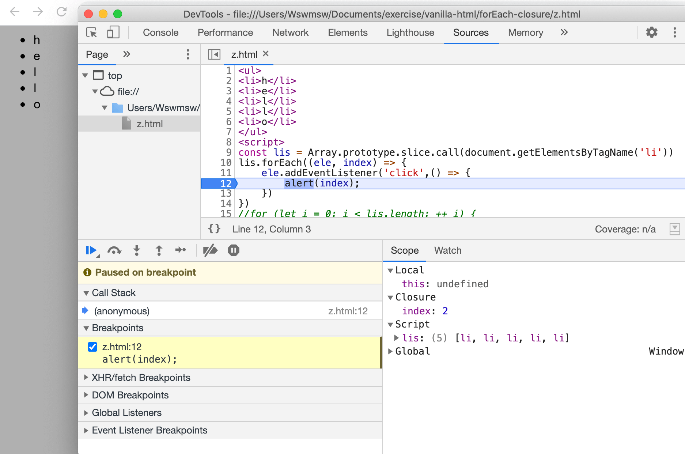
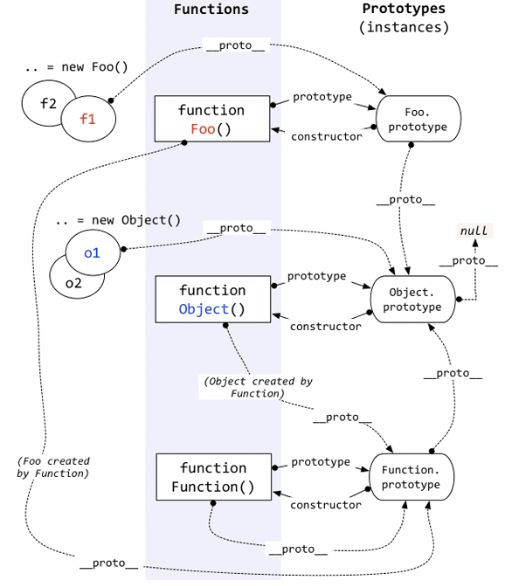
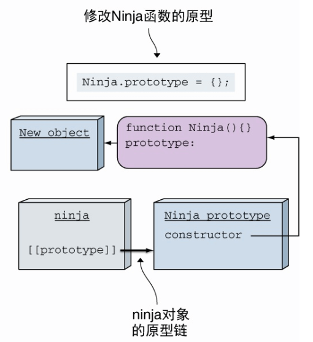

# JavaScript 学习记录


## 遗留问题

> [围绕原始数据类型创建一个显式包装器对象从 ECMAScript 6 开始不再被支持。 然而，现有的原始包装器对象，如 new Boolean、new String以及new Number，因为遗留原因仍可被创建。](https://developer.mozilla.org/zh-CN/docs/Web/JavaScript/Reference/Global_Objects/Symbol#description)

## 闭包 closure 和作用域

### 闭包

<span id="r闭包参数"></span>
<span id="r闭包返回值"></span>
函数作为[入参](#闭包参数)或[返回值](#闭包返回值)都**有可能**形成闭包（特殊的作用域）。这是因为，函数的执行会创建作用域，作用域形成作用域链，作用域链又会存在分支，因此作用域有了父子、兄弟关系，作用域中传递的是变量，**当使用变量的作用域不是定义变量的作用域的子作用域的时候，一定会产生闭包**，这一`策略`使闭包里的变量**让函数正常引用变量、正常执行**。

闭包很常见，例如可以观察 forEach 检测是否形成了闭包：这里 forEach 的回调是监听一串 li 的点击事件，点击后打印 li 的序号（及 forEach 回调的第二参）。点击 li 后发现打印出了对应的序号，和这个现象作对比的是将 forEach 替换成 for 循环，结果将始终打印 1 个值

在上述 forEach 的例子，往监听的回调函数添加断点后，点击某个 li 就看见了 DevTools 内 Sources 下的 Scope 面板出现了 Closure 这个特殊的作用域（下方图）。想用 for 循环完成这样的工作，可以给监听的回调使用 bind 或裸 IIFE 返回函数（IIFE 内定义变量存储 index，返回的函数中使用），后者利用了闭包。



上图中，我点击了第一个'l'，应该打印 2。

在日常开发中，复杂度不高、无需使用 new 实例保存状态时，就使用**返回函数**创建闭包的方法，这样每返回的一个函数就是一个全新作用域，来代表一个全新状态，好处是避免了重复逻辑代码。**具体的例子**就是防抖节流时 timer，还有向回调函数传参，比如给点击时间的回调传参。下面是一个能直接运行的例子：

```
function returnF()
{
	var b = 0;
	return function()
	{
		++ b;
		console.log(b);
	}
}
// 这里创建了 3 个不同的变量 b
let c = returnF(); let d = returnF(); let e = returnF();

console.log('=== closure ===');

c(); c();
d();
e(); e(); e();
```

直接使用闭包会导致内存无法释放，下面进行释放内存的例子，浏览器中使用 DevTools / Memory 的 Allocation instrumentation on timeline 查看释放前后对比区别：

```
function returnF() {
    var b = 0;
    return {
        incr: () => { ++ b; return 'ok'; },
        get: () => { console.log(b); return 'ok'; },
        free: () => { b = null; return 'ok'},
    }
}
```

> [闭包 (计算机科学)](https://zh.wikipedia.org/zh-cn/%E9%97%AD%E5%8C%85_(%E8%AE%A1%E7%AE%97%E6%9C%BA%E7%A7%91%E5%AD%A6))

### 作用域

#### this

this 很好理解，this 总是会出现在实例中，指向（代表）当前实例。

this 的注意点：调用全局方法时，指向 window；箭头函数没有自己的 this（无法通过 apply, call, bind 方法指定 this），但是会继承上层作用域的 this。

#### 运行 fn() 和 new fn() 区分各自作用域中的 this

```
var a = 10
function fn()
{
	console.log(this)
	a = 5
	console.log(a)
	console.log(this.a)
	var a
	console.log(a)
	console.log(this.a)	
}
fn() // 5 10 5 10
new fn() // 5 undefined 5 undefined
```


*模拟 bind：*

```javascript
Function.prototype.bind1 = function()
{
	const args = Array.prototype.slice.call(arguments);
	const t = args.shift();
	const self = this;
	return function() { return self.apply(t, args) }
}
```

*模拟 call：*

- apply 以数组或集合的方式传入；
- call 和 bind 以多参数传入；

```javascript
Function.prototype.call1 = function(t)
{
	let res;
	t = t || window;
	t.fn = this;
	res = arguments.length;
	if (res > 1)
	{
		const args = Array.prototype.slice.call(arguments).slice(1);
		res = t.fn(...args);
	}
	else { res = t.fn() }
	delete t.fn;
	return res;
}
```

> [闭包 (计算机科学)](https://zh.wikipedia.org/wiki/%E9%97%AD%E5%8C%85_(%E8%AE%A1%E7%AE%97%E6%9C%BA%E7%A7%91%E5%AD%A6))：wiki，闭包的理论。
> 
> [闭包](https://developer.mozilla.org/zh-CN/docs/Web/JavaScript/Closures)：mozilla 对比包的解释，有很多例子。
> 
> [闭包的起源](https://juejin.cn/post/6844904035531636744)：掘金一篇关于闭包的博文。

## 对象

### 模拟继承

*这样继承不会出现子类的构造器是父类的错误：*

```javascript
function Person() {}
Person.prototype.dance = function() {};

function Ninja() {
	Person.call(this);
}
Ninja.prototype = Object.create(Person.prototype);

Object.defineProperty(Ninja.prototype, "constructor", {
  enumberable: false,
  value: Ninja,
  writable: true // 定义一个不可枚举的 constructor 属性 Ninja
});

var ninja = new Ninja();
// ninja.constructor === Ninja // true。
```

模拟继承的几个关键：
- `Person.call(this);`，用于复制父类的属性；
- `Ninja.prototype = Object.create(Person.prototype);`，把父类作为子类的原型，用于获取父类的方法；
- `Ninja.prototype.constructor = Person;`（或者使用 Object.defineProperty 另构造器不可枚举），用于维持类的正确性，使子类的构造函数是自己而不是父类。

相关链接：

- [扎实前端系列：JavaScript实现继承](https://www.jianshu.com/p/af39457e7722)
- [Javascript实现继承的6种方式](https://blog.csdn.net/Tokki_/article/details/91357384)
- [用 Object.create() 实现类式继承](https://developer.mozilla.org/zh-CN/docs/Web/JavaScript/Reference/Global_Objects/Object/create#%E7%94%A8_object.create_%E5%AE%9E%E7%8E%B0%E7%B1%BB%E5%BC%8F%E7%BB%A7%E6%89%BF)
- [JavaScript 中对象的 constructor 属性的作用是什么？](https://www.zhihu.com/question/19951896/answer/13457869)——模拟继承过程中会改变子类的构造器，为什么修改？
- [Object.prototype.constructor-MDN](https://developer.mozilla.org/zh-CN/docs/Web/JavaScript/Reference/Global_Objects/Object/constructor)
- [JavaScript常用八种继承方案](https://juejin.cn/post/6844903696111763470#heading-6)

instanceof 的警告：构造函数原型的改变会导致 instanceof 返回否。

`Object.create(null)`和`{}`：{} 创建的对象继承了 Object 自身，OCN 创建的对象则是干净的对象，可以使用`Object.create(Object.prototype)`达到和`{}`相同的效果。

关联博文：[详解Object.create(null)](https://juejin.im/post/5acd8ced6fb9a028d444ee4e)；[Object.create()](https://developer.mozilla.org/zh-CN/docs/Web/JavaScript/Reference/Global_Objects/Object/create)。

---

*Object.getOwnPropertyNames()：*

- 返回自身属性，包括不可枚举属性，不包括 Symbol 值作为名称的属性；
- 该方法使用 Array.prototype.filter() 方法结合 Object.keys() 计算出所有不可枚举属性；
- ES5 中该方法的入参不是原始对象类型会报异常。

---

*Object.prototype.hasOwnProperty()：*

- 检测一个对象是否有特定的自身属性；和 in 不同，该方法忽略从原型链上继承的属性；
- 无视属性值为 null 或 undefined，只要有键即返回 true；
- 直接使用原型上的该方法，Object.prototype.hasOwnProperty.call(foo, 'bar')，这样防止对象把继承的 hasOwnProperty 方法覆盖了，无法发挥正确作用。

---

### 关于如何检测对象中的某个键

有两种方式创建对象，

```
var p = {};
var p2 = Object.create(null);
```

，通过`Object.prototype.hasOwnProperty.call(p, "toString");`检测。

在上面的方法 1 中，不可以使用`p.hasOwnProperty("toString");`，因为不能保证 p 是否添加了属性 hasOwnProperty。在上面的方法 2 中，不能使用`if (p['toString'])`来检测，即使 p2 没有继承 Object，但是也不能确定会不会有类似`false`、`null`、`undefined`、`0`或`NaN`之类的值

相关链接：[Is creating JS object with Object.create(null) the same as {}?](https://stackoverflow.com/a/21079232)

### 对象、函数和构造器的关系图



- 所有对象原型的原型都指向 Object.prototype，有 1 个例外；
- 所有函数的原型都指向 Function.prototype；
- 实例指向各自的对象原型；
- Object.prototype 的原型指向 null，是 1 个例外。

### 获取实例和对象的原型

```javascript
function F() {}
var f = new F(); // 创建一个函数 F 的实例对象 f
```

通过`Object.getPrototypeOf`获取实例或对象的原型：

```javascript
Object.getPrototypeOf(Object.getPrototypeOf(Object.getPrototypeOf(f))); // null
```

通过`__proto__`可以达到一样的效果，但`__proto__`是浏览器实现的特性，不是标准，所以通常还是使用`Object.getPrototypeOf`：

```javascript
f.__proto__.__proto__.__proto__; // null
```

### getter 和 setter 的使用

对象由属性和值组成，属性又分为两种，第一种叫做数据属性，例如“`{ a: 1 }`”里的 a，另一种叫做访问器属性(accessor property)，就是这里的 getter 和 setter。

访问器属性的描述符和数据属性的描述符不同，访问器属性的描述符相比没有 value 和 writable 属性，但是多了 set 和 get 属性：

```javascript
// 数据属性的描述符
Object.getOwnPropertyDescriptor({ a: 1 }, "a"); // { "value": 1, "writable": true, "enumerable": true, "configurable": true }
```

```javascript
// 访问器属性的描述符
Object.getOwnPropertyDescriptor({ get a() { return 1; } }, "a"); // {set: undefined, enumerable: true, configurable: true, get: ƒ}
```

初始化对象之后，通过“Object.defineProperty”创建访问器属性：

```javascript
var o = { a: 0 };
Object.defineProperty(o, "b", { get: function() { return this.a + 1; } }); // 这里没有设置 enumerable 和 configurable，所以默认为 false，不能枚举，不能被删除
```

使用：可以为属性做限制，例如这里利用 set 限制名字的长度必须小于 4，

```javascript
let user = {
  get name() {
    return this._name;
  },

  set name(value) {
    if (value.length < 4) {
      alert("Name is too short, need at least 4 characters");
      return;
    }
    this._name = value; // 虽然可以通过 user._name访问，但是约定：以下划线 "_" 开头的属性是内部属性，不应该从对象外部进行访问
  }
};
```

相关链接：

- [属性的 getter 和 setter](https://zh.javascript.info/property-accessors)—— JAVASCRIPT.INFO 上的教程；
- [getter](https://developer.mozilla.org/zh-CN/docs/Web/JavaScript/Reference/Functions/get)：MDN 文档。

### 一些获取对象属性的方法

`Object.getOwnPropertyNames`：获取非原型链上的可枚举和不可枚举的属性。

`for...in`：用于对象而不是数组，遍历可枚举属性，包括原型链上的。

`Object.prototype.hasOwnProperty`：通常用“`Object.prototype.hasOwnProperty.call(foo, "bar");`”的方式检测对象里是否有某属性，属性可枚举或者不可枚举，但不能在原型链上。

### Object.keys

### Object.create

“`Object.create(Object.prototype)`”相当于“`{}`”。

“`Object.create(null)`”可以用于存储数据，因为它没有原型链，但是要注意例如“`"abc" + Object.create(null)`”这样的代码会报错，少去了继承原型链的方法，一些曾经便于调试的默认行为也就没有了。

### Object.assign

使用`Object.assign`拷贝访问器，会忽略 set，并直接使用 get 的 return。

完整拷贝访问器：

```javascript
function completeAssign(target, ...sources) {
  sources.forEach(source => {
    let descriptors = Object.keys(source).reduce((descriptors, key) => {
      descriptors[key] = Object.getOwnPropertyDescriptor(source, key);
      return descriptors;
    }, {});

    // By default, Object.assign copies enumerable Symbols, too
    Object.getOwnPropertySymbols(source).forEach(sym => {
      let descriptor = Object.getOwnPropertyDescriptor(source, sym);
      if (descriptor.enumerable) {
        descriptors[sym] = descriptor;
      }
    });
    Object.defineProperties(target, descriptors);
  });
  return target;
}
```

Object.assign 和展开符的区别：由于 Object.assign 会修改传入的第一个对象，所以它会触发第一个对象里的 setter，

```
Object.assign({
  set a(v) {
    console.log("trigger"); // 这一行将被触发
    this.b = v;
  },
  b: 2
}, { a: 99 }); // { b: 99 }
{...{ set a(v) {
  console.log("not trigger"); // 这一行不被触发
  this.b = v;
}, b:2 }, ...{ a: 4 }} // { a: 4, b: 2 }
```

相关链接：

- [\[译\] Object.assign 和 Object Spread 之争, 用谁？](https://cloud.tencent.com/developer/article/1730947)
- [Object spread vs. Object.assign](https://stackoverflow.com/a/48582976)

### 相关链接

- [\[译\] JavaScript 引擎基础：Shapes 和 Inline Caches](https://hijiangtao.github.io/2018/06/17/Shapes-ICs/)：引擎是怎么处理原型的，解释了“为什么不要随便改原型”。
- [\[译\] JavaScript 引擎基础：原型优化](https://hijiangtao.github.io/2018/08/21/Prototypes/)：引擎是怎么处理原型的，解释了“为什么不要随便改原型”；
- [typeof-Real-world usage](https://developer.mozilla.org/zh-CN/docs/Web/JavaScript/Reference/Operators/typeof#real-world_usage)：typeof 的真实使用。

## Symbol

## Proxy

紹介<small style="color: salmon">しょうかい</small>：代理，访问目标对象前拦截它，并对该访问进行过滤和改写，它在 API 使用者和对象间是**中间人**角色。生成 Proxy 实例的例子：`var proxy = new Proxy(target, handler);`，target 是目标对象，handler 是用于拦截的处理器（trap）对象。

借助代理并定义明确的规则来禁止访问 target 对象的某些属性，对外只暴露代理而不暴露 target 对象（target 应该对使用者完全隐藏）。

handler 对象的方法：`handler.getPrototypeOf()`，Object.getPrototypeOf 方法的捕捉器；`handler.setPrototypeOf()`，Object.setPrototypeOf 方法的捕捉器；`handler.isExtensible()`，Object.isExtensible 方法的捕捉器；`handler.preventExtensions()`，Object.preventExtensions 方法的捕捉器；`handler.getOwnPropertyDescriptor()`，Object.getOwnPropertyDescriptor 方法的捕捉器；`handler.defineProperty()`，Object.defineProperty 方法的捕捉器；`handler.has()`，in 操作符的捕捉器；`handler.get()`，属性读取操作的捕捉器；`handler.set()`，属性设置操作的捕捉器；`handler.deleteProperty()`，delete 操作符的捕捉器；`handler.ownKeys()`，Object.getOwnPropertyNames 方法和 Object.getOwnPropertySymbols 方法的捕捉器；`handler.apply()`，函数调用操作的捕捉器；`handler.construct()`，new 操作符的捕捉器。メソッドの紹介：https://es6.ruanyifeng.com/#docs/proxy#get；https://developer.mozilla.org/zh-CN/docs/Web/JavaScript/Reference/Global_Objects/Proxy。

Proxy 的　静的<small style="color: salmon">せいてき</small>メサット：Proxy.revocable()，示例：`let {proxy, revoke} = Proxy.revocable(target, handler);`，执行返回的 revoke 函数后就不能使用 proxy 实例了。

Proxy 实例的 this：Proxy 代理的目标对象 this 指向生成的实例，因此会无法直接访问一些属性或方法。

get：如需要“禁止访问下划线开头的属性”的时候使用，访问的时候抛错让使用者知道这些属性不可通过代理访问。

set：如需要“禁止设置下划线开头的属性”的时候使用；如需要“模式验证”的时候使用，例如让 age 属性只能是数字和大于零；如需要“限制通过代理设置属性的次数”的时候使用，结合 revocable。

使用处理器方法实现**链式操作**（get）、**限制属性值大于 0**（set）等例子：https://es6.ruanyifeng.com/#docs/proxy#get

[实现限制 age 的值大于 0](#实现限制 age 的值大于 0)

## Reflect

Reflect の設計<small style="color: salmon;">せっけい</small>目的：存储语言内部方法；返回合理结果（catch 和 bool）；使操作变为函数行为而非命令式；配合 Proxy。

Reflect 的方法和 Proxy 的所有拦截方法对应。

**has** 和 **deleteProperty** 的用法：

```
var obj = { foo: 1 }
Reflect.has(obj, 'foo') // true // 代替 in 演算子　えんざんし
Reflect.deleteProperty(obj, 'foo') // true // 代替 delete 演算子
```

apply 方法：https://es6.ruanyifeng.com/#docs/reflect#Reflect-applyfunc-thisArg-args；https://developer.mozilla.org/zh-CN/docs/Web/JavaScript/Reference/Global_Objects/Reflect/apply。

### Thunk 函数

关于函数**参数求值时机**的问题，有“传值调用（call by value）”和“传名调用（call by name, cbn）”的意见，cbn 的实现往往把参数放到一个叫 **Thunk 函数**的临时函数中，用来替换**表达式**参数，而在 JavaScript 里则是用来替换入参**多参数成为单参数**。

*简单的 Thunk 函数转换器：*

```
var Thunk = function(fn)
{
	return function()
	{
		var args = Array.prototype.slice.call(arguments);
		return function(callback)
		{
			args.push(callback);
			return fn.apply(this, args);
		};
	};
};
// 上：ES5 下：ES6
const Thunk = function(fn)
{
	return function(...args)
	{
		return function(callback)
		{
			return fn.call(this, ...args, callback);
		};
	};
}; // 。
```

> https://es6.ruanyifeng.com/?search=thunk&x=0&y=0#docs/generator-async#Thunk-%E5%87%BD%E6%95%B0

## Promise

简单回调函数的 3 个问题：错误处理困难；相互依赖的“金字塔噩梦”；并行任务的棘手样板代码。

创建 Promise 的 4 个方式：fetch；Promise.resolve；Promise.reject；Promise 的构造函数。

promise 对象的状态：pending 挂起，未实现；fulfilled 兑现承诺，实现；rejected 违背承诺，拒绝态。

Promise 对象构造函数的参数：该参数是函数，执行成功进入 fulfilled，执行失败（隐式或显式）进入 rejected，否则 pending。

Promise 的回调函数：成功和失败的回调可以同时在 then 方法中（错误函数在 then 的第二参数），也能**链式调用**分别在 then 和 catch 方法内。

如果不是处理互相依赖的任务，**并行任务**使用 Promise.all，**竞赛任务**使用 Promise.race，两个方法的参数都是 1 个 Promise 数组。

Promise 结合 Generator 完成互相依赖的异步任务：

```
async(generator);
function* generator()
{
	try
	{
		const ninjas = yield getJSON("data/ninjas.json");
		const missions = yield getJSON(ninjas[0].missionsUrl);
	}
	catch(e)
	{
		console.log("we weren't able to get details");
	}
}
function async(generator)
{
	var iterator = generator();
	function handle(iteratorResult)
	{
		if (iteratorResult.done) { return }
		const iteratorValue = iteratorResult.value;
		if (iteratorValue instanceof Promise)
		{
			iteratorValue.then(res => handle(iterator.next(res)))
										.catch(err => iterator.throw(err));
		}
	}
	try { handle(iterator.next) }
	catch(e) { iterator.throw(e) }
} // 。
```

在线工具解释 Promise 链（Promise 连缀调用的树型结构）：https://bevacqua.github.io/promisees。

Promise A+：https://juejin.cn/post/6844903649852784647。

## 迭代与流程控制

### 迭代器协议和可迭代协议

普通对象要变成可迭代的，必须要：给对象的 Symbol.iterator 属性赋值一个函数。下面是一段示例：

```
// ES6 之前
const example = {}
example[Symbol.iterator] = fn // 符号属性不能直接嵌入对象字面量
// ES6 之后
const example = {
	[Symbol.iterator]: fn // 使用计算属性名将符号键加到对象字面量
}
```

上面代码中，fn 函数必须返回一个对象，该对象必须遵守迭代器协议。下面通过例子说明这个协议：

```
const items = ['l', 'e', 'n', 'n', 'o', 'n']
const sequence = {
	[Symbol.iterator]() {
		let i = 0
		return {
			next() {
				const value = items[i]
				++ i
				const done = i > items.length - 1
				return { value, done }
			}
		}
	}
}
```

上面代码中包含的**迭代器协议**，**迭代器方法**返回的对象必须有 next 方法，next 方法不接受参数，并且返回包含 value 和 done 的对象。

3 种迭代办法：for..of；扩展操作符；Array.from 方法。

#### 无穷序列 ∞


### Generator

生成器是，创建一个生成器函数（function 关键字后的星号），调用它，即返回一个生成器对象。下面的一段示例说明**生成器对象同时遵守可迭代协议和迭代器协议**：

```
function* abc() { yield 'a'; yield 'b'; yield 'c'; }
const chars = abc()
typeof chars[Symbol.iterator] === 'function'
typeof chars.next === 'function'
chars[Symbol.iterator]() === chars
```

以上，函数 abc 之后的逐行代码分别表示：

- **生成器对象** chars 通过调用函数 abc 创建；
- chars 是**可迭代对象**，因为它有方法 Symbol.iterator；
- chars 是**迭代器**，因为它有方法 next；
- chars 自己就是迭代器，而一般的可迭代对象的迭代器是 i[Symbol.iterator]\(\)，i 是可迭代对象。

生成器函数参数发送值：正常参数。

next 发送值：值是上一次被挂起的 yield 表达式的最终结果。

生成器的**双向通信**：通过 yield 从生成器返回值（中间结果），通过迭代器 next() 把值传回生成器。

抛出异常：异常将抛回生成器。


### async function

利用 async 和 promise 完成同步等待：

```
function sleep(milliS)
{
	return new Promise(resolve => { setTimeout(() => { resolve() }, milliS) })
}
await sleep(3576).then(() => { console.log('action') })
console.log(1) // 等待了约 3576 毫秒后，执行了本条语句
```

## Class

类定义的 toString 方法与 ES5 function 定义的行为不一致，类定义的**不可枚举**：

```
var Point = function(x, y) {};
Point.prototype.toString = function() {};
Object.keys(Point.prototype); // ["toString"]
Object.getOwnPropertyNames(Point.prototype); // ["constructor", "toString"] // 。
```

\_\_proto\_\_ の特性<small style="color: salmon">とくせい</small>：这是各浏览器厂商实现的**私有属性**，我们**使用 Object.getPrototypeOf 方法**避免在生产环境依赖私有属性。当修改实例的原型时这么用。

クラス式<small style="color: salmon">しき</small>は、名前付き<small style="color: salmon">なまえつき</small>でも名前なしでもできます：const Myclass = class {};

## 集合

## 数组

プロパテイ：constructor, length, [@@unscopables].

メソッド：**変更メソッド、アクセサメソッド、反復メソッド**。

**変更**<small style="color: salmon">へんこう</small>：copyWithin, fill, pop, push, reverse, shift, sort, splice, unshift.

**アクセサ**：concat, includes, indexOf, join, lastIndexOf, slice, toSource, toString, toLocalString.

**反復**<small style="color: salmon">はんぷく</small>：entries, every, filter, find, findIndex, forEach, keys, map, reduce, reduceRight, some, values, [@@iterator].

第一类修改器方法都不是纯函数（不改变原数组，返回一个数组），它们都修改了原函数。

shift 的选择：使用 shift 和 unshift 之后每一个索引都要调整，存在性能问题。

slice 和 splice：slice 是纯函数，抽取一段，splice 则是拼接（替换）一段，在原数组上可以拼接一段空也能拼接一段有意义的数据。

split 和 join：split 是 String 的方法，以符号分割成数组，join 以符号合并数组元素成字符串，`'1-2-3'.split('-'); [1, 2, 3].join('-');`。

```javascript
var arr1 = arr.concat([50, 60]);
var arr2 = arr.map(num => num*10)
var arr3 = arr.filter(num => num > 25)
var arr4 = arr.slice()
```

reduce() 方法：

- 構文<small style="color: salmon">こうぶん</small>，arr.reduce(callback(accumulator, currentValue[, index[, array]]), initialValue)；


```
let maxCallback  = (acc, cur) => Math.max(acc.x, cur.x);
let maxCallback2 = (acc, cur) => Math.max(acc, cur);
[{ x: 2 }, { x: 22 }, { x: 42 }].reduce(maxCallback); // NaN
[{ x: 2 }, { x: 22 }           ].reduce(maxCallback); // 2
[{ x: 2 }                      ].reduce(maxCallback); // {x: 2}
[                              ].reduce(maxCallback); // TypeEr
[{ x: 2 }, { x: 22 }           ].map(el => el.x).reduce(maxCallback2, -Infinity); // 。
```

> [Array.prototype.reduce()](https://developer.mozilla.org/zh-CN/docs/Web/JavaScript/Reference/Global_Objects/Array/Reduce)
> 
> [Understanding Reduce in JavaScript](https://www.aboutmonica.com/blog/2020-03-29-understanding-reduce-in-javascript)

数组去重的办法：利用 Set；forEach 结合 indexOf；filter 结合 indexOf。下面用代码说明举例：

```
const a = [3, 3, 5, 5];
function unique(arr) // 利用 Set
{
	return [...new Set(arr)]
}
function unique2(arr) // forEach 结合 indexOf
{
	const res = []
	arr.forEach(item => {
		if (res.indexOf(item) < 0) { res.push(item) }
	})
}
function unique3(arr) // filter 结合 indexOf
{
	arr.filter((item, index) => {
		if (arr.indexOf(item) === index) {return item}
	})
}
```

## Map 数据结构

`对象`类型数据的 key 必须是字符串。当使用非字符串类型如 HTML 元素作为 key 时，其值被 toString 方法转为字符串类型。

```javascript
const firstE = document.getElementById("f");
const map = {};
map[secondE] = {data: secondE}; // DIV 元素转换为字符串后的值为 [object HTMLDivElement]
// firstE 和 secondE 在对象里均静默转换为 [object HTMLDivElement]
```

向 Map 添加成员，作为构造函数，可以接受数组作为参数。

```javascript
const map = new Map([
  ['name', '张三'],
  ['title', 'Author']
]);
map.get('name'); // "张三"

// 传入数组参数时，可看作如下算法
const items = [
  ['name', '张三'],
  ['title', 'Author']
];
const map = new Map();
items.forEach(
  ([key, value]) => map.set(key, value)
);
```

Map 的键和内存地址绑定，这能解决了同名属性碰撞（clash）的问题。

两个值`严格相等`，Map 则视为同一个键，`NaN`除外，即使 NaN!==NaN，Map 也视为同一个键。0, -0, +0 被视为一个键。

|  | Map | Object |
|:--|:--|:--|
| 意外的键 | Map 只有显式插入的键 | 有原型，可能被显式插入的覆盖 |
| 键的类型 | 任意值 | String 或 Symbol |
| 键的顺序 | 有序，插入顺序 | 无序* |
| Size | size 属性  | 手动计算 |
| 迭代 | 可迭代 | 迭代的前提是获取键 |
| 性能 | 适合频繁增删 | 不适合频繁增删 |

> Web 开发技术请参见 - JavaScript请参见 - JavaScript 参考请参见 - JavaScript 标准内置对象 - Map - https://developer.mozilla.org/zh-CN/docs/Web/JavaScript/Reference/Global_Objects/Map

### 实例属性和方法

Map 的方法和属性：

- new Map()
- map.set(key, value)
- map.get(key)
- map.has(key)
- map.delete(key)
- map.clear()
- map.size

Map 迭代：

- map.keys()
- map.values()
- map.entries()

map.forEach(func)

从对象创建 Map 和从 Map创建对象：

`[[...], [...], ...]`这样形式的数组，Map 通过 map.entries 生成，Object 通过 Object.entries(obj) 生成；要生成 Map 或 Object 都可以依赖这样形式的数组，生成 Map 通过 new Map(arr)，生成 Object 通过 Object.fromEntries。

```
Map 的默认遍历器接口是 entries 方法
map[Symbol.iterator] === map.entries // true
for (let [key, value] of map.entries()) 等同于
for (let item of map.entries()) 等同于
for (let item of map)
```

```javascript
// Map 结合 数组的map方法、filter方法
const map0 = new Map()
  .set(1, 'a')
  .set(2, 'b')
  .set(3, 'c');

const map1 = new Map(
  [...map0].filter(([k, v]) => k < 3)
);
// 产生 Map 结构 {1 => 'a', 2 => 'b'}

const map2 = new Map(
  [...map0].map(([k, v]) => [k * 2, '_' + v])
);
// forEach 的回调函数参数：value, key, map，forEach 的第一个参数时回调函数，第二个参数是 this 指向
// Map 转为数组
// 数组转为 Map
// Map 转为对象
function strMapToObj(strMap) {
  let obj = Object.create(null);
  for (let [k,v] of strMap) {
    obj[k] = v;
  }
  return obj;
}
// 对象转为 Map
let map = new Map(Object.entries(obj)); // 或者
function objToStrMap(obj) {
  let strMap = new Map();
  for (let k of Object.keys(obj)) {
    strMap.set(k, obj[k]);
  }
  return strMap;
}
// Map 转为 JSON
// JSON 转为 Map
```


## Set 数据结构

Set 里 NaN 和 NaN 相同，+0 和 -0 相同。

```
let s = new Set()
[2, 3, 5, 4, 5, 2, 2].forEach(x => s.add(x))

let s = new Set([1, 2, 3, 3, 4, 5, 5, 5])
s.length // 5
[...s] // [1, 2, 3, 4, 5]
[...new Set('wwsswmmswww')].join('') // 'wswmsw' // 去除重复字符

let set = new Set(); // 5 和 '5' 加入是两个不同值，NaN 例外，Same-value-zero equality
let a = NaN;
let b = NaN;
set.add(a);
set.add(b);
set // Set {NaN}

Set.prototype.add(value), 1.2.delete(value), 1.2.has(value), 1.2.clear()
Set.prototype.keys(), 1.2.values(), 1.2.entries(), 1.2.forEach()
Set.prototype[Symbol.iterator] === Set.prototype.values // true，意味着可以使用 for (let x of set) 遍历 1.2.values

let intersect = new Set([...a].filter(x => b.has(x))); // a 和 b 的交集

// WeakSet，存对象，不可遍历，add, delete, has，反射的应用场景
```

使用 Set 实现基本集合操作：https://developer.mozilla.org/zh-CN/docs/Web/JavaScript/Reference/Global_Objects/Set。

## 操作符

typeof：识别所有值类型；识别函数；判断是否引用类型（不可再细分）。

------

instanceof：

检测构造函数的 prototype 是否在实例的原型链上。

instanceof 的警告：构造函数原型改变将导致 instanceof 返回否。

```javascript
function Ninja() {}
const ninja = new Ninja();
ninja instanceof Ninja // true
Ninja.prototype = {} // 修改 Ninja 的原型
ninja instanceof Ninja // false // 不成立
```

ninja 对象的原型链上不存在 Ninja 函数的原型（一个新的空对象），instanceof 操作符返回 false



### in

在判断全局对象 window 上有没有定义变量`z`的时候，使用 in 比 typeof 和 window.z 更安全：

- 如果在`typeof z`后面执行`let/const z`（即使之前执行了`var z`），将产生“暂存死区<span style="color:orange">temporal dead-zone</span>”，即 typeof 报错（<span style="background-color: rgb(255, 240, 240);color:rgb(226, 0, 0)">`Uncaught ReferenceError: z is not defined`</span>（如果执行了`var z`‌会报<span style="background-color: rgb(255, 240, 240);color:rgb(226, 0, 0)">`Uncaught SyntaxError: Identifier 'z' has already been declared`</span>））；
- `window.z`可能会有 falsely 值`false, 0, "", NaN, null, undefined`，不鲁棒<span style="color:orange">robust</span>；
- 请考虑`'z' in window`或`Reflect.has(window, 'z')`。

### Reference

> [接近完美地判断JS数据类型，可行吗](https://segmentfault.com/a/1190000022221464)

## 浏览器模型

### Web Worker

https://wangdoc.com/javascript/bom/webworker.html

## XMLHttpRequest

> 你真的会使用XMLHttpRequest吗？ https://segmentfault.com/a/1190000004322487

## 应用

### 深拷贝

为了避免`浅拷贝`和直接`引用地址`使用深拷贝。

```javascript
function deepClone(obj = {}) {
  if(typeof obj !== 'object' || obj === null) { return obj }
  
  let result = obj instanceof Array ? [] : {};
  
  for (let key in obj) // in 操作符包含了原型链上的属性
  {
    if (obj.hasOwnProperty(key)) // hasOwnProperty 不包含原型链上的属性
    {
      result[key] = deepClone(obj[key]);
    }
  }
  return result;
}
```

递归深入，跳出递归的条件：参数不是对象类型（除了 null 对象）。

执行“`JSON.parse(JSON.stringify(obj))`”进行简单的深拷贝，这种方法的问题：

- ~~时间对象 -> 时间字符串 `new Date()`~~
- RegExp、Error 对象 -> 空对象 `new RegExp('\\w+')`
- function、undefined -> 丢失
- NaN、Infinity、-Infinity -> NULL
- 构造函数生成值 -> 丢失值的 constructor `p: new Person('chen')；clone.p.__proto__.constructor === Object`
- 循环引用报错 `obj.obj = obj`

### 数组拍平

```javascript
function flat(arr)
{
	const isDeep = arr.some((item) => (item instanceof Array)); // 判断数组有否内嵌
	if (!isDeep) { return arr }
	const res = Array.prototype.concat.apply([], arr);
	return flat(res);
}
```

这里的关键是 apply 和 concat 方法。前者的一个入参是数组，这个数组的每个元素将作为执行函数的每个入参；后者将接收的入参生成数组变成数组里的一个个元素。这两者结合，会逐层消去数组方括号。

## ~~小特性~~

类型转换的发生场景：字符串拼接；`==`；if 语句和逻辑运算

`==` 的一些执行结果：

```javascript
100 == '100' // true
0 == '' // true
0 == false // true
false == '' // true
null == undefined // true

// variable == null 相当于 variable === null || variable == undefined 
```

if 语句和逻辑运算里决定结果的 truely 和 falsely：

```javascript
// truly 变量即 !!variable === true
// falsely 变量即 !!variable === false
// 当判断条件或逻辑运算的值为变量时，它们是 truly 或 falsely
!!0 === false
!!NaN === false
!!'' === false
!!null === false
!!undefined === false
!!false === false
```

## 性能

### Performance API

以下会列举大量关于 timing 属性的例子，但是`Performance.timing`已废弃，将来替代者为[Performance.timeOrigin](https://developer.mozilla.org/zh-CN/docs/Web/API/Performance/timeOrigin)。

window.performace 性能指标：\[**Promt for unload**\] --navigationStart--redirectStart-- \[**redirect**\] --redirectEnd--fetchStart-- \[**App cache**\] --domainLookupStart-- \[**DNS**\] --domainLookupEnd--connectStart-- \[**TCP**\] --connectEnd--requestStart-- \[**Request**\] --responseStart-- \[**Response**\] --responseEnd--domLoading-- \[**Processing**\] --domComplete--loadEventStart-- \[**onLoad**\] --loadEventEnd；unloadStart-- \[**unload**\] --unloadEnd；TCP 节点内可能会有 secureConnectionStart；Processing 节点内有domInteractive, domContentLoaded。

Performance API 的常用指标计算：下面是一些例子

```
const timingInfo = window.performance.timing;
timingInfo.connectEnd - timingInfo.connectStart // TCP 连接耗时
timingInfo.responseEnd - timingInfo.responseStart // DOM 资源下载
timingInfo.responseStart - timingInfo.navigationStart // 首字节耗费时间 TTFB(Time To First Byte) // 。
```

开发者工具 Performance 面板 Timings 栏的性能指标：

- FP(First Paint)，任一元素首次渲染时间；

- FCP(First Contentful Paint)，白屏时间；

- DCL(DOMContentLoaded Event)；

- FMP(First Meaningful Paint)，首次有意义内容出现；

- （TTI, Time To Interactive）；

- [LCP(Largest Contentful Paint)](https://web.dev/lcp/)；

- L(Onload Event)。

> [PageSpeed Insights](https://developers.google.com/speed/pagespeed/insights)：谷歌的页面性能分析工具，提供了优化建议。
>
> [分析运行时性能](https://developers.google.com/web/tools/chrome-devtools/rendering-tools)：谷歌 DevTools 官网里的性能部分，是对 DevTools Performance 面板的讲解。
>
> [Lighthouse Scoring Calculator
](https://googlechrome.github.io/lighthouse/scorecalc/)
>
> [WEBPAGETEST](https://webpagetest.org)：这个网页输入页面，会返回页面性能相关内容，这个网站在我了解 LCP 计算方法的时候收集到（目测比较原始、专业）。
>
> [ImageOptim](https://imageoptim.com/mac)：这是 Mac 上压缩图片的应用，从[WEBPAGETEST](https://webpagetest.org/result/210306_Ai2M_3d9e882b6b2de837deb4125989a49840/)这个网站的“Did you know...”内容跳转找到。

缩短 TTFB（time to first byte）时间：

- TTFB = time request response round trip delay + time server proccessing
- 测 client 到 server 之间的 RTT（round-trip time）
- 看 server 处理每个请求的时间

---

在页面构建的**不同阶段**触发动作：

```javascript
// DOM 树加载完毕
document.addEventListener('DOMContentLoaded', function() { });
// 资源完全加载完毕
document.addEventListener('load', function() { });
```

事件代理：

- e.target 获取触发元素
- matches 判断是否触发元素

**节流**：监听鼠标滑动时，节流避免频繁计算；节流和接下来的防抖都是**闭包的应用**；

```javascript
function throttle(fn, delay = 500, context)
{
  var timer = null;
  return function()
  {
    if (timer) { return }
    timer = setTimeout(function()
    {
      fn.apply(context, arguments);
      timer = null;
    }, delay)
  }
} // 。
```

**防抖**：需要依据表单输入内容发出请求时，使用防抖把请求集中在停止输入的一段时间后，避免频繁请求；监听屏幕宽度时，使用防抖在停止改变屏幕宽度的一段时间后执行动作，避免频繁计算；

```javascript
function debounce(fn, delay = 500, context)
{
  var timer = null;
  return function() {
    if (timer) { clearTimeout(timer) }
    var self = context;
    timer = setTimeout(function()
    {
      fn.apply(self, arguments);
      timer = null;
    }, delay)
  }
}
```

> [聊聊lodash的debounce实现](https://github.com/ColaDaddyz/Blog/issues/8)：了解 [AMD,UMD 等](https://segmentfault.com/q/1010000008904696)的时候，通过[这位博主](https://segmentfault.com/u/854402272)的回复，看见了她收藏的一篇博文。

引起布局 <span style="color: orange">Layout Trashing</span> 抖动的 API 和属性：

| 接口对象 | 属性名 |
|:--|:--|
| Element | clientHeight, clientLeft, clientTop, clientWidth, focus, getBoundingClientRect, getClientRects, innerText, offsetHeight, offsetLeft, offsetParent, offsetTop, offsetWidth, outerText, scrollByLines, scrollByPages, scrollHeight, scrollIntoView, scrollIntoViewIfNeeded, scrollLeft, scrollTop, scrollWidth |
| MouseEven | layerX, layerY, offsetX, offsetY |
| Window | getComputedStyle, scrollBy, scrollTo, scroll, scrollY |
| Frame, Document, Image | height, width |

；消除抖动的库，FastDom(https://github.com/wilsonpage/fastdom)。

### 图片加载

// 刷新 DOM 避免点击事件逗留

指定 DOM 内如果有图片，innerHtml 导致的重绘将重新请求服务器资源。

容器内无子元素适用 innerHtml，向容器尾追加适用 appendChild。

[WEB IMAGE 加载优化方案--WEBP](https://sylvenas.github.io/blog/2018/03/07/webp.html)：网易云 FP 工程师的关于优化的文章，里面描述了使用 imagemin 生成 webp。

### 渲染

CDN：避免 CDN 和应用服务器的域名相同，可以避免携带 cookie；本地 DNS 服务器，网站权威 DNS 服务器，CDN 权威 DNS 服务器，CND 全局负载均衡，边缘节点，区域节点，中心节点，网站。

渲染：解析 HTML 生成 DOM 树，解析 CSS 生成规则树，解析完成后生成渲染树，绘制，显示；针对这样的渲染顺序，使用诸如内联 CSS 和 async 的方法加快渲染速度；下方的 Reference 中有关于浏览器的工作原理的文章，用于了解渲染。

```
|----------|
| HTML 文档 |------------
|----------|           ｜ CSS 解析
      | DOM 解析        ｜
|----------|      |----------|
| DOM Tree |      |  CSS OM  |
|----------|      |----------| 
      |     附着 CSS 规则 |
      |------------------
      |
|-------------|
| Render Tree | 回流（reflow）--------------------【 paint 】
|-------------|               没有触发 Render Layer
      |
      | 层叠上写文处理
      |
|--------------| 重绘
| Render Layer |--------
|--------------|       |
      |                | 层提升
      |           |----------------|
      |           | Graphics Layer |
      |           |----------------|
      |                |
|----------|      |---------|
|   Paint  |      | GPU 绘制 |
|----------|      |---------|
      |                |
      ------------------
               |
               | 层合并
          |-----------|
          | 渲染最终页面 |
          |-----------|
```


重绘与回流：回流（位置、尺寸、字体）将引起重绘（边框、颜色、阴影）；把合适的样式设置成 position 或 fixed 会让元素提升到 Rander Layer，这样在回流操作时不会影响其它元素；可以使用**启动硬件加速**的方式，使用 GPU 进行绘制，避免重绘、回流。

常见触发回流的情况：初次渲染；元素大小变化；元素位置变化；窗口变化；插删 DOM 元素；激活伪类；改变字体。

减少重绘与回流的方法：避免 table；读写分离，批处理写；scrollWidth, scrollHeight, scrollTop, scrollLeft, getBoundingClientRect()...，把这些任务缓存；使用类名修改样式，避免 style 属性；复杂动画的 absolute 和 fixed。

关于 drawTextBlob：https://stackoverflow.com/questions/33173919/timeline-paint-profiler-in-devtools-suggests-everything-is-being-painted；https://zhuanlan.zhihu.com/p/63318397。

---

使用 defer 和 async：

- 异步不阻塞，前者适合用在业务代码，因为它在 DOMContentLoaded 后执行，后者适合用在第三方如统计代码，因为执行时间不确定（什么时候下载完不确定）；
- defer 是“渲染完（DOM 结构完全生成，以及其他脚本执行完成）再执行”，async 是“下载完就执行” --- [js 文件加载的传统方法](https://es6.ruanyifeng.com/#docs/module-loader#%E4%BC%A0%E7%BB%9F%E6%96%B9%E6%B3%95)。

### Reference

> [Performance features reference](https://developer.chrome.com/docs/devtools/evaluate-performance/reference/)：解释了 Devtools 的性能面板，暂无译文（谷歌）
>
> [渲染性能](https://developers.google.com/web/fundamentals/performance/rendering)：渲染性能的系列文章，均有译文（谷歌）
>
> [浏览器的工作原理：新式网络浏览器幕后揭秘](https://www.html5rocks.com/zh/tutorials/internals/howbrowserswork/#Introduction)
>
> [前端性能优化指南](https://segmentfault.com/a/1190000020867090)
> 
> [尾递归优化的支持度](http://kangax.github.io/compat-table/es6/)：浏览器会尾递归优化，一直递归不报错。
> 
> [Chrome DevTools 的使用](https://developers.google.com/web/tools/chrome-devtools/network/reference?utm_source=devtools#timing-explanation)：谷歌 DevTools 官网（英文），微软 Edge DevTools 官网有对应的中文版本。
>
> [Web 性能优化（翻译）](https://www.bilibili.com/read/cv7148970)
> 
> [2019 前端性能优化年度总结（译文）](https://github.com/xitu/gold-miner/blob/master/TODO1/front-end-performance-checklist-2019-pdf-pages-6.md#62-%E6%98%AF%E5%90%A6%E8%AE%BE%E7%BD%AE%E4%BA%86%E6%8C%81%E7%BB%AD%E7%9B%91%E6%8E%A7)，[原文](https://www.smashingmagazine.com/2021/01/front-end-performance-2021-free-pdf-checklist/)
> 
> [Web 性能的方方面面](https://github.com/laoqiren/web-performance)：GitHub 文章，通过[掘金作者](https://juejin.cn/user/1697301683260343)跳转来，这位作者“自己动手撸一个静态博客生成器”。

## 事件

移除事件：removeEventListener 和 addEventListener 的第二参数（函数）要保持一致，为了避免分别使用 bind 返回新函数（非单 this 的区别）应该**提前**使 bind 返回的新函数赋值一个可以**共同访问的上级作用域变量**，再分别使用它。

---

### ~~自定义事件~~

- 为什么要使用自定义事件？松耦合，当代码触发匹配条件不需要指定关于条件的细节代码。
- 为什么不直接调用全局函数？调用的代码为函数，需要定义一个固定名称，并且使用共享函数的页面均需要使用这样的一个函数。

```html
<style>
   #whirlyThing {
      display: none;
   }
</style>
<button type="button" id="clickMe">Start</button>  <!--⇽--- 单击按钮，模拟Aj ax请求-->
  <!--⇽--- 使用旋转的图片表示 正在加载-->
<script>
   function triggerEvent(target, eventType, eventDetail) {
      const event = new CustomEvent(eventType, { // ⇽--- 使用CustomEvent构 造器创建一个新事件
         detail: eventDetail // ⇽--- 通过detail属性为事件对象传入信息
      });
      target.dispatchEvent(event); // ⇽--- 使用内置的dispatchEvent方法向指 定的元素派发事件
   }

   function performAjaxOperation() {
      triggerEvent(document, 'ajax-start', {
         url: 'my-url'
      });
      setTimeout(() => {
         triggerEvent(document,
            'ajax-complete'
            ); // ⇽--- 使用延迟计时器模拟 Ajax请求。开始执行时，触发ajax-start事件，一段时间过去之后，激活ajax-complete事 件。传入URL作为事件额外信息
      }, 5000);
   }
   const button = document.getElementById('clickMe');
   button.addEventListener('click', () => {
      performAjaxOperation(); // ⇽--- 当单击一个按钮时，Ajax操作开始  
   });
   document.addEventListener('ajax-start', e => { // ⇽--- 显示旋转图片，处理 ajax-start 事件
      document.getElementById('whirlyThing').style.display = 'inline-block';
      assert(e.detail.url === 'my-url', 'We can pass in event data'); // ⇽ --- 验证我们可以访问附加的事件数据
   });
   document.addEventListener('ajax-complete', e => { // ⇽--- 处理ajax-comp lete事件，隐藏旋转图片
      document.getElementById('whirlyThing').style.display = 'none';
   });
</script>
```


### 滚轮事件

滚轮事件包括`wheel`,`DOMMouseScroll`,`mousewheel`，所包含的属性值分别对应了`delta, deltaX, deltaY`,`detail`,`wheelDelta, wheelDeltaX, wheelDeltaY`。

```javascript
event.wheelDeltaX
event.wheelDeltaY
event.deltaX // FireFox 内容右移正值，左移负值
event.deltaY // 内容上移负值，下移正值
// 使用 X 和 Y 比较，X 大则表明触发了横向滚动事件
elem.scrollTo(x, y) // 滚动至 (x, y) 处
event.preventDefault() // 阻止默认事件，如果给监听器开启了 passive 为 true 的值，preventDefault 将被忽略，即遵循 passive 不阻止默认事件
event.stopPropagation() // 阻止冒泡
```

## 安全

同源策略：ajax 请求时，浏览器当前网页和 server 必须同源（协议、域名、端口三者一致），但是图片（统计打点，第三方统计服务）、样式（CDN）和脚本（CDN, JSONP）的加载都无视同源。

> http://www.ruanyifeng.com/blog/2016/04/same-origin-policy.html

避免同源，跨域的方法：JSONP；CORS；WebSocket。

JSONP：因为服务端可以返回任意数据，script 标签可以实现跨域，因此只要服务端**愿意**返回数据（合法 js 格式），就实现了获取跨域数据。

*CORS：*

- http://www.ruanyifeng.com/blog/2016/04/cors.html；
- 有一些公共接口，通常用来测试 ajax 请求在应用中正常运作的状态，比如 https://dog.ceo/api/breeds/image/random，自己的应用中请求它将开启 cors，请求头中可以看见 origin 字段，响应头中可以看见 access-control-allow-origin 字段；
- cors 有简单请求和非简单请求，请求方法是`HEAD, GET, POST`之一，HTTP 头信息不超出`Accept, Accept-Language, Content-Language, Last-Event-ID, Content-Type`这些字段，满足这两个条件就是简单请求，其它是非简单请求；
- cors 中预检（preflight）请求的作用，preflight 出现在非简单请求中，客户端在正式发出请求前“先询问服务器，当前网页所在的域名是否在服务器的许可名单之中，以及可以使用哪些HTTP动词和头信息字段”，如果得到否定回复，触发的错误将被 XMLHttpRequest 的 onerror 回调函数捕捉；
- 実践<small style="color: salmon">じっせん</small> CORS：https://www.cnblogs.com/MrSaver/p/11202319.html。

XSS：嵌入 script 脚本，收割 cookie；XSS 攻击的处理 https://blog.alswl.com/2017/05/xss/；XSS 预防工具 https://github.com/leizongmin/js-xss/blob/master/README.zh.md。

CSRF：https://www.cnblogs.com/meituantech/p/9777222.html。

阮一峰-图解 SSL/TLS 协议：http://www.ruanyifeng.com/blog/2014/09/illustration-ssl.html。

### HTTP 协议

博文链接：

- https://segmentfault.com/a/1190000017313642
- https://www.cnblogs.com/ranyonsue/p/5984001.html

TCP:

- 三次握手与四次挥手（上）：https://www.cnblogs.com/AhuntSun-blog/p/12028636.html；
- 三次握手与四次挥手（下）：https://www.cnblogs.com/AhuntSun-blog/p/12037852.html。

## Module

- 浏览器加载 ES6 模块使用`<script>`标签，加入`type=module`属性
- 利用 module 顶层`this`指向`undefined`，侦测当前代码是否在模块中，`const isNotModuleScript = this !== undefined;`
- ES6 模块输出的是值的引用

ES6 模块和 CommonJS 和 AMD 模块：ES6 模块不是“运行时加载”，而是“编译时加载”，好处是，将来服务器和浏览器都会支持 ES6 模块，将来不用全局变量或 navigator 对象的属性，将来不需要对象作为命名空间；编译时加载在分析编译时，可以做静态优化，tree shaking，在头部引用。

### Node.js 加载

- v13.2 开始，Node.js 默认打开了 ES6 模块支持
- `.mjs`文件总是以 ES6 模块加载；`.cjs`文件总是以 CommonJS 模块加载；`.js`文件的加载取决于`package.json`里面`type`字段的设置，如果没有`type`字段或者`type`字段为`commonjs`，则文件会被解释成 CommonJS 模块
- 比较简单的模块，可以只使用`main`字段，指定模块加载的入口文件，然后，`import`命令就可以加载这个模块，[ryf-main 字段](https://es6.ruanyifeng.com/#docs/module-loader#main-%E5%AD%97%E6%AE%B5)
- `exports`字段的优先级高于`main`字段，[ryf-export 字段](https://es6.ruanyifeng.com/#docs/module-loader#exports-%E5%AD%97%E6%AE%B5)

### 循环加载

#### ES6 的循环加载

- ES6 模块是动态引用，如果使用`import`从一个模块加载变量（即`import foo from 'foo'`），那些变量不会被缓存，而是成为一个指向被加载模块的引用，需要开发者自己保证，真正取值的时候能够取到值

### AMD, CMD, CommonJS, UMD ...

模块化的规范制度。

| 单词/缩写 | 全称 | 解释 | 来源 |
|:--|:--|:--|:--|
| CommonJS | 同 | 最初服务器端（如 Node.js）模块规范，require，exports 加载和读取文件模块；同步，因为服务端操作的是本地文件 | |
| AMD | Asynchronous Module Definition | 异步模块定义，异步加载，在浏览器中 |  |
| RequireJS | 同 | AMD 的实现；依赖前置，提前执行：`model1 entry\nmodel2 entry\nmodel1\nmodel2`，首先加载完依赖的模块，有点像变量提升 | |
| CMD | Common Module Definition | 通用模块定义，Sea.js 推广中形成；依赖就近，延迟执行：`model1 entry\nmodel1\nmodel2 entry\nmodel2`，按步骤执行；凉了 |  |
| UMD | Universal Module Definition | 通用模块定义；加几个 if 判断模块的场景，通用 CommonJS，AMD 和全局变量规范，跨平台 |  |
| ESM | European Computer Manufacturers Association Script Modules| 官方标准化模块系统；import，export；编译时执行，而不是运行时加载；Tree shaking；Rollup 是个打包 ESM 的工具 | |

> 这个是requireJs的实现原理，依赖提前执行，必须先等模块所有的依赖加载完成后，才能执行回调函数。requireJS其中一个作用是实现js文件的异步加载，说的是这个模块的加载，而不是这个模块的依赖，该模块加载时，不阻塞页面其他资源的加载，避免网页失去响应 --- [评论](https://segmentfault.com/q/1010000008904696)

> [《模块化系列》彻底理清 AMD,CommonJS,CMD,UMD,ES6](https://zhuanlan.zhihu.com/p/108217164)
> 
> [AMD, CMD, CommonJS和UMD](https://segmentfault.com/a/1190000004873947)
> 

## HTML 元标签

### viewport

[重新认识Pixel、DPI / PPI 以及像素密度](https://blog.infolink.com.tw/2021/rediscover-pixel-dpi-ppi-and-pixel-density/)：DPI dots per inch；PPI pixels per inch；DPR device pixel ratio/dots per pixel。

- 显示器的成像密度是 72dpi，现有图像宽度尺寸是 512px，求在完整展示图像时所需要的显示器宽度？答：`512px / (72px / inch) = 7.111inch = 18.062cm`。
- 为什么出现了 CSS Pixel？答：当通过实际像素来分辨屏幕类型的时候，高分辨率的手机会被识别为桌面屏幕。
- Web 中给不同解析度的图像？答：` 的 srcset 和 sizes 屬性`。

[HTML5中meta viewport 的用法](https://blog.csdn.net/Liuqz2009/article/details/89500080)：viewport ラベル<small style="color: orange">label</small>の使い方<small style="color: salmon">つかいかた</small>，下面的一点记录很混乱，没有说明原理和用法，好在它们都来自这篇博文，找时间重新整理。

devicePixelRatio = 物理像素 / 独立像素。我的 MBP 2015 的 window.devicePixelRatio = 2，即代表 1 个 ps 对应 2 个物理像素。

移动设备上，获取默认的超出屏幕宽度的 viewport 宽度的方法（Layout Viewport）：document.documentElement.clientWidth。

移动设备可视区域宽度的获取方法（Visual Viewport）：window.innerWidth，Android 2, Opera mini, UC8 无法获取。

理想宽度：作用是为了让不同分辨率设备上观看网站的效果差不多。

content 里的 width 和 initial-scale：width=device-width 用来修改 LV 成理想宽度，但是 iPhone 和 iPad 会有问题（转不过来），因此用 initial-scale=1 来相对 VV 缩放一倍（不变），达到 width 属性相同效果，但是 IE 有问题（不转），最后两者结合解决问题。

[WEB IMAGE 加载优化方案](https://sylvenas.github.io/blog/2018/03/06/web-image-%E4%BC%98%E5%8C%96.html)：网易云 FP 工程师的文章，解释了 CSS 密度。

#### 1px 像素问题

解决方法 1：

```
@media only screen and (-webkit-min-device-pixel-ratio: 3.0) {
    .border-bottom::after {
        transform: scaleY(0.33);
    }
}
```

解决方法 2:

```
(function()
{
	var scale = 1.0;
	scale /= window.devicePixelRatio;
	document.write(`<meta name="viewport" content="initial-scale=${scale}, width=device-width, user-scalabel=no"`);
})
```

### Reference

[Should I "close" `` and other HTML tags?](https://dev.to/alex_arriaga/should-i-close-img-and-other-html-tags-3727)

```
HTML5: the ending slash '/' is optional.
HTML4: the slash is technically invalid. However, it's accepted by W3C's HTML validator.
XHTML: The slash is REQUIRED.
--- https://qr.ae/pG5iAJ
```

## HTTP

[POST请求的四种content-Type](https://blog.csdn.net/qq_22339269/article/details/103504879)：Content-Type 用于服务端判断数据编码方式，`application/json`方便提交复杂结构化数据，“适合 RESTfun 接口”。

```
    h            r            e           f
  o  r  i  g  i  n
            h  o  s  t
protocol hostname port pathname   search      hash

https://site.com:8080/path/page?p1=v1&p2=v2...#hash
```

[URL 规范](https://url.spec.whatwg.org/#api)：有日本翻译。

## 抓包

- 使用`Charles`，Android 设置`代理服务器主机名`、`端口`，Mac 在系统偏好设置的网络下查看主机名，在 Charles 的`proxy settings`选项查看端口

## Sass

一种样式文件结构：

```
styles/
	_variables.scss（各种变量以及可配置设置）
	_mixins.scss（全局 mixins）
	_functions.scss（全局 functions）
components/
	Button/
		style.scss（组件单独的样式）
```

Sass 主要知识点小记 https://www.cnblogs.com/ForRickHuan/p/8330401.html

## ESLint

ESLint 工作原理探讨 https://www.jianshu.com/p/526db7eeeecc

## 前端工程化

关于工具函数：设计工具函数的主要原则之一是尽可能保证功能单一性（工具函数单一性原则）。

> 不论是面向服务器端的 CommonJS，还是针对浏览器的 AMD/CMD，都是在语言规范缺失时代背景下的折中产物 。

## Mock

[vue-cli项目如何mock数据](https://github.com/jiangshanmeta/jiangshanmeta.github.io/issues/17)

[前端mock方案](https://github.com/jiangshanmeta/jiangshanmeta.github.io/issues/31)

## 学習サイト

> https://javascript.info/ 
> 
> 这是谷歌的 Web 教程、指南、最佳实践 https://developers.google.com/web/fundamentals?hl=zh-cn
> 
> 前端精读周刊 https://github.com/dt-fe/weekly
> 
> [ES6 教程](https://wangdoc.com/es6/index.html)：阮一峰的 js 教程

## 私はのコードスタイル


## 精选 blog

[IBM JavaScript](https://developer.ibm.com/zh/languages/javascript/)

[Bobi.ink](https://bobi.ink/)：“if 我是前端 Leader”系列文章；来源：作为参考资料的“CodeSandbox 如何工作？上篇”。

[little forest](https://sylvenas.github.io/)：网易云前端成员，写作函数式文章。

[Joe's Blog](https://hijiangtao.github.io/posts)：有翻译文章，总结常见问题，回顾基础知识。

[web.dev](https://web.dev/learn/)：谷歌的 Web 学习文章，系统有深度。

[云音乐大前端专栏](https://musicfe.dev/)


## ほしのかけら

[The history of “typeof null”](https://2ality.com/2013/10/typeof-null.html)

为什么不能用`Object.prototype.toString.call(null)`代替`[object Null]`：因为早期的浏览器环境通过 toString 得到的结果是`[object Object]`，所以当需要检查 null 的类型时最好直接用`[object Null]`，查看[链接](https://developer.mozilla.org/zh-CN/docs/Web/JavaScript/Reference/Operators/typeof#real-world_usage)。

> Early JS environments return '[object Object]' for null, so it's best to directly check for it.

[前端跨域请求解决方案汇总](https://hijiangtao.github.io/2017/06/13/Cross-Origin-Resource-Sharing-Solutions/)。

[组合 a 标签与 canvas 实现图片资源的安全下载](https://hijiangtao.github.io/2020/02/15/Safely-Download-Image-Resource-With-JavaScript/)。

单页应用使用 hash 作为路由的原因：对于浏览器，域名、路径、后缀、参数的不同，浏览器会视为全新 URL，而 Hash 不同，对于浏览器无差别。

使用 console like a pro: https://medium.com/javascript-in-plain-english/mastering-js-console-log-like-a-pro-1c634e6393f9；https://denic.hashnode.dev/use-consolelog-like-a-pro。

锤子时钟样式：https://github.com/pqina/flip/。

[es6console](https://es6console.com/)

[正则图示转化](https://regexper.com/)

函数可以“捕获”外部变量，这个机制的利弊：TS 可以限制函数的类型和参数类型，而不能体现捕获变量。

let vs. const：使用 const 更容易推测数据流动，使用 let 时思考重新赋值的原因。

浏览器多进程和事件循环详解：https://www.jianshu.com/p/76a3a4f83d4f。

数组洗牌：下面的方法会发生概率倾斜，更好的是使用[`Fisher-Yates shuffle`算法](https://zh.javascript.info/task/shuffle)。[三种洗牌算法shuffle](https://blog.csdn.net/qq_26399665/article/details/79831490?utm_medium=distribute.pc_relevant.none-task-blog-2%7Edefault%7EBlogCommendFromMachineLearnPai2%7Edefault-1.control&dist_request_id=&depth_1-utm_source=distribute.pc_relevant.none-task-blog-2%7Edefault%7EBlogCommendFromMachineLearnPai2%7Edefault-1.control)。

```
function shuffleSongs(songs) // songs：数组
{
	return songs.slice().sort(() => Math.random() > 0.5 ? 1 : -1)
}
```

类型判断：typeof；instanceof；constructor；Object.prototype.toString；次<small style="color:salmon">つぎ</small>は4つの例<small style="color:salmon">れい</small>で説明<small style="color:salmon">せつめい</small>します，

```
let book = true; typeof book; // "boolean"
book instanceof Boolean; // false
book.constructor === Boolean; // true
Object.prototype.toString.call(book) // "[object Boolean]"
```

《JavaScript设计模式与开发实践》：https://www.doc88.com/p-9955326115091.html。

URL 获取 query：
- URLSearchParams；
- [a 标签](https://stackoverflow.com/a/12470263)；
- 正则。

前端如何给 JavaScript 加米：https://www.zhihu.com/question/47047191/answer/121013968。

JavaScript 字符串底层是如何实现的呢：https://www.zhihu.com/question/51132164/answer/124450796。

Lodash 常用：https://www.cnblogs.com/t-sun-j/p/10642568.html。

检查一个对象是否有某个方法：Object.prototype.hasOwnProperty.call(z, 'toString')，这里检查对象 z 有没有 toString 方法，不用 z.hasOwnProperty('toString') 的原因是 z 可能会有自定义的 hasOwnProperty 方法。

0 和 1 的随机：Math.floor(Math.random()*2)。

由于浏览器脚本的默认语言是 JavaScript，因此`type="application/javascript"`可以省略。

HTML 标签的`contenteditable=“true”`和`tabindex="0"`令该标签可被获取焦点。

事件的 bind：不要直接在事件方法的第二参数使用 bind 方法，因为 bind 生成的新函数无法用于移除该事件。

事件的 mouseover 和 mouseleave：？？？

响应布局：

- `@media only screen and (max-width: 1024px) {}`基于宽于 1024px 的布局样式，min-width 相反；
- rem 的相对根元素的字体大小的相对单位，移动端适配则设置根元素字体大小 100vw/7.5；
- grid、flex 等排版布局。

移动端延迟：禁用缩放，`<meta name="viewport" content="user-scalable=no" />`；样式设置，`html { touch-action: manipulation; }`；设置 passive 为 true。

Chrome 的 Base64 编解码：window.btoa(""), window.atob("")。

Git：git log --graph --pretty=oneline --abbrev-commit 美化日志；git branch -d feature1 删除分支；

ECMAScript 标准定义的 8 种数据类型：`Boolean, Null, Undefined, Number, BigInt, String, Symbol`, `Object`。

待读书籍：

- Web性能实战，https://www.ituring.com.cn/book/2011；
- Learning JavaScript Design Patterns，https://addyosmani.com/resources/essentialjsdesignpatterns/book；
- 函数式编程指南，https://legacy.gitbook.com/book/llh911001/mostly-adequate-guide-chinese。

## 资料

- [ECMAScript 6 入门](https://es6.ruanyifeng.com/?search=getter&x=0&y=0)
- [现代 JavaScript 教程](https://zh.javascript.info/)
- [微服务是什么？](https://www.ruanyifeng.com/blog/2022/04/microservice.html)


## ふしぎなアメ

<span id="闭包参数"></span>[返回](#r闭包参数)

```javascript
function print(fn) {
  let a = 200;
  fn();
}
let a = 100;
function fn() {
  console.log(a);
}
print(fn) // 100
```

<span id="闭包返回值"></span>[返回](#r闭包返回值)

```javascript
function create() {
  let a = 100;
  return function() {
    console.log(a);
  }
}
let fn = create();
let a = 200;
fn(); // 100
```

<a id="实现限制 age 的值大于 0"></a>

```javascript
let validator = {
  set: function(obj, prop, value) {
    if (prop === 'age') {
      if (!Number.isInteger(value)) {
        throw new TypeError('The age is not an integer');
      }
      if (value < 0) {
        throw new RangeError('The age seems invalid');
      }
    }

    // 对于满足条件的 age 属性以及其他属性，直接保存
    obj[prop] = value;
  }
};

let person = new Proxy({}, validator);
person.age = -12; // wrong
```