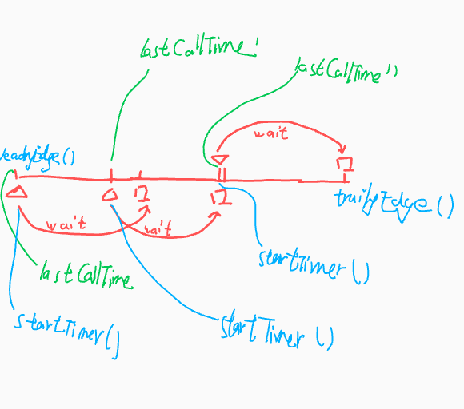

# Lodash 阅读记录

{{TOC}}

Lodash 是一个工具库。它有对数据更严格的处理，阅读它利于加深我对 javascript 的理解，作为大型开源项目，编码也很规范，阅读它会提高我的编码水平。Lodash 最新（08/22/22）主分支上的版本中，每个函数按模块单独分开，每个模块不长，十分利于阅读。

## .internal

### toKey

把入参转为字符串类型的键。`-0`通过‌“\`${-0}\`”后会得到`0`，因此：

```javascript
const result = `${value}`
return (result == '0' && (1 / value) == -INFINITY) ? '-0' : result // 负无穷大的时候直接返回 -0
```

### Hash

Hash 维护一个数组 \_\_data\_\_，维护一个长度 size，包含 5 个方法，
- 用于清空的 clear，
- 用于删除的 delete，
- 用于获取的 get，
- 用于判断是否存在的 has，
- 用于添加数据的 set，

Lodash 会用常量`__lodash_hash_undefined__`来表示设置某个键的值为`undefined`。

### MapCache

MapCache 是一个包装类型，包含了三类数据——`string`、`hash`和`map`，
- 如果键是 string，用 string 类型存储，
- 如果键是 number、symbol、boolean、null，用 hash 类型存储，
- 其他情况用 map 存储，

Hash 类型就是`.internal/Hash`。

### SetCache

Set 是一种数据结构类型，这种类型存储唯一的值。

在 Lodash 的实现中，SetCash 是 MapCache 的特殊情况。SetCache 有两个方法，`add`和`has`，要添加一个 set 值时，把这个值当作 MapCache 的键，并把这个键的值设置为`__lodash_hash_undefined__`。

相关链接：[Set (abstract data type)](https://en.wikipedia.org/wiki/Set_(abstract_data_type))

### ?strictIndexOf

indexOf 的严格版本，比较的时候使用`===`。

```
var a = [1, undefined, null];
a.indexOf(null); // 2（预期 1）
a.indexOf(undefined); // 1
```

### baseIsNaN

判断是否是`NaN`，`NaN !== NaN`为 false。

### baseFindIndex

遍历数组，每一个元素执行断言函数，第一个成功断言的返回数组下标。

有一个向左向右遍历的技巧：

```javascript
let index = fromIndex + (fromRight ? 1 : -1) // 如果向左，游标加 1，如果向右，游标减 1
while ((fromRight ? index-- : ++index < length)) { // 这里向左的部分，“--”应该放在后面，这样才能遍历到 0 的情况
  // 省略
}
```

### baseIndexOf

Lodash 实现的 indexOf。其中在检查非 NaN 的情况使用 strictIndexOf，在检查 NaN 的情况使用 baseFindIndex。

这里在非 NaN 的情况也可以用 baseFindIndex。baseFindIndex 接收一个断言函数，也就是 baseFindIndex 被设计的很抽象，可以另外定义一个`isEqualToValue`，然后放入 baseFindIndex 中，就可以省去引用 strictIndexOf。但这只是一个函数（isEqualToValue）代替另一个函数（strictIndexOf）的问题，直接使用 strictIndexOf 反而可读性更好，代价只是牺牲一点组合技巧。

### arrayIncludesWith

和 arrayIncludes 类似，arrayIncludesWith 引入了比较器 comparator，用来比较数组的每个元素（arrayItem）和目标值（target），“comparator(target) === arrayItem”。

### arrayIncludes

Array.prototype.x 的 Lodash 实现。

### cacheHas

简单封装`cache.has(key)`。

### setToArray

Set 转 array。入参 set，forEach 循环 set，放入 array。

### ?createSet

创建 set。

```
(Set && (1 / setToArray(new Set([,-0]))[1]) == INFINITY) // ?
  ? (values) => new Set(values)
  : () => {}
```

### baseUniq

数组去重的更高层抽象，另外有 iteratee 和 comparator 两个入参，分别用于计算每个元素和比较每个元素。

baseUniq 主要维护两个数据，seen 和 result。result 是最终去重后的结果；seen 里存放 iteratee 计算后的结果，seen 里的元素也都是唯一的，只不过是经过了计算。

函数 baseUniq 包含一些优化和技巧：

- 为了优化性能，对长度大于 200 的数组，更换存储的数据类型（Lodash 实现的 Set），不用像数组在查找某个元素的时候遍历；
- 通过`value !== 0 ? value : 0`来让`-0`和`+0`都转换为`0`；
- 通过`computed === computed`来判断值是不是`NaN`。

### isIndex

Javascript 的数字存储使用了 IEEE 754 中规定的双精度浮点数数据类型，这一数据类型能够安全存储 -(2^53 - 1) 到 2^53 - 1 之间的数值（包含边界值）。超过范围的计算会发生错误。

```javascript
// 最大安全整数
const MAX_SAFE_INTEGER = 9007199254740991
```

---

`?:`表示[非捕获组](https://zh.javascript.info/regexp-groups#fei-bu-huo-zu)。

```javascript
// 大于等于 0 的整数正则
const reIsUint = /^(?:0|[1-9]\d*)$/
```

非捕获组的例子：

```javascript
let str = "Gogogo George!";
// ?: 从捕获组中排除 'go'
let regexp = /(?:go)+ (\w+)/i;
let result = str.match(regexp);
/**
 * {
 *   0: "Gogogo George",
 *   1: "George",
 *   groups: undefined,
 *   index: 0,
 *   input: "Gogogo George!",
 *   length: 2,
 * }
 */
```

---

```javascript
// 浮点数的 value 不能通过 value % 1 == 0
(value > -1 && value % 1 == 0 && value < length)
```

### getTag

```javascript
const toString = Object.prototype.toString
function getTag(value) {
  if (value == null) {
    return value === undefined ? '[object Undefined]' : '[object Null]'
  }
  return toString.call(value)
}
```

相关历史问题：

这里的 `toString(null)`同样可以得到`[object Null]`，但是在第 4 行单独对 null 的情况返回了硬编码的字符串`[object Null]`，这是因为在旧版本的 js 环境，`toString(null)`的结果是[object Object]。

相关链接：[typeof-Real-world usage](https://developer.mozilla.org/zh-CN/docs/Web/JavaScript/Reference/Operators/typeof#real-world_usage)——在 mdn 的 typeof 文档里，有一条注释说明了老的 js 环境的`toString(null)`的结果，“Early JS environments return '[object Object]' for null, so it's best to directly check for it.”。

### isObjectLike

`typeof`是`object`而且不是 null 的时候，定义这个变量是类对象的。

关于这个函数中判断的顺序：假设返回值为 false，`value !== null`放在前面，value 需要全等 null 的时候才能满足，这样省去了后面的`typeof value === 'object'`判读。但可以猜测实际中，大部分情况的入参不会是 null，所以`value !== null`的判断放在了后面。

结论：多个条件`&&`的时候，容易失败的放在前面。

```javascript
function isObjectLike(value) {
  return typeof value === 'object' && value !== null
}
```

### isLength

基于 ECMA 的 [ToLength](https://262.ecma-international.org/7.0/#sec-tolength) 实现。

范围是 0 到 2^53 - 1。

```
typeof value === 'number' &&
    value > -1 && value % 1 == 0 && value <= MAX_SAFE_INTEGER
```

### isArrayLike

类数组，不是函数类型，有`length`属性（0 到 2^53 - 1）。

```
value != null && typeof value !== 'function' && isLength(value.length)
```

### isObjectLike

类对象，非 null 并且`typeof value === 'object'`。

### stringToPath

```
/[^.[\]]+|\[(?:([^"'][^[]*)|(["'])((?:(?!\2)[^\\]|\\.)*?)\2)\]|(?=(?:\.|\[\])(?:\.|\[\]|$))/g
```

```javascript
const rePropName = RegExp(
  // Match anything that isn't a dot or bracket.
  '[^.[\\]]+' + '|' +
  // Or match property names within brackets.
  '\\[(?:' +
    // Match a non-string expression.
    '([^"\'][^[]*)' + '|' +
    // Or match strings (supports escaping characters).
    '(["\'])((?:(?!\\2)[^\\\\]|\\\\.)*?)\\2' +
  ')\\]'+ '|' +
  // Or match "" as the space between consecutive dots or empty brackets.
  '(?=(?:\\.|\\[\\])(?:\\.|\\[\\]|$))'
  , 'g')
```

相关链接：

- [前瞻断言和后瞻断言](https://zh.javascript.info/regexp-lookahead-lookbehind);
- [str.replace(str|regexp, str|func)](https://zh.javascript.info/regexp-methods#strreplacestrregexpstrfunc)

### copyArray

前拷贝数组。`array || (array = new Array(length))`表示提供了 array 则不创建，否则创建。

## public

### ?times

两个入参，n 和 iteratee，times 的作用是迭代 n 次 iteratee，并把每次迭代的结果放入一个数组中。

Times 限制了最多循环 9007199254740991（MAX_SAFE_INTEGER），数组最长长度 4294967295（MAX_ARRAY_LENGTH）。如果数组长度用完了，仍然迭代剩余的 iteratee。

times 的问题（下面代码块的第三行将不会执行）：

```javascript
index = MAX_ARRAY_LENGTH
n -= MAX_ARRAY_LENGTH // n = MAX_ARRAY_LENGTH + 1 的时候，执行这一行后 n = 1
while (++index < n) { // MAX_ARRAY_LENGTH + 1 < 1 🚫 不会执行
	iteratee(index)
}
```

### [debounce](https://github.com/lodash/lodash/blob/master/debounce.js)

为了解释方便，做一些定义：
- f，被调用的函数，希望不被频繁调用的函数；
- debounce，防抖函数；
- df，防抖化函数，也就是执行 debounce(f, 600) 的结果。

通常防抖的实现：
- df 每一次执行，清除上一次的定时器，生成新的定时器，这样可以一直向后延迟，让 f 在每两次时间间隔小于 600ms 的一系列调用中只执行 1 次；
- 假如用户在 600ms 内调用了 100 次 df，就进行了 100 次删除并创建定时器的操作，存在性能代价。

Lodash 的防抖的实现不同，Lodash 不清除定时器，假设用户已经频繁调用 df 了 3000ms，Lodash 最多只创建 5 次定时器，所以防抖的性能稳定。



这张图的三角形表示调用 df，正方形表示预期执行 f，最右边的正方形真正执行了 f。

利用`requestAnimationFrame`代替`setTimeout`，在没有指定`wait`延迟时间的时候优化性能。

相关链接：
- [聊聊lodash的debounce实现](https://github.com/ColaDaddyz/Blog/issues/8)

### memoize

缓存函数的结果。提供了第二个入参，resolver，

```javascript
var memoizedFunc = _.memoize(func, resolver);
memoizedFunc(1, 9, 9); // 这里将会使用 resolver(1, 9, 9) 的值作为缓存的 key
```

，上面的 memoizedFunc 使用 resolver 来生成作为缓存的键，由用户决定，否则默认情况下取 memoizedFunc 的第一个入参。

对于判断条件`typeof func !== 'function' || (resolver != null && typeof resolver !== 'function')`，`||`后面的`resolver != null`起到了性能优化的作用（这里假设执行“resolver != null”的代价比“typeof resolver !== 'function'”要小），因为预想中的大部分调用 memoize 的时候不提供 resolver。

### isArguments

入参是`arguments`类型时，是可以判断的，通过 typeof value === "[object Arguments]"。

## 已完成

uniq, baseProperty, times, getTag, isSymbol, toKey, memoize, memoizeCapped, stringToPath, map, toPath, flip, delay

## 标记

- toArray，做了 utf-16 长度的兼容。

## 问题

p/isSymbol：`value != null`的作用？

p/memoize：为什么是`memoized.cache = cache.set(key, result) || cache`而不是直接使用`cache.set(key, result)`？

p/toPath：`copyArray(stringToPath(value))`中的`stringToPath(value)`已经返回了新数组，为什么还要套一层 copyArray 浅拷贝一遍？

## 重看

stringToPath：匹配对象`.`和`[]`表示的属性的正则。

## TODO

- createSet