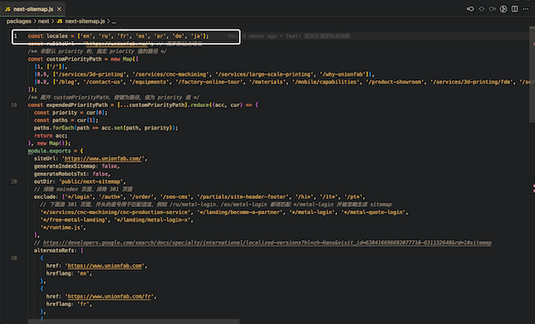

# 23年8月到24年6月Next.js12的性能和SEO实践

后面的内容会涉及到项目里页面的类型，下面是这些类型的一个概览。细分下来，`unionfab.com` 有下面 6 种类型的页面：

1. 内部自己的页面，如首页、why-unionfab；
2. 兼容 Next.js 的静态缓存（`static-cache` 文件夹下）的页面，使用 innerHTML 和 appendChild 兼容（`<DangerouslySetInnerHTML>` 组件），这些页面的导航栏可以使用 Next.js 的路由，无感跳转，但是内容没有翻译；
3. 拼接的页面（使用 site-header-footer 拼接头尾导航栏），拼接的页面不能使用 Next.js 的路由无感跳转：
	- 存在项目本地的，在 `static-cache` 文件夹下的静态缓存的页面；
		- 
	- 实时拉取 Wordpress 的博客页面；
		- 
	- 商城。
		- 
4. 非 Wordpress 的博客页面，这些页面由 Cao 用 Vue 写的 CMS 管理，基本可以从导航栏的“Resources”面板下访问，目前暂时是 SSR，速度稍慢。
	- 

以下是基于 Next.js 12 的营销页做的实践，Next.js 14 或之后的版本可作参考。

## 性能

- 渲染方式从 SSR 向 SSG 迁移；
- 全路径导入依赖，缩小产包，避免 `export *`（桶文件）导致的摇树失效；
- 延迟统计、日志脚本的加载，延迟加载 IM iframe；
- 组件库的用法优化；
- 固定图片的宽高，固定图片的比例，避免布局抖动；
- 将图片的尺寸缩放成适当大小，并且缩小图片体积；
- 图片、视频等资源的懒加载；
- 移除导航栏大量链接的 prefetch；
- 同步线性的多个请求修改为异步的 allSettled 请求；
- 移除未使用的依赖。

### SSG 迁移

#### 营销页面的 SSG

营销页中，几乎所有页面只需要动态获取 SEO 数据，原来的 SSR 在每次请求后，next 服务再向存储 SEO 的 Supabase 数据库请求 SEO 数据，会有长时间白屏问题，除了请求 SEO 数据外没有其他接口请求需要，所以替换为 SSG，将请求 SEO 的时间转移到编译期间。

Supabase 中的 SEO 数据可以由运营人员动态改动，为了避免每次改动需要开发重新打包部署，使用了增量静态生成（isr）的按需重生成，它会在更新 SEO 之后向 next 服务发送一个接口，服务器上的 next 服务会在后台生成对应最新的静态页面，而无需重新打包部署。


isr 按需重生成的坑：营销页有 3 个节点，法兰克福、硅谷和阿里云上部署的，isr 按需重生成只会更新一个节点，比如我在中国打开营销页，做 SEO 的更新，更新之后可能只会更新阿里云上部署的营销页的页面，另外两个节点的页面还是老页面。

isr 按需重生成的填坑方法参考：

- 找到一种方法，为不同的节点生成不同的 isr 按需重生成接口，在运营人员改动后，调用每个 isr 按需重生成接口；
- 不使用 isr 的按需重生成，就用传统的，isr 提供了定时的选项，超过了定时期，next 服务接收到了定时期之后的第一个人的访问，就重新 SSG 更新最新的页面；
- 维护一个版本数据库，客户访问到页面后检测到版本过旧，给用户提供更新按钮，点击之后做 isr 的按需重生成（这种方法比较适合商城的 SSG）；
- SEO 不是常更新数据，彻底删除编辑 SEO 信息的功能。

相关链接：
[Data Fetching: Incremental Static Regeneration (ISR) | Next.js](https://nextjs.org/docs/pages/building-your-application/data-fetching/incremental-static-regeneration)

#### 缓存的 Wordpress 页面 SSG

缓存的 Wordpress 页面存放在 `static-cache` 文件夹中。


目前 `static-cache` 里有一部分页面通过 SSR，在每次请求的时候读取这些页面，做页面的裁剪拼接，下面是几点这种方法的问题：

- 兼容代码会破坏原项目的架构和自然逻辑，变得难维护；
- 通过裁剪兼容后的页面功能不全，不能使用 Next.js 的平滑路由跳转；
- 页面出现后，再等待一会后才出现导航，加载慢，为了提速，需要自己在 next 服务里维护一套额外缓存逻辑；
- 复杂的兼容代码，很容易导致忘记移除老代码、检查是否有重复的新代码，会出现越来越多的重复执行或重复导入资源。

拼接的是页面的头部导航栏和尾部导航栏，这两块来自 `pages/partials/site-header-footer.tsx`。

目前 `static-cache` 里有另一部分使用 SSG，通过 `innerHTML` 和 `appendChild` 来兼容这些缓存页面，具体可以查看 `<DangerouslySetInnerHTML>` 组件和它的使用方式，下面有一些点要注意：

- 平滑路由会在一个浏览器窗口执行每一个访问到的 Wordpress 页面，里面的脚本也会重复执行，要考虑这些代码是否会增加窗口的内存占用，例如重复监听事件；
- 不能直接使用 React 的 `dangerouslySetInnerHTML` 兼容，是因为这个属性不会执行字符串里的 `<script>` 标签里的脚本；
- `<head>` 标签里的内容是通过 useEffect 加载到页面中的，其中包括的 `<title>` 和其他 meta 标签的加载可能会影响到 SEO。

非静态缓存到本地的 Wordpress 博客页面，线上的，不做 SSG 迁移，因为可能有更新，做了 SSG 意味着只会在打包时更新页面内容。

#### 商城的 SSG

经过尝试，商城也可以通过上一节提到的 `<DangerouslySetInnerHTML>`，加入 SSG 的渲染方式。

商城本身被单独部署在另一个域名（`service.unionfab.com`）下，营销页会进行拼接整合，如果商城发布，营销页用 SSG 整合，同时就要也重新发布营销页。这样会复杂化发布流程，如果确实需要 SSG，可以考虑这个方法：维护一个版本数据库，客户访问到页面后检测到版本过旧，给用户提供更新按钮，点击之后做 isr 的按需重生成。

目前商城仍然是通过 SSR 拼接裁剪页面的方式，兼容到 `unionfab.com` 这个域名下的，用户访问商城，首先向 `unionfab.com` 的 next 服务请求，next 服务再向部署商城的页面请求，返回 html 给 next 服务后，再请求 `site-header-footer` 页面，进行页面的头尾导航栏拼贴。

### 全路径导入

`_app.js` 文件做了全路径导入的优化，把形如 `@/components` 之类的引入桶文件中的依赖，优化成类似 `../../components/xxx/index`，优化之后缩小了 700Kb。

登录按钮组件占用产包 1Mb，优化或重构之后可以缩小大量产包体。


### 组件库用法优化

antd 的走马灯（轮播图）组件，切换效果从滚动改为了渐隐（effect="fade"），提升了 cls 指标。要注意，组件某些属性不同的实现方式会导致一些性能指标问题。

<details>
<summary>展开查看轮播图渐隐效果的 GIF 图片。</summary>


</details>

### 比例图片的初始固定宽高

设置固定的比例宽高，避免 cls 问题，可以通过 `padding` 和 `aspect-ratio` 这两个属性设置，例如设置 1:0.75 的宽高，可以设置 `padding-bottom: 75%`，`padding` 的百分比是基于元素自身的宽度的。

<details>
<summary>展开查看比例图片在拖动浏览器窗口时变化的 GIF 图片。</summary>


</details>

### 缩小图片尺寸，压缩图片体积

在合适的屏幕上展示合适尺寸的图片，不能在 1980 宽的屏幕上展示原始宽度 5000 像素的图片，否则浏览器会阻塞做做图片的缩小导致局部白屏。如果只提供了一张图片，图片的尺寸不能大于最大版心宽度。其他还需考虑设备的分辨率，例如 1500px 的渲染宽度，在苹果设备上会需要 3000 实际像素的图片。

尺寸修改之后，使用类似“https://tinypng.com/”的工具进行体积压缩。


如果能提供一张图片在不同屏幕上的不同版本，可以使用 `<picture>` 元素结合 `<source>` 元素，定义 `<source>` 元素的 `media` 属性，这样浏览器会在不同屏幕上按需适配展示不同的屏幕。这种 HTML 元素的方式相比通过 CSS 媒体查询和 JS 监控屏幕宽度有几点好处：

- JS 监控很慢，要等待脚本加载；
- CSS 媒体查询需要配合 `` 的 `loading="lazy"` 才能实现懒加载，否则依然一次性全部图片加载，`loading="lazy"` 有兼容性问题；
- HTML 元素的方式最快，如果样式表和脚本加载失败，图片依然能按要求展示。

可以查看 InstaMach 站点的首页轮播图的实现方式，其中的每张图片需要提供两个版本，宽屏和窄屏的版本，并且利用了 `<picture>` 和 `<source>` 来实现。

相关链接：
- [响应式图片 - 学习 Web 开发 | MDN](https://developer.mozilla.org/zh-CN/docs/Learn/HTML/Multimedia_and_embedding/Responsive_images)
- [next.config.js Options: images | Next.js](https://nextjs.org/docs/pages/api-reference/next-config-js/images)

### 资源懒加载

资源需要懒加载，例如图片可以在滚动到指定位置之后懒加载，视频在点击播放之后再加载。图片使用 Next.js 的 `<Image>` 组件即可懒加载。

`services/3d-printing` 页面在没有进行视频懒加载之前，进入这个页面至少要支付 1GB 的流量。


### 移除链接的 prefetch

使用 Next.js 的 `<Link>` 组件，对于 SSG 页面，默认会打开 `prefetch` 预请求页面。
导航栏有上百个链接，可能影响性能，所以关闭了大部分链接的预加载（prefetch）选项。


```html
<Link href="/ok" prefetch={false}>ok</Link>
```

相关链接：https://nextjs.org/docs/app/api-reference/components/link#prefetch

### await 请求

SSR 中，不使用多个同步的 await 代码，应该用 `Promise.allSettled` 或者 `Promise.all` 包裹起来，避免白屏阻塞。在 js 业务代码中，同样要避免多个线性同步的 await 代码。

## SEO

- 生成结构化路径，展示面包屑组件；
- 由接口管理的 title 和 description 配合 SSG 做增量静态生成；
- 使用 canonical `<link>` 标签规范网址，避免用于统计的 query string 被单独收录，例如避免 `https://official.com?code=abc` 被收录；
- 规范并生成多语言的 sitemap，为 sitemap 排除 noindex、301 页面；
- 为每个页面的多语言添加 alternate `<link>` 标签；
- 对禁止抓取的网址添加 noindex `<meta>` 标签或响应 noindex 头；
- 为图片添加 `alt` 属性、规范页面标题结构；
- 规范页面路径，启用硬 404，对旧路径实行 301 跳转；
- 点击事件跳转页面替换为 `<a>` 标签，增加内链数量；
- 性能优化。

### 面包屑组件（BreadcrumbList）

组件在它的文件夹下提供了详细的文档（packages/component/src/layout/BreadcrumbList/README.md）：


面包屑组件会做两件事情：

1. 渲染用于展示给用户的面包屑的 UI；
2. 生成用于 SEO 的结构化数据。

下面的图片，左边框选的蓝色部分是 UI，右边框选的数据是用于 SEO 的结构化数据，这两者会通过组件生成：


这两个功能总是同时出现在一个页面中，并且只会出现一次，因此封装到了一个组件中。后续，可以继续优化该组件，例如添加属性，只生成 UI，添加另一个属性，只生成结构化数据，这样更灵活。

面包屑提供了两种用法，分别是配置式和行内式：
- 配置式就是在使用面包屑组件前，要先在配置文件中进行面包屑数据的配置编写，这个文件和面包屑组件在同一文件夹内，名称为 `data.ts`，`data.ts` 的具体用法请查看面包屑组件的 `README.md`；
- 行内式，即无需考虑上面的配置文件夹，直接将面包屑数据作为属性传递给组件即可，使用起来很方便。

两种方法，按需考虑，未来如果行内式更方便可删除配置式，如果配置式更利于管理也可移除行内式。

结构化数据会体现在 Google Search Console 的路径面板，搜索引擎中，会展示在每个搜索结果的标题下面：


相关链接：https://developers.google.com/search/docs/appearance/structured-data/intro-structured-data?hl=zh-cn

### SEO 数据和增量静态生成

SEO 数据通过接口获取，在保证页面 SSG 的前提，也要动态更新页面，所以使用了增量静态生成，但由于站点部署到了 3 个站点，增量静态生成不能同时更新这 3 个站点。具体的问题请查看上面“性能”一节的“营销页面的 SSG”，对问题做了详细解释。

### Canonical link 标签

链接携带 query-string 不应该被收录，例如 `www.unionfab.com?origin=xyz`，这里需要为页面添加 canonical 标签设置一个页面的权威链接来排除这个问题。

通过谷歌 search console 找到哪些 query-string 链接被收录，进入“已编入索引的网页数量”页面，`Ctrl/Cmd + F` 搜索“?”即可：

| 第一步 | 第二步 | 第三步 | 第四步 |
|:--|:--|:--|:--|
|  |  |  |  |

除了上面按需逐个页面添加 canonical 的方法，也可以提前在所有页面添加，在 `_app.js` 中添加。

可以参考 Apple 的官网，任意打开页面，切换不同的语言，打开开发者工具，在源码中搜索“canonical”。

### Sitemap 站点地图

官网的 sitemap 可以从 `packages/next/public/sitemap.xml` 中看到：


其中的 `https://www.unionfab.com/next-sitemap/sitemap-0.xml` 是由脚本生成的，脚本的路径是 `packages/next/next-sitemap.js`，生成的站点地图包含营销页的所有页面。


脚本里维护了一些东西，当新增或删减某个语言的时候做一些更改，例如下面图片里框选的 `locales` 数组：



脚本里面，下面图片框选的函数，主要作用是避免生成错误的多语言路径，另一个作用是单独适配俄语的路径，因为俄语的域名不一样：


由于俄语的域名不同，导致站点地图在 Google Search Console 的解析出现错误：


实际的站点地图会在打包之后生成，生成之后可以查看，或者也可以通过下面图片里的这个命令直接生成（`npm run postbuild`），可能有时会失败：


相关链接：https://developers.google.com/search/docs/specialty/international/localized-versions?hl=zh-cn#html

### alternate link 标签

alternate 有三种设置，分别是 `<link>` 标签、http 请求头和站点地图，这 3 种方法取一种即可，目前营销页通过站点地图设置 alternate，站点地图的 altenate 在 sitemap 脚本里自定义设置：


相关链接：https://developers.google.com/search/docs/specialty/international/localized-versions?hl=zh-cn

### noindex 页面

添加 noindex meta 标签表示不希望搜索引擎收录，目前代码里有两种 noindex 方式，一种添加 noindex meta 标签，另一种在响应头中加 `'X-Robots-Tag': 'noindex'`。


相关 commit hash：758099b2ab3c14e06a

使用 noindex 的页面不多，例如登录页、下单页，这些都可以从 SEO 一节开头的表格链接里找到。

有的页面单独维护响应头的 `'X-Robots-Tag': 'noindex'`，是因为这些页面不走 Next.js 的 SSR 或 SSG，是自己生成的 HTML 字符串内容返回给客户端。

相关链接：https://developers.google.com/search/docs/crawling-indexing/block-indexing?hl=zh-cn

### 301 跳转

项目里用了两种方式实现 301 跳转，一种在 Next.js 配置文件配置 `redirects`，另一种向客户端返回 301 相应代码。

#### 配置文件配置 `redirects`

配置文件路径：`packages/next/next.config.prod.js`
配置是一个对象，对象里有一个属性 `redirects`，这个属性的值是一个函数，返回需要重定向的页面。


需要注意，不应该出现连续重定向或者经常改动重定向的情况，经常重定向可能不利于收录。

在这个配置文件里有一个辅助函数 `gen301Config`，可以用来生成 `redirects` 需要的结构，简化流程。

#### 返回 301 响应代码

用在 Wordpress 博客页面（这些页面不是缓存到本地的，是线上的），`unionfab.com` 在访问博客页面的时候，会在 next 服务中拉取 Wordpress 的页面，获取到页面的字符串后，再和 `unionfab.com` 自己的头部、底部导航栏做拼接，最后返回给客户端。

由于 Wordpress 内容是在 next 服务里获取的，如果请求的 Wordpress 页面在 Wordpress 管理平台设置了重定向，用户在浏览器客户端是不能感知到的，因为用户拿到的是已经在 next 服务里重定向后的结果。

目前项目针对 Wordpress 页面的重定向要反映在浏览器重定向的需求，做了处理，会在 next 服务中，请求 Wordpress 页面时首先做 Head 请求，而不是获取完整的内容，如果获取的状态码是 301 重定向，则把这个 301 状态码的响应头直接返回给浏览器客户端，让浏览器继续重定向的操作。

下面的图片展示了代码在项目里大概的位置：


相关链接：[next.config.js Options: redirects | Next.js](https://nextjs.org/docs/pages/api-reference/next-config-js/redirects)

### 链接的 \<Link\>（\<a\>）标签

**纯链接**应该使用 `<Link>` 标签，**不能使用点击事件进行跳转**，纯链接有利于 SEO 内链。

Next.js 提供的 `<Link>` 组件，会在多语言的时候，自动插入多语言前缀，例如默认语言的路径是“/why-unionfab”，切换日语后，语言的路径会变成“/jp/why-unionfab”；第二，`<Link>` 组件支持平滑切换路由，无需刷新浏览器标签页；第三，默认进行页面的预加载。
这些特性，单独使用 `<a>` 不支持。

Next.js 12，在设置样式、或是设置 `target` 属性的时候，需要额外在 `<Link>` 组件内套一层原生的 `<a>` 标签，Next.js 12 以上的新版本不需要添加 `<a>` 标签。

导航栏有上百个链接，可能影响性能，所以关闭了大部分链接的预加载（prefetch）选项。


相关链接：
[Components: \<Link\> | Next.js](https://nextjs.org/docs/pages/api-reference/components/link)