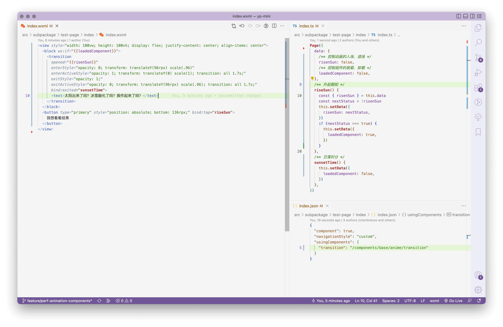
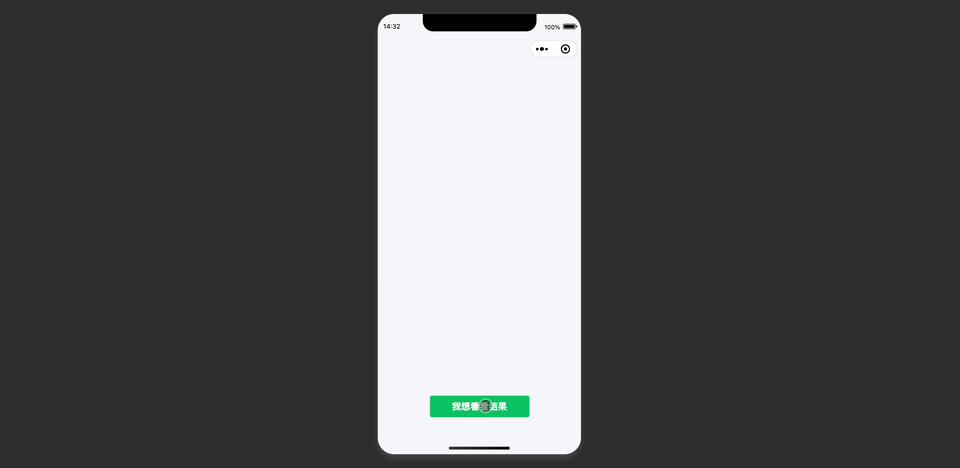
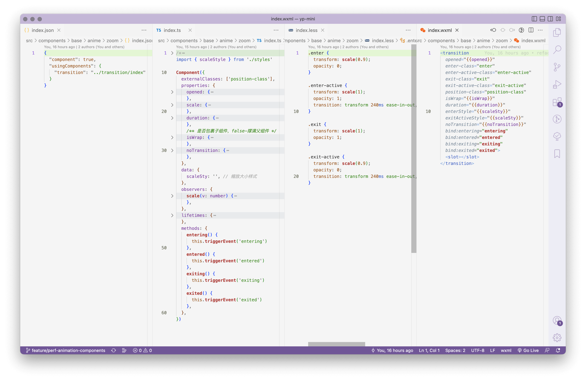
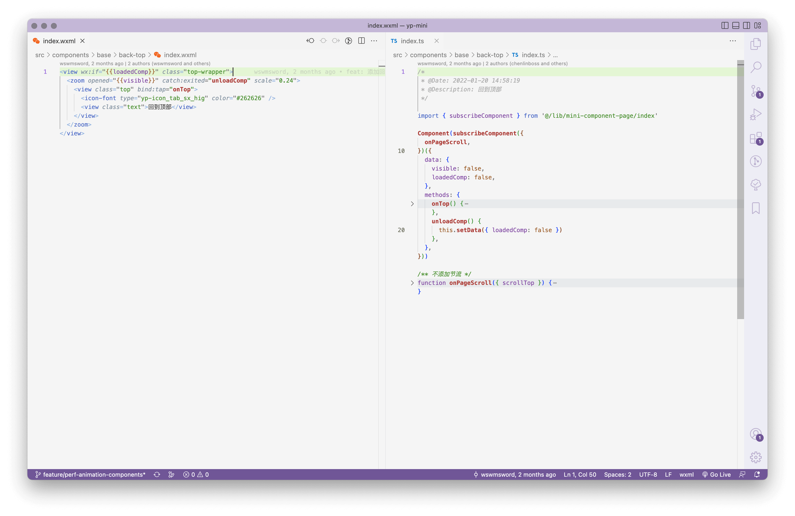
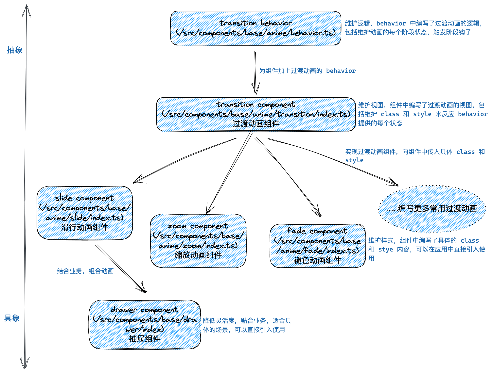
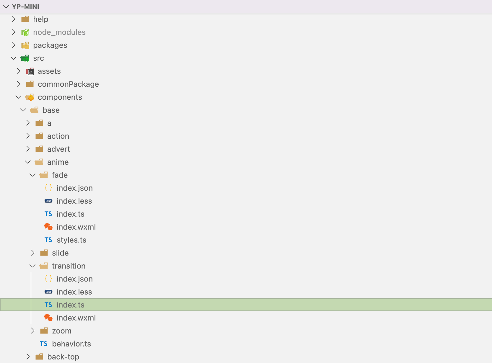

# transition 过渡动画组件

{{TOC}}

本组件（后面简称“过渡组件”）用来完成有**入场**和**退场**状态的动画。

过渡组件的路径：`/components/base/anime/transition/index`

通常，在不使用这类过渡组件前，我们会通过触发开关，进行 class 的添加和移除来渲染入场和退场动画。这么做的确已经实现了日常中的动画要求，但不足以面对更多的要求，例如：
- 卸载过渡组件来减轻页面体量上的压力；
- 友好地使过渡组件被屏幕阅读器识别（提高页面的可访问性）；
- 复用动画提升可维护性（减少业务中动画相关的“setTimeout”、“class”和样式）；
- ……

如果我们不抽象这类过渡组件，就要在每个需要动画的地方，维护定时器，在超过动画时间后执行卸载组件操作，或者维护动画开始（transitionstart）、动画结束（transitionend）事件，大量的非业务代码对于稳定维护业务是个考验。

下面的图片是首页的界面，包含了滑行动画（slide 组件）、缩放动画（zoom 组件）和渐变动画（fade 组件），这些动画都使用了过渡组件：


## 属性

向过渡组件传入动画每个阶段的 class 属性和开关属性 `opened` 即可完成动画的编写。每个阶段的 class 属性是“`enter-class`”、“`enter-active-class`”、“`exit-class`”和“`exit-active-class`”，下面的表格介绍了每个 class 对应的动画阶段，后面的“例子”章节中演示了具体的使用方法。

| Name | Type | Default | isRequired | Description
|:--|:--|:--|:--|:--|
| opened | boolean | false | Y | 为 true 进行入场动画，false 进行退场动画 |
| isWrap | boolean | true | N | 是否包裹子组件，为 false 则过渡组件的高度和宽度为“100%” |
| enter-class | string | / | N | 入场动画初始状态 class |
| enter-active-class | string | / | N | 入场动画结束状态 class |
| exit-class | string | / | N | 退场动画初始状态 calss |
| exit-active-class | string | / | N | 退场动画结束状态 class |
| position-class | string | / | N | 位置或方位的 class，被过渡组件包裹的内部组件可能是样式组件，通过这个 class，样式组件可以保持纯净，只有外观样式，不包含位置样式，如果该属性失效，则使用下面的 positionStyle，目前在百度小程序中，嵌套的外部样式类是无效的，已向社区反馈这个问题 |
| entering | ()=>{} | / | N | “入场动画开始了”钩子函数 |
| entered | ()=>{} | / | N | “入场动画结束了”钩子函数 |
| exiting | ()=>{} | / | N | “退场动画开始了”钩子函数 |
| exited | ()=>{} | / | N | “退场动画结束了”钩子函数，在这里执行卸载组件操作 |
| ignoreFirst | boolean | false | N | 禁止首次动画，如果考虑流畅度，可以用在嵌套动画的地方 |
| noTransition | boolean | false | N | 禁止动画 |
| duration | number | / | N | 过渡动画的时间，如果 class 中设置了就不需要再这里设置 |
| enterStyle | string | / | N | 入场动画初始状态 style，推荐用上面的 enter-class |
| enterActiveStyle | string | / | N | 入场动画结束状态 style，推荐用上面的 enter-active-class |
| exitStyle | string | / | N | 退场动画初始状态 style，推荐用上面的 exit-class |
| exitActiveStyle | string | / | N | 退场动画结束状态 style，推荐用上面的 exit-active-class |
| positionStyle | string | / | N | 位置的 style，如果 position-class 失效，则使用这个属性代替，等待百度修复问题后，再换回 position-class |

## 例子

### 生肉，直接食用

这是一个“朝阳升起夕阳沉落动画”的例子，例子里使用过渡组件，并以最快、最简单的方式完成了动画，且会在完成动画后卸载组件（函数 sunsetTime），下面的图片是所有代码：



上面的动画代码仅仅利用了过渡组件（transition），并且传入动画样式字符串，完成了一个过渡动画。

下面的动图是动画的效果：



下面是页面（wxml）代码：

```html
<view style="width: 100vw; height: 100vh; display: flex; justify-content: center; align-items: center">
  <block wx:if="{{loadedComponent}}">
    <transition
      opened="{{risenSun}}"
      enterStyle="opacity: 0; transform: translateY(96rpx) scale(.96)"
      enterActiveStyle="opacity: 1; transform: translateY(0) scale(1); transition: all 1.7s;"
      exitStyle="opacity: 1;"
      exitActiveStyle="opacity: 0; transform: translateY(96rpx) scale(.96); transition: all 1.7s;"
      bind:exited="sunsetTime">
      <text>太阳出来了吗？冰雪融化了吗？振作起来了吗？</text>
    </transition>
  </block>
  <button type="primary" style="position: absolute; bottom: 136rpx;" bind:tap="riseSun">
    我想看看结果
  </button>
</view>
```

下面是逻辑（ts）代码：

```javascript
Page({
  data: {
    /** 控制动画的入场、退场 */
    risenSun: false,
    /** 控制组件的装载、卸载 */
    loadedComponent: false,
  },
  /** 升起朝阳 */
  riseSun() {
    const { risenSun } = this.data
    const nextStatus = !risenSun
    this.setData({
      risenSun: nextStatus,
    })
    if (nextStatus === true) {
      this.setData({
        loadedComponent: true,
      })
    }
  },
  /** 日落时分 */
  sunsetTime() {
    this.setData({
      loadedComponent: false,
    })
  },
})
```

下面是页面配置（json）代码：

```json
{
  "component": true,
  "navigationStyle": "custom",
  "usingComponents": {
    "transition": "/components/base/anime/transition"
  }
}
```

### zoom 组件（缩放动画组件）

下面的图片是利用过渡组件实现了一个常见动画组件的代码内容（缩放动画）：



上面图片里的四个文件中，最重要的是“`index.less`”，可以看到“`index.less`”中有 4 个 class，分别表示缩放过渡动画的 4 个阶段，入场动画初始状态、入场动画结束状态、退场动画初始状态和退场动画结束状态。

把这 4 个表示动画状态的 class 字符串传递给“`index.wxml`”内的过渡组件标签（`<transition />`）中，再通过开关触发 `opened` 属性，这样就完成了缩放过渡动画。

从上面的代码可以看到，过渡组件相比缩放动画组件更抽象，这里的缩放动画组件在继承过渡组件的基础上，进行了样式的维护（封装）。缩放动画效果可以查看本文档头部的首页动图中，右下角的“回到顶部”按钮的动画情况。

另一个重要的事情是在完成动画后卸载，下面图片中的代码演示了在使用缩放组件时动画结束后卸载组件的方法：



可以看到上面的图中，“`index.wxml`”中向缩放动画组件标签（`<zoom />`）传递了 exited 方法，exited 方法是退场动画结束时的钩子，执行后变量 `loadedComp` 被设置成 false，组件卸载了。

## 结构

下面的图片是过渡组件相关文件的结构或关联情况：



下面的图片是过渡组件在编辑器中的树形结构情况：



## ⚠️ 警告 ⚠️

如果动画开始前或动画结束后，需要隐藏，请不要（也不能）使用“`opacity: 0`”或者“`left: -1000rpx`”表示隐藏，请使用“`visibility: hidden`”，或者销毁组件。使用“`opacity: 0`”和“`left: -1000rpx`”不会对屏幕阅读器隐藏，页面的无障碍体验会很糟糕，视觉上和元素结构中，请保持意义一致。

## 已知未修复问题

在入场动画即将结束时触发退场动画，可能闪退：
- 解释：在入场动画即将结束时，触发退场，期望是立即执行退场动画（这时不会触发入场动画的 transitionend），可实际情况是需要等待一段时间（视图->逻辑->视图）才执行退场，这时入场动画结束的回调 transitionend 已经执行完毕，而在这个回调中，我能识别到的动画状态是错误的退场状态，所以期望的退场动画没有出现，而是动画组件被立即卸载了。
- Solutions：
	1. 目前小程序没有提供 transitionstart 回调函数，日后如果提供，可以利用 transitionstart 确定动画的状态；
	2. 判断 transitionend 回调的时间和上次触发动画时间的时间差，如果像几十毫秒一样小，就代表用户的目的是完成退场动画，而不是立即结束，卸载动画，这可以保证动画稳定但会导致动画不被卸载，由于卸载的重要性，不应该使用该方案；
	3. 使用 setTimeout 定时器代替 transitionend 回调。
- 总结：目前使用 transitionend 在语义和易维护性上是最合适的，不推荐其它方案，应该尽快催促小程序官方尽快实现 transitionstart 钩子，如果有更好的解决方法，请修复。

## 其它

什么时候不需要该组件？
- 不需要获取动画各个阶段的回调（例如不需要动画执行完销毁组件，也即动画开始前才装载组件）；
- 动画开始前和结束后使用“`visibility: hidden`”隐藏；
- 在确定以上两点都不需要后，且自己编写动画更快捷方便的时候。

过渡组件的路径：`/components/base/anime/transition/index`

过渡动画组件路径：
- 缩放，`/components/base/anime/zoom/index`
- 褪色（渐变），`/components/base/anime/fade/index`
- 滑行，`/components/base/anime/slide/index`

同类组件：
- [过渡 Transition](https://doc.mini.talelin.com/component/animation/transition.html)
- [CSSTransition](http://reactcommunity.org/react-transition-group/css-transition)