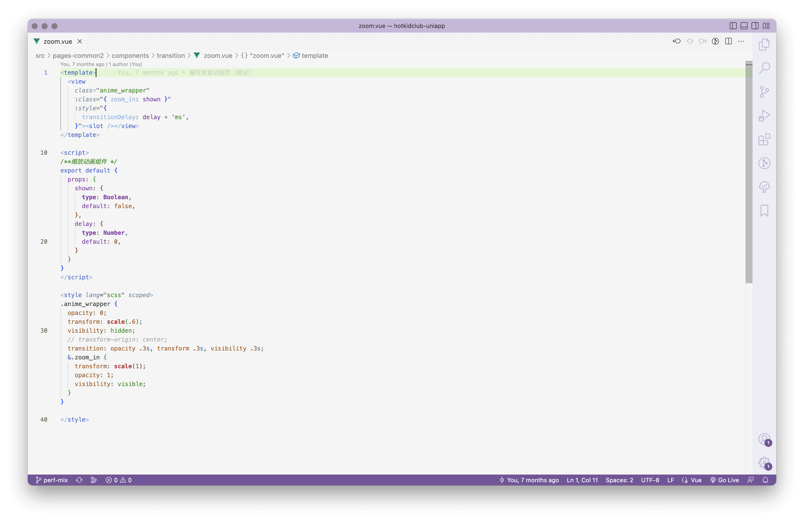
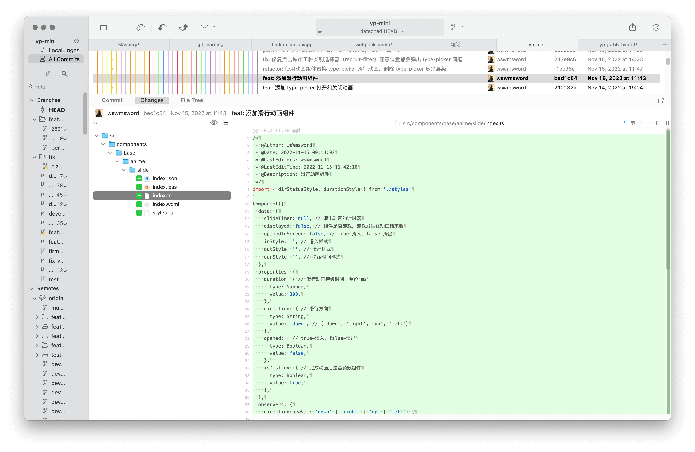
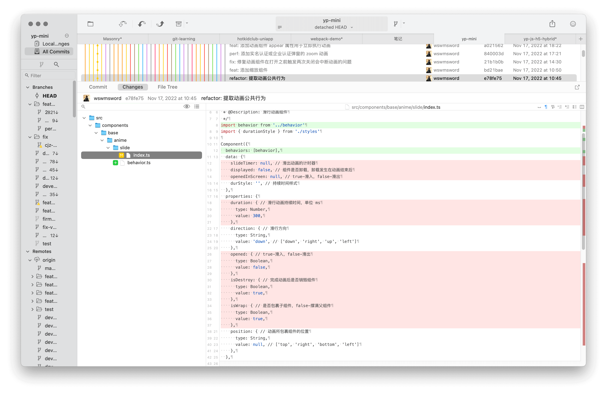
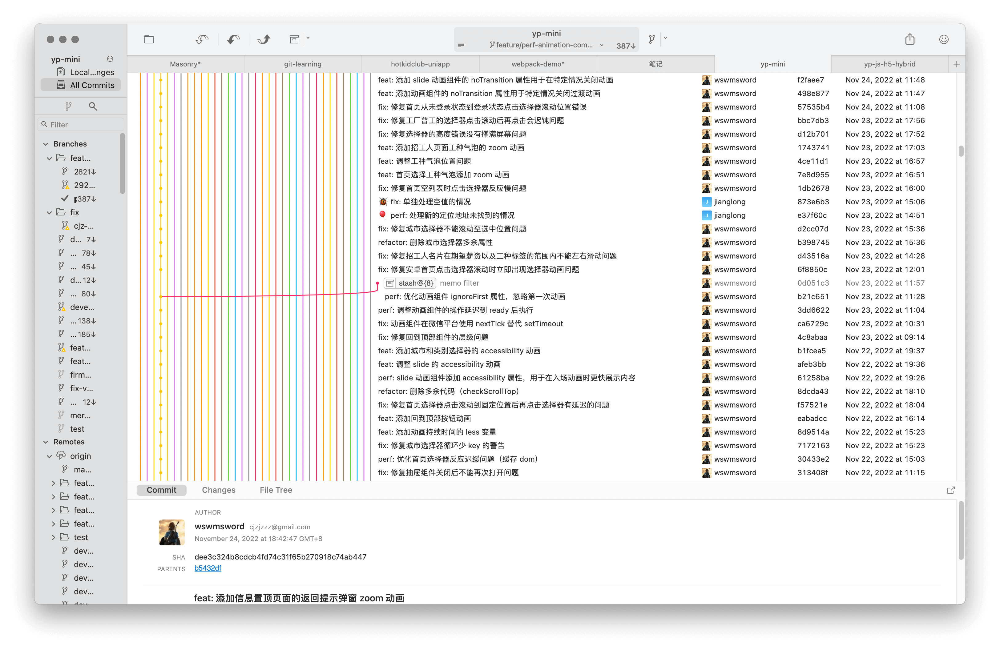
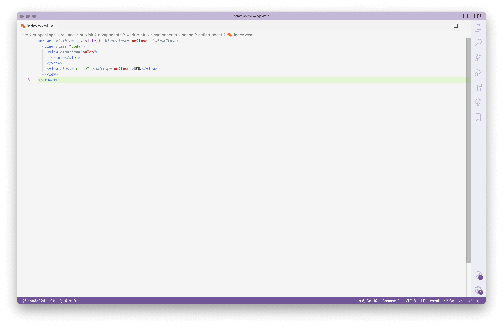
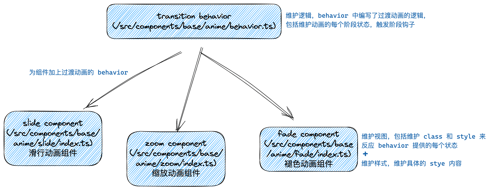
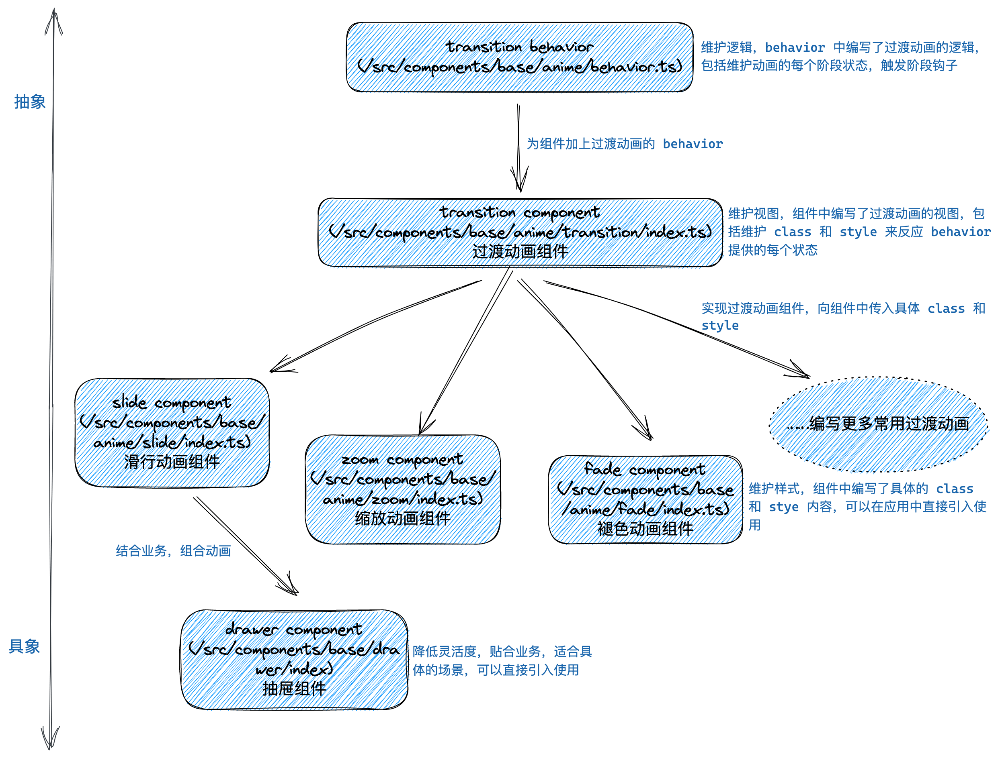

# 最近三个月编写的 transition 过渡动画组件

写一个组件需要几步？你可能在想，两步吗？
- 打开编辑器；
- 把组件代码写到编辑器。

我想这可能和绘画很像，认识、理解、勾勒、润色，如果不能一次做好，就要丢进纸篓，然后重复前面的步骤，最后才能看到成品。

> 在我读完《素描的诀窍》，我学到了动笔是诀窍，所以动动键盘。

在最近三个月在职的时间里，做的事情包括项目的两项需求、正则和字符编码方面的深入、无障碍的学习、[屏幕适配的实践](https://github.com/wswmsword/postcss-mobile-to-multi-displays)以及[过渡动画组件](./%E6%96%87%E6%A1%A3/transition%20%E8%BF%87%E6%B8%A1%E5%8A%A8%E7%94%BB%E7%BB%84%E4%BB%B6.md)的完善。从入职第二周左右开始优化项目的动画，到目前离职之际，可以说已经提取出了一个可用的组件，能够方便地完成过渡动画的工作（不用重复编写定时器、选择器和样式）。

接下来我会介绍过渡动画组件的编写过程，这个过程不会讨论结果，把源代码分解成若干部分解说，而是重走一遍编写组件之路。


首先不是构思，而是积累。仰望绽放的烟花，或者电视上惟妙惟肖的动画，都让我们最早地感受了真实的动画。后来，我们使用前端技术模仿，了解动画和性能的关系，观察每个项目对动画的处理，学会使用社区的动画库，编写成百上千的组件，学习编码技巧，每一个节点都让我们最终得以编写一个称心的过渡组件。道路无疑是漫长曲折的。

下面的图片是我编写的第一份缩放过渡动画组件（第三份工作）：



这是个简单的实现，对外提供两个属性，分别是开关和时间。推想一下，如果不使用组件，业务代码中也就会多出动画样式和选择器的代码。虽然整体不复杂，但已经实现了功能，而且做到了对业务代码的最小干扰。

> 这里只是希望出现动画效果，就需要嵌套一层 `<view>`，感觉有些浪费，这是因为小程序没有提供像 React 提供的 [cloneElement](https://zh-hans.reactjs.org/docs/react-api.html#cloneelement) API，否则是可以把这个组件作为一层“效果层”叠加到子元素上的。

三个月前，新项目（第四份工作）给了我重新（继续）完成过渡组件的机会。下面我会翻一翻 Git 提交记录，回顾一路上的细节。路上有三个里程碑，分别是“提取逻辑”、“覆盖使用”和“分层优化”。

## 提取逻辑

项目里动画的实现都会使用定时器 `setTimeout`，定时器的时间就是动画的持续时间，如果想要在动画结束后卸载刚才动画的组件，就可以在定时器的回调函数中完成这项工作：

```javascript
// 等待 300ms 完成动画
setTimeout(() => {
	// 如果是退场动画，销毁动画组件
}, 300);
```

项目里使用最多的是滑行过渡动画，最早，我把定时器直接卸载需要动画的地方，这一步正常实现了动画功能，在动画结束进行卸载，没有做其它的事情，这一步相当于“让程序跑起来了”。

可是项目中需要滑行过渡动画的场景还有很多。所以下一步就是封装一个滑行动画组件，及时封装，以防加重业务的负担：



> 这一步做的事情和我编写的第一份过渡动画组件是一样的，仅仅多了定时器完成卸载任务。

滑行动画经常被用在菜单、或是抽屉类的组件里。紧接着就是替换，这是重构的常规操作，把硬编码的定时器滑行动画替换为新封装的滑行动画组件，同时进行测试。完成替换后就要覆盖每个使用滑行动画的场景。

接着考虑下一个常用动画，也就是缩放动画，它会被用在所有的弹窗上。由于缩放动画和滑行动画仅仅样式不同，所以我们终于要提取逻辑了。下面的图片展示了提取逻辑之后的滑行动画组件，红色背景的部分是被提取进 `behavior.ts` 中而删除的部分，`behavior.ts` 就是被提取出来的逻辑：



提取是为了复用，提取之后也方便编写第三、第四个组件了。逻辑的具体内容不复杂，包括一个对外的开关属性、两个对外的动画开始和结束的钩子以及一个对内的动画真实的开关属性。

> 为什么需要对内的动画真实的开关属性，不是已经有对外的开关属性了吗？过渡动画至少有四个阶段，分别是入场动画开始前、入场动画开始后、退场动画开始前、退场动画开始后，可以把对外的开关属性理解为用来控制入场和退场动画开始前的阶段，而内部的则是用于控制入场和退场动画开始后的阶段。

## 覆盖使用

接下来的任务重复却重要，需要覆盖所有缩放组件的使用场景，进行添加、替换并调试。直到编写第三个渐变动画组件时仍是如此。

这一段路之所以重要，是因为重复的事情往往被小看，另一个原因是覆盖使用的场景越广，组件就更具兼容性，整体就更完善。

其中的一个问题是入场动画有小概率失效，当我把所有的行为都移到初始状态渲染完毕后执行，就没有再出现动画失效的问题了。其它的优化还有使用 transitionend 回调代替定时器，这样提升了易读性，可能也提升了性能；添加 noTransition 适应业务中需要临时关闭动画的场景；添加 accessibility 提高可访问性；对内部命名优化；添加进入动画和离开动画的钩子。

下面的图片展示了这一阶段的提交记录，大多是修复和优化兼容时的问题：



这是一次全身体检。也是在这时，动画方面的修改跟随新版本同步到了生产环境。

## 分层优化

为什么组件没有被组员使用？当然一方面是没有推广介绍，更重要的就是组件难以理解的对外属性了。通过观察旧代码中常用的动画组件，可以发现它们在组件命名、对外属性命名和对外属性数量上的优势，称手的组件当然要具备这些优势。

下面的图片展示了抽屉组件（`<drawer>` 元素）在业务中的使用：



从上面的图片可以看到，元素和属性的命名简单、具象、符和直觉，同时没有很多属性作为负担，所以当 `visible` 打开，我们就已经知道抽屉会向上滑动，由于抽屉组件没有层层嵌套，所以即使在使用时出现了问题，也能很快通过查看源码得到解决。

回到我编写的动画组件，虽然逻辑已经分离，但是样式层仍然混乱，而且样式和逻辑层保留着千丝万缕的联系，如果想要查看源码，就不得不再从样式层深入查看逻辑层，这样整个组件难以理解、维护与扩展。

下面的图片展示了此时过渡动画组件的结构情况：



从上面的结构图可以看到，组件一层同时维护了视图（标签）和样式（样式表）。

目前想扩展组件是困难的，因为我们希望扩展的是不同动画的样式，而视图基本没有变化，所以每当我准备新建一个动画组件时，就要复制一份其它动画组件的视图，这就是阻碍。

这时的逻辑层也是混乱的，多个动画组件中有些属性是公用的，而这些属性只属于视图层，可是复用心理作祟，它们目前被安置到了逻辑层，这带来了混乱。

能否分离视图和样式呢？如果样式在外层编写，通过选择器传递到内层，就可以做到，在目前的框架环境中可以通过一个叫做“外部样式类 externalClasses” 的功能来实现。

> 通过编写“`react-transition-group`”的经验，了解了通过外部选择器想内部传递样式的方法，同时学习到了过渡动画每个阶段的分类方法（入场动画前、开始入场动画、入场动画结束、退场动画前、开始退场动画、退场动画结束）。

下面的图片展示了使用外部样式类进行视图和样式分层之后的组件结构情况：



把属于视图的属性从逻辑层分离到视图层，解决了逻辑层混乱的问题；通过外部样式类解决了难以对动画组件进行扩展的问题。另外，这个组件里视图和逻辑的关系更近，视图就像是逻辑的代理，隐藏了复杂的内部细节，向外提供简单的 API。

现在的组件变得更容易扩展，只需要编写新动画的样式即可。组件的引入使用也更方便了，由于内部结构清晰，调试会更容易，如果想要类似“`<drawer>`”组件的实用性，在目前的动画组件上层继续包裹一层即可。

> 分层之后也带来一些框架层面的兼容问题，这是多端项目的特点，希望每个平台的差异越来越小。

在离职前的一两周，一段高压的业务迭代之后，结束了过渡动画组件第三阶段的收尾工作。

## 总结

经过三个月的勾勒、润色之后，过渡动画组件变成了一幅成品，现在它可用、稳定、易维护。

所以完成一个组件需要几步？没有标准答案，如果我来做，我会像素描一样完成一个组件。道路漫长曲折，我们只需要始终握住手中的方向盘。

下面的图片是我初学前端时（三年前），模仿 dribbble 上的某个作品制作的动画（animation 动画）：


## 其它

[查看源码文件](./%E6%BA%90%E7%A0%81/%E8%BF%87%E6%B8%A1%E5%8A%A8%E7%94%BB%E7%BB%84%E4%BB%B6/)
