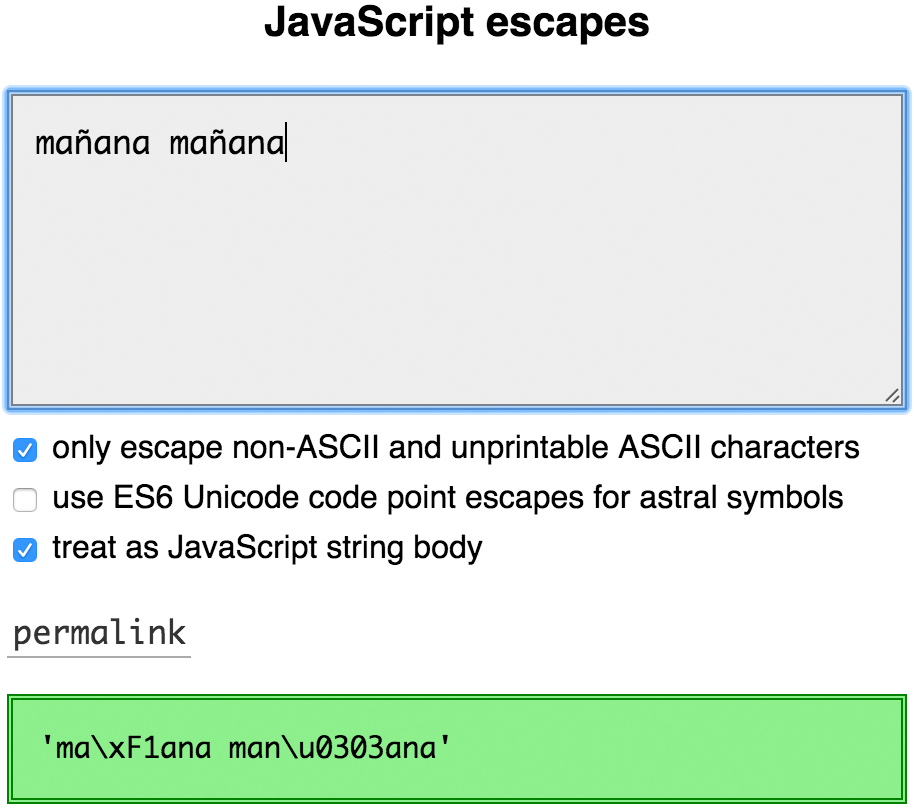

# JavaScript 有个 Unicode 天坑

原文：*https://mathiasbynens.be/notes/javascript-unicode*

来源：*‌https://stackoverflow.com/questions/54369513/how-to-count-the-correct-length-of-a-string-with-emojis-in-javascript*

原文日期：20th October 2013

原文作者：[Mathias](https://twitter.com/mathias)

翻译日期：01/16/23 00:15:24 CST

JS 处理 Unicode 的方法非常的……惊吓。本文解释了 JS 里和 Unicode 相关的痛点，提供了常见问题的解决方案，也解释了 ES6 标准是怎样改善现阶段的。

## Unicode 基础

在我们深入 JS 前，我们要保证我们对 Unicode 的理解在同一次元。

我们很容易把 Unicode 想像成一个数据库，它把所有符号都映射成了被称为**码点**的数字和一个唯一名称。这就能很简单地引用一个特定符号而不使用符号本身。例如：

- `A` is [U+0041 LATIN CAPITAL LETTER A](https://codepoints.net/U+0041). “A”使用“U+0041”引用拉丁大写字母 A。
- `a` is [U+0061 LATIN SMALL LETTER A](https://codepoints.net/U+0061). “a”使用“U+0061”引用拉丁小写字母 A。
- `©` is [U+00A9 COPYRIGHT SIGN](https://codepoints.net/U+00A9). “©”使用“U+00A9”引用版权符号。
- `☃` is [U+2603 SNOWMAN](https://codepoints.net/U+2603). “☃”使用“U+2603”引用雪人。
- `💩` is [U+1F4A9 PILE OF POO](https://codepoints.net/U+1F4A9). “💩”使用“U+1F4A9”引用一坨便便。

码点通常被展示成十六进制数字，“零填充”至少四位，携带“U+”前缀。

码点的范围是从 U+0000 到 U+10FFFF 之间，大概有 110 万（1114095）个字符。为了井然有序不失控，Unicode 把码点分成了 17 个平面（17 等份），每个平面有 65000（65535）个码点。

第一个平面（U+0000 → U+FFFF）被称为**基本多文种平面**或 **BMP**，也是最重要的一个平面，因为它囊括了所有最常用的字符。在英语文档里，大部分情况你不再需要 BMP 平面外的其它平面的字符了。和别的平面一样，BMP 里有 65000 个符号。

剩下的约 100 万个码点（U+010000 → U+10FFFF）分布在 BMP 之外。属于这些码点的平面被称为**补充（辅助）平面**，或**星星平面**（后文统一称为辅助平面，辅助平面中的字符称为辅助字符，辅助字符的码点称为辅助码点）。

**辅助码点**很好识别：如果某个字符需要你用大于 4 位的十六进制数来表示码点，那它就是辅助码点。

现在我们对 Unicode 有了基本认识，让我们看看它是怎么应用在 JavaScript 的字符串里的。

## 转义序列

你可能以前看过[这样的东西](https://mathiasbynens.be/notes/javascript-escapes)：

```bash
>> '\x41\x42\x43'
'ABC'

>> '\x61\x62\x63'
'abc'
```

这是[十六进制转义序列](https://mathiasbynens.be/notes/javascript-escapes#hexadecimal)。他们由两位十六进制数字组成，用来引用匹配到的码点。例如，`\x41`表示 [U+0041 大写字母 A](https://codepoints.net/U+0041)。这种转义序列可以表示在 U+0000 到 U+00FF 间的码点。

下面这种转义也很常见：

```bash
>> '\u0041\u0042\u0043'
'ABC'

>> 'I \u2661 JavaScript!'
'I ♡ JavaScript!'
```

这是 [Unicode 转义序列](https://mathiasbynens.be/notes/javascript-escapes#unicode)。他们用 4 位十六进制数字表示码点。例如，`\u2661`表示 [U+2661 白色心形](https://codepoints.net/U+2661)。这些转移序列可以表示 U+0000 到 U+FFFF 范围内的码点，也就是完整的基本多文种平面（BMP）。

其它平面的码点如何表示——辅助平面呢？我们还需要添加 4 位十六进制数字（共 8 位）来表示这些码点……所以该怎么转义它们？

在 ES6 中很容易，因为 ES6 引入了一种新的转义序列方法：[Unicode 码点转义](https://mathiasbynens.be/notes/javascript-escapes#unicode-code-point)。例如：

```bash
>> '\u{41}\u{42}\u{43}'
'ABC'

>> '\u{1F4A9}'
'💩' // U+1F4A9 PILE OF POO
```

你可以在花括号之间写十六进制数字，这样能够表示所有的码点。这不会像上面的十六进制转移序列和 Unicode 转移序列，没有限制花括号内数字的位数，所以可以很容易转义所有字符的码点。

如果要向后兼容 ES5 和更老的环境，不好意思只能用代理对的方式（来表示辅助平面的字符）：

```bash
>> '\uD83D\uDCA9'
'💩' // U+1F4A9 PILE OF POO
```

这个例子里，每个转义字符表示半个代理对的码点。两个一半的代理对组成一个辅助平面的字符。

请注意代理对由两部分组成，代理对是由原始码点计算出来的，已经和原始码点不一样了。有[公式](https://mathiasbynens.be/notes/javascript-encoding#surrogate-formulae)可以通过辅助码点计算出代理对，也可以通过代理对计算出辅助码点。

使用代理对能表示所有的辅助码点（从 U+010000 到 U+10FFFF）……可是像这样用单个转义字符表示 BMP 符号，用两个转义字符表示辅助符号，会让人觉得困惑了，最终也会产生很多混乱的问题。

## 计算字符串中的字符数量

如果你要计算字符串长度，该怎么做？

我的第一反应很简单，通过 `length` 属性得到字符串长度。

```bash
>> 'A'.length // U+0041 LATIN CAPITAL LETTER A
1

>> 'A' == '\u0041'
true

>> 'B'.length // U+0042 LATIN CAPITAL LETTER B
1

>> 'B' == '\u0042'
true
```

这个例子里，`length` 属性实际反映了字符数量。很容易理解：如果用转移序列表示符号，很明显对于每个符号，我们只需要一个转义字符。可是，事情不会一直顺利！下面是个稍微不同的例子：

```bash
>> '𝐀'.length // U+1D400 MATHEMATICAL BOLD CAPITAL A
2

>> '𝐀' == '\uD835\uDC00'
true

>> '𝐁'.length // U+1D401 MATHEMATICAL BOLD CAPITAL B
2

>> '𝐁' == '\uD835\uDC01'
true

>> '💩'.length // U+1F4A9 PILE OF POO
2

>> '💩' == '\uD83D\uDCA9'
true
```

JavaScript 在内部用代理对表示辅助符号，且把代理对的两部分当成成分开的两个“字符”。如果你只能用兼容 ES5 的转义序列表示符号，你会看到辅助符号都需要两个转义符号表示。让人难懂，因为我实际看见的字符数量和计算机告诉我的数量不一样。

### 解释辅助符号

回到问题：该怎样在 JS 里准确地获取符号字符数量？答案是计算代理对的数量，把每个代理对当成单个字符。就像下面这样：

```javascript
var regexAstralSymbols = /[\uD800-\uDBFF][\uDC00-\uDFFF]/g;

function countSymbols(string) {
	return string
		// Replace every surrogate pair with a BMP symbol.
		.replace(regexAstralSymbols, '_')
		// …and *then* get the length.
		.length;
}
```

或者如果你用 [Punycode.js](https://mths.be/punycode)（[Node.js](http://nodejs.org/) 内置），可以用它的工具方法在 JS 字符串和 Unicode 码点间转换。`punycode.ucs2.decode` 方法把一个字符串转换成一个 Unicode 码点数组；每一个元素对应了每个符号。

```javascript
function countSymbols(string) {
	return punycode.ucs2.decode(string).length;
}
```

ES6 中，你可以利用 [`Array.from`](https://mths.be/array-from)来计算字符串长度，它使用[字符串迭代器](https://mathiasbynens.be/notes/javascript-unicode#iterating-over-symbols)来把字符串按单个符号字符分割成数组。

```javascript
function countSymbols(string) {
	return Array.from(string).length;
}
```

或者也可以使用解构符号 `...`：

```javascript
function countSymbols(string) {
	return [...string].length;
}
```

使用以上的任意一个 ES6 方法，我们的结果都更准确了：

```bash
>> countSymbols('A') // U+0041 LATIN CAPITAL LETTER A
1

>> countSymbols('𝐀') // U+1D400 MATHEMATICAL BOLD CAPITAL A
1

>> countSymbols('💩') // U+1F4A9 PILE OF POO
1
```

### 解释规范化

但如果我们更考究一点，计算字符串字符数量有更复杂的场景。考虑下面的例子：

```
>> 'mañana' == 'mañana'
false
```

JS 说这两个串不同，但我们看上去是一摸一样！所以又出了什么问题？

<!--  -->


我的 [JS 转义工具](https://mothereff.in/js-escapes#1ma%C3%B1ana%20man%CC%83ana)会告诉你，原来是下面这样：

```bash
>> 'ma\xF1ana' == 'man\u0303ana'
false

>> 'ma\xF1ana'.length
6

>> 'man\u0303ana'.length
7
```

第一个字符串包括了 [U+00F1 带颚化符的拉丁小写字母 N](https://codepoints.net/U+00F1)，第二个字符串使用两个单独的码点（[U+006E 拉丁小写字母 N](https://codepoints.net/U+006E) 和 [U+0303 组合颚化符](https://codepoints.net/U+0303)）来创建相同的字型。这就解释了为什么它们不等，为什么有不同的 `length`。

可如果我们想拿到我们实际看到的字符数量，我们预期的答案是两个长度为 `6` 的字符串，因为这是视觉上能够区分的数量。该怎样实现呢？

ES6 的方案很简单：

```javascript
function countSymbolsPedantically(string) {
	// Unicode Normalization, NFC form, to account for lookalikes:
	var normalized = string.normalize('NFC');
	// Account for astral symbols / surrogates, just like we did before:
	return punycode.ucs2.decode(normalized).length;
}
```

`String.prototype` 上的 `normalize` 方法执行 [Unicode 规范化](http://unicode.org/reports/tr15/)。如果某个单个码点和另一个通过组合标志（combining mark）组合的码点，形成了相同的字型，他会被规范化成一个单独的码点形式。

```bash
>> countSymbolsPedantically('mañana') // U+00F1
6
>> countSymbolsPedantically('mañana') // U+006E + U+0303
6
```

如果要向后兼容 ES5 和更老的环境，可以使用[一个 String.prototype.normalize 的 polyfill](http://git.io/unorm)。

### 解释其它组合标志

目前为止还不够完美——应用多个组合符号的码点总会得到一个视觉上是单个字型的字符，但这个字符可能没有规范化的形式，这种情况规范化也没有帮助。例如：

```bash
>> 'q\u0307\u0323'.normalize('NFC') // `q̣̇`
'q\u0307\u0323'

>> countSymbolsPedantically('q\u0307\u0323')
3 // not 1

>> countSymbolsPedantically('Z͑ͫ̓ͪ̂ͫ̽͏̴̙̤̞͉͚̯̞̠͍A̴̵̜̰͔ͫ͗͢L̠ͨͧͩ͘G̴̻͈͍͔̹̑͗̎̅͛́Ǫ̵̹̻̝̳͂̌̌͘!͖̬̰̙̗̿̋ͥͥ̂ͣ̐́́͜͞')
74 // not 6
```

如果你需要一个更准确的结果，你可以用[一个正则](https://github.com/mathiasbynens/esrever/blob/master/scripts/export-data.js)来移除组合标志。

```javascript
// Note: replace the following regular expression with its transpiled equivalent
// to make it work in old environments. https://mths.be/bwm
var regexSymbolWithCombiningMarks = /(\P{Mark})(\p{Mark}+)/gu;

function countSymbolsIgnoringCombiningMarks(string) {
	// Remove any combining marks, leaving only the symbols they belong to:
	var stripped = string.replace(regexSymbolWithCombiningMarks, function($0, symbol, combiningMarks) {
		return symbol;
	});
	// Account for astral symbols / surrogates, just like we did before:
	return punycode.ucs2.decode(stripped).length;
}
```

这个函数移除所有组合标志，只留下原字符本身。（未匹配到的组合标志被完好地保留下来？）。这个方案甚至能在 ES3 的环境工作，它提供了目前为止最准确的结果：

```javascript
>> countSymbolsIgnoringCombiningMarks('q\u0307\u0323')
1
>> countSymbolsIgnoringCombiningMarks('Z͑ͫ̓ͪ̂ͫ̽͏̴̙̤̞͉͚̯̞̠͍A̴̵̜̰͔ͫ͗͢L̠ͨͧͩ͘G̴̻͈͍͔̹̑͗̎̅͛́Ǫ̵̹̻̝̳͂̌̌͘!͖̬̰̙̗̿̋ͥͥ̂ͣ̐́́͜͞')
6
```

### 解释其他类型的字型族

上面的算法还是太简单了——它不能处理类似 `நி `([ந](https://codepoints.net/U+0BA8) +[ ி](https://codepoints.net/U+0BBF))的字型族，由 conjoining Jamo 构成的韩文，例如 `깍`（[ᄁ](https://codepoints.net/U+1101) + [ᅡ](https://codepoints.net/U+1161) + [ᆨ](https://codepoints.net/U+11A8)），emoji 序列，例如 `👨‍👩‍👧‍👦`（[👨](https://codepoints.net/U+1F468) + [U+200D ZERO WIDTH JOINER](https://codepoints.net/U+200D) + [👩](https://codepoints.net/U+1F469) + [U+200D ZERO WIDTH JOINER](https://codepoints.net/U+200D) + [👧](https://codepoints.net/U+1F467) + [U+200D ZERO WIDTH JOINER](https://codepoints.net/U+200D) + [👦](https://codepoints.net/U+1F466)），以及其它类似的符号。

*Unicode Text Segmentation* 上的 Unicode Standard Annex #29 描述了[一种确定字型族边界的算法](http://www.unicode.org/reports/tr29/#Grapheme_Cluster_Boundaries)。如果要完全准确的结果，工作于所有 Unicode scripts 中，就要在 JS 里实现这个算法，然后就能把每个字型族当作单个符号。已经有[一个关于这项工作的草案](https://github.com/tc39/proposal-intl-segmenter)。

## 逆转 JS 字符串

这是个类似问题的例子：在 JS 里逆转一个字符串。这还不简单？飞快写出答案：

```javascript
// naive solution
function reverse(string) {
	return string.split('').reverse().join('');
}
```

大部分情况都工作良好：

```bash
>> reverse('abc')
'cba'

>> reverse('mañana') // U+00F1
'anañam'
```

直到碰到了包含组合标志和辅助符号的字符串，就完全错误了：

```bash
>> reverse('mañana') // U+006E + U+0303
'anãnam' // note: the `~` is now applied to the `a` instead of the `n`

>> reverse('💩') // U+1F4A9
'��' // `'\uDCA9\uD83D'`, the surrogate pair for `💩` in the wrong order
```

为了能在 ES6 中正确地逆转辅助符号，我们要利用 [`Array.from`](https://mths.be/array-from) 使用[字符串迭代器](https://mathiasbynens.be/notes/javascript-unicode#iterating-over-symbols)：

```javascript
// slightly better solution that relies on ES6 StringIterator and `Array.from`
function reverse(string) {
	return Array.from(string).reverse().join('');
}
```

虽然辅助符号的代理对问题解决了，但还是不能解决带有组合符号的字符串。

可幸，有一位叫 Missy Elliot 的杰出计算机科学家提出了一种解决这些问题的[算法](https://www.youtube.com/watch?v=cjIvu7e6Wq8&t=33s)：


> I put my thang down, flip it, and reverse it. I put my thang down, flip it, and reverse it.「我抛开当下，转换姿势。我抛开当下，转换姿势。——歌曲“Work It”的网易云翻译」

事实上：通过将组合标志和被组合的符号进行交换，以及在进一步字符串操作之前逆转代理对，可以[成功避免这些问题](https://mths.be/esrever)。谢谢你，Missy！

```javascript
// using Esrever (https://mths.be/esrever)

>> esrever.reverse('mañana') // U+006E + U+0303
'anañam'

>> esrever.reverse('💩') // U+1F4A9
'💩' // U+1F4A9
```

## 关于字符串方法里的 Unicode 问题

这种代理对的行为同样影响了其他字符串方法。

### 转变码点至符号

`String.fromCharCode` 允许你通过 Unicode 码点创建字符串。但是这个方法只能正确处理 BMP 中的范围（U+0000 到 U+FFFF）。如果你需要辅助码点，将不符预期。

```bash
>> String.fromCharCode(0x0041) // U+0041
'A' // U+0041

>> String.fromCharCode(0x1F4A9) // U+1F4A9
'' // U+F4A9, not U+1F4A9
```

唯一的解决办法是自己计算，自己[计算代理对的两部分](https://mathiasbynens.be/notes/javascript-encoding#surrogate-formulae)，分别作为参数传入。

```bash
>> String.fromCharCode(0xD83D, 0xDCA9)
'💩' // U+1F4A9
```

如果你不想体验计算代理对的糟糕生活，你还得用 [Punycode.js](https://mths.be/punycode) 的工具方法：

```bash
>> punycode.ucs2.encode([ 0x1F4A9 ])
'💩' // U+1F4A9
```

可幸，ES6 引入了能正确处理辅助符号的 `String.fromCodePoint`。它可以被用到所有 Unicode 码点中，范围是 U+000000 到 U+10FFFF 全覆盖。

```bash
>> String.fromCodePoint(0x1F4A9)
'💩' // U+1F4A9
```

要兼容 ES5 和更老的版本，要使用 [String.fromCodePoint 的 polyfill](https://mths.be/fromcodepoint)。

### 从字符串里获取符号字符

如果你要用 `String.prototype.charAt` 来获取首字符是便便的字符串的第一个字符，你只会得到半个代理对，而不是整个字符。

```bash
>> '💩'.charAt(0) // U+1F4A9
'\uD83D' // U+D83D, i.e. the first surrogate half for U+1F4A9
```

ES7 有个引入 [`String.prototype.at` 的草案](https://mail.mozilla.org/pipermail/es-discuss/2013-October/034240.html)。它会像 charAt 一样但是能获取到完整的字符而不是一半代理对。

```bash
>> '💩'.at(0) // U+1F4A9
'💩' // U+1F4A9
```

如果要兼容老环境，请使用 [polyfill](https://mths.be/at)。

### 从字符串获取码点

同样，如果你用 `String.prototype.charCodeAt` 来获取第一个字符的码点，你会得到半个代理对而不是整个字符。

```bash
>> '💩'.charCodeAt(0)
0xD83D
```

感谢 ES6 又提供了 `String.prototype.codePointAt`，可以正确的拿到预期的完整字符而不是半个代理对。

```bash
>> '💩'.codePointAt(0)
0x1F4A9
```

兼容问题请用 [polyfill](https://mths.be/codepointat)。

### 遍历字符串的所有符号字符

现在假设你要遍历一个字符串，而且要对每个字符单独处理。

在 ES5 里你要写大量的模版代码（boilerplate code）来计算代理对：

```javascript
function getSymbols(string) {
	var index = 0;
	var length = string.length;
	var output = [];
	for (; index < length; ++index) {
		var charCode = string.charCodeAt(index);
		if (charCode >= 0xD800 && charCode <= 0xDBFF) {
			charCode = string.charCodeAt(index + 1);
			if (charCode >= 0xDC00 && charCode <= 0xDFFF) {
				output.push(string.slice(index, index + 2));
				++index;
				continue;
			}
		}
		output.push(string.charAt(index));
	}
	return output;
}

var symbols = getSymbols('💩');
symbols.forEach(function(symbol) {
	assert(symbol == '💩');
});
```

或者，你可以利用像 `var regexCodePoint = /[^\uD800-\uDFFF]|[\uD800-\uDBFF][\uDC00-\uDFFF]|[\uD800-\uDFFF]/g;` 一样的正则来遍历匹配到的字符。

现在，在 ES6 你能直接用 `for...of`。字符串迭代器会处理完整字符而不是代理对。

```javascript
for (const symbol of '💩') {
	assert(symbol == '💩');
}
```

`for...of` 不能用 polyfill 了，因为这是语法级别的构造。

### 别的问题

这样的行为影响几乎所有的字符串方法，包括以上没有提及的（诸如 `String.prototype.substring`、 `String.prototype.slice` 等等），所以要谨慎使用这些方法。

## 正则里的 Unicode 问题

### 匹配码点和 Unicode scalar 值

点操作符（`.`）在正则里只匹配“字符”……但是 JS 暴露了代理对表示单独的“字符”，这就导致点操作符处理不了辅助符号。

```bash
>> /foo.bar/.test('foo💩bar')
false
```

让我们想一会儿……什么正则能匹配 Unicode 字符？有什么想法？就像前面说的，`.` 符号不行，因为[它不能匹配换行](https://ecma-international.org/ecma-262/5.1/#sec-15.10.2.8)和完整的辅助符号。

```bash
>> /^.$/.test('💩')
false
```

为了正确匹配换行符号，我们可以用 `[\s\S]`，但这还不能匹配辅助符号。

```bash
>> /^[\s\S]$/.test('💩')
false
```

事实证明，正则匹配 Unicode 字符不容易：

```bash
>> /[\0-\uD7FF\uE000-\uFFFF]|[\uD800-\uDBFF][\uDC00-\uDFFF]|[\uD800-\uDBFF](?![\uDC00-\uDFFF])|(?:[^\uD800-\uDBFF]|^)[\uDC00-\uDFFF]/.test('💩') // wtf
true
```

当然，你肯定不想手写匹配这些字符的正则，更别谈调试了。为了生成前面的正则，我用了 *[Regenerate](https://mths.be/regenerate)* 这个工具，这是一个根据码点和符号来创建正则的库。

```bash
>> regenerate().addRange(0x0, 0x10FFFF).toString()
'[\0-\uD7FF\uE000-\uFFFF]|[\uD800-\uDBFF][\uDC00-\uDFFF]|[\uD800-\uDBFF](?![\uDC00-\uDFFF])|(?:[^\uD800-\uDBFF]|^)[\uDC00-\uDFFF]'
```

从左往右表示，匹配 BMP 字符，匹配代理对，匹配只剩下一半的代理对（后文统一称为孤独代理对）。

虽然孤独代理对在 JS 中技术上是允许出现的，但它们不映射任何字符，应该避免。[Unicode scalar 值](http://www.unicode.org/glossary/#unicode_scalar_value)指的是除代理对用到的码点之外的码点。下面是个用于匹配 Unicode scalar 值的正则：

```bash
>> regenerate()
     .addRange(0x0, 0x10FFFF)     // all Unicode code points
     .removeRange(0xD800, 0xDBFF) // minus high surrogates
     .removeRange(0xDC00, 0xDFFF) // minus low surrogates
     .toRegExp()
/[\0-\uD7FF\uE000-\uFFFF]|[\uD800-\uDBFF][\uDC00-\uDFFF]/
```

[Regenerate](https://mths.be/regenerate)意味着可以被用在作为构建脚本的一部分，用来创建复杂的正则，同时可以保持构建脚本的易读性和易维护性。

ES6 [~~将有望~~引入](http://norbertlindenberg.com/2012/05/ecmascript-supplementary-characters/#RegExp)  `u` 修饰符，这时 `.` 操作符可以匹配完整的码点，而不是代理对的一半。

```bash
>> /foo.bar/.test('foo💩bar')
false

>> /foo.bar/u.test('foo💩bar')
true
```

注意 `.` 操作符仍然不能匹配换行符。当设置 `u` 修饰符时，`.` 操作符相当于下面的兼容操作：

```javascript
>> regenerate()
     .addRange(0x0, 0x10FFFF) // all Unicode code points
     .remove(  // minus `LineTerminator`s (https://ecma-international.org/ecma-262/5.1/#sec-7.3):
       0x000A, // Line Feed <LF>
       0x000D, // Carriage Return <CR>
       0x2028, // Line Separator <LS>
       0x2029  // Paragraph Separator <PS>
     )
     .toString();
'[\0-\t\x0B\f\x0E-\u2027\u202A-\uD7FF\uE000-\uFFFF]|[\uD800-\uDBFF][\uDC00-\uDFFF]|[\uD800-\uDBFF](?![\uDC00-\uDFFF])|(?:[^\uD800-\uDBFF]|^)[\uDC00-\uDFFF]'

>> /foo(?:[\0-\t\x0B\f\x0E-\u2027\u202A-\uD7FF\uE000-\uFFFF]|[\uD800-\uDBFF][\uDC00-\uDFFF]|[\uD800-\uDBFF](?![\uDC00-\uDFFF])|(?:[^\uD800-\uDBFF]|^)[\uDC00-\uDFFF])bar/u.test('foo💩bar')
true
```

### 字符集合中的辅助符号

`/[a-c]/`匹配在 [U+0061 字母 a](https://codepoints.net/U+0061) 到 [U+0063 字母 c](https://codepoints.net/U+0063) 的范围，它让我们想到 `/[💩-💫]/` 也会匹配从 [U+1F4A9](https://codepoints.net/U+1F4A9) 到 [U+1F4AB](https://codepoints.net/U+1F4AB) 范围的字符，事实并非如此：

```bash
>> /[💩-💫]/
SyntaxError: Invalid regular expression: Range out of order in character class
```

这是因为上面的正则相当于下面这样：

```bash
>> /[\uD83D\uDCA9-\uD83D\uDCAB]/
SyntaxError: Invalid regular expression: Range out of order in character class
```

我们想它会匹配 U+1F4A9、U+1F4AA 和 U+1F4AB，但实际上匹配了：

- U+D83D（高位代理），或……
- 从 U+DCA9 到 U+D83D 间的范围（这是无效的，因为左边的码点 U+DCA9 小于右边的码点 U+D83D），或……
- U+DCAB（低位代理）。

再次，又又因为 ES6 提供了 `u` 修饰符让你能更合理地操作。

```bash
>> /[\uD83D\uDCA9-\uD83D\uDCAB]/u.test('\uD83D\uDCA9') // match U+1F4A9
true

>> /[\u{1F4A9}-\u{1F4AB}]/u.test('\u{1F4A9}') // match U+1F4A9
true

>> /[💩-💫]/u.test('💩') // match U+1F4A9
true

>> /[\uD83D\uDCA9-\uD83D\uDCAB]/u.test('\uD83D\uDCAA') // match U+1F4AA
true

>> /[\u{1F4A9}-\u{1F4AB}]/u.test('\u{1F4AA}') // match U+1F4AA
true

>> /[💩-💫]/u.test('💪') // match U+1F4AA
true

>> /[\uD83D\uDCA9-\uD83D\uDCAB]/u.test('\uD83D\uDCAB') // match U+1F4AB
true

>> /[\u{1F4A9}-\u{1F4AB}]/u.test('\u{1F4AB}') // match U+1F4AB
true

>> /[💩-💫]/u.test('💫') // match U+1F4AB
true
```

很难过，`u` 修饰符不兼容老环境。如果需要，可以用 [Regenerate](https://mths.be/regenerate) 来生成兼容的表达式，来匹配辅助平面范围的符号：

```bash
>> regenerate().addRange('💩', '💫')
'\uD83D[\uDCA9-\uDCAB]'

>> /^\uD83D[\uDCA9-\uDCAB]$/.test('💩') // match U+1F4A9
true

>> /^\uD83D[\uDCA9-\uDCAB]$/.test('💪') // match U+1F4AA
true

>> /^\uD83D[\uDCA9-\uDCAB]$/.test('💫') // match U+1F4AB
true
```

> 更新：另一个办法是通过包含 [*regexpu*](https://github.com/mathiasbynens/regexpu) 的编译工具编译你的代码。我写了[另一片博客，详细介绍了 ES6 支持 Unicode 的正则](https://mathiasbynens.be/notes/es6-unicode-regex)。

## 生活中的 bug，以及如何避免

这样的行为会导致很多问题。推特允许一条推文有 140 个字符，而且它们的服务端不介意符号的类型——辅助符号或其它符号类型。但它们的前端只是读取 length 属性，所以不能够输入超过 70 个字符。（bug 已修复。）

很多库不能正确处理辅助符号。

例如 Countable.js 就[不能正确处理辅助符号](https://github.com/RadLikeWhoa/Countable/issues/9)。

*Underscore.string* 的 `reverse` 的实现[不能处理组合标志和辅助符号](https://github.com/epeli/underscore.string/issues/220)。（使用 [Missy Elliot](https://mths.be/esrever) 算法代替。）

[解码 HTML numeric entities 到辅助符号也会发生错误](https://github.com/epeli/underscore.string/issues/218)，例如 `&#x1F4A9;`。许多 HTML entity 转换器[库](https://github.com/pierreliefauche/htmlentities.js/issues/4)[有](https://github.com/vokidas/html-pe/issues/1)[同样的](https://github.com/substack/node-ent/pull/7)[问题](https://github.com/fb55/node-entities/issues/11)。

这些都是很容易碰到的问题——毕竟 JavaScript 处理 Unicode 的方式很头疼。本文已经展示了如何解决这些问题；那么如何预防呢？

## 介绍……The Pile of Poo Test™

当你在编写处理字符串或正则的 JavaScript 代码时，**只需要在单元测试里字符串上加个“💩”**，看看有没有问题。这个方法快速、开心、简单地检查你的代码支不支持辅助平面的字符。一旦有什么问题，用上文提到的技术解决就行了。

一般测试一个字符串的 Unicode 支持度的好例子如下：`Iñtërnâtiônàlizætiøn☃💩`。头 20 个字符在 U+0000 到 U+00FF 的范围，后面一个字符在 U+0100 到 U+FFFF 的范围，最后一个字符是辅助符号字符（范围在 U+010000 到 U+10FFFF）。

TL;DR Go forth and submit pull requests with piles of poo in them. It’s the only way to Unicode the Web Forward®.


## Slides

……

## Translations

- Korean: [자바스크립트의 유니코드 문제](http://ujinbot.blogspot.com/2013/10/blog-post.html) by Eugene Byun

## Comments

……