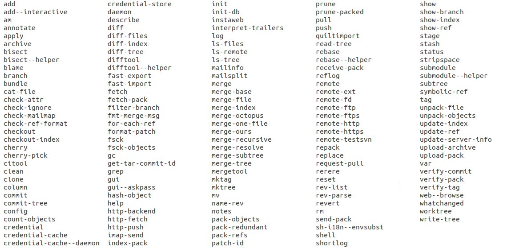

# What makes Git so hard to use? 是什么让 Git 那么难用？

原文：*https://www.highflux.io/blog/what-makes-git-hard-to-use*

来源：*‌https://www.ruanyifeng.com/blog/2023/01/weekly-issue-238.html*

原文日期：November 16, 2022

原文作者：[Mathijs Vogelzang](https://github.com/mathijs81)

翻译日期：01/09/23 00:59:29 CST

Git is a beautiful work of engineering. It's blazingly fast even on massive repositories, and it efficiently manages vast numbers of branches.

Git 是个漂亮的工程作品。即使在大型存储库中速度也非常快，并且可以高效地管理大量分支。

These qualities have made git the dominant source control system, even though it's hard for humans to use.

这些品质让 Git 成为主流版本控制系统，尽管它很难用。

So what's wrong with git?

所以 Git 出了什么问题？

## Git commands are too many, too low-level and hard to understand. Git 命令太多了，底层而难以理解。

The git program is a collection of 157 commands:

Git 程序是一套共 157 条命令的集合：

<!--  -->



The sheer number of commands is a problem. Even though it's pretty easy to master the most common 10 commands for day-to-day coding, you often run into commands you've never seen before. So git makes you feel like you're always a beginner!

大量的命令是个问题。尽管掌握日常编码里最常见的 10 条命令很简单，但也常常会碰到从来没见过的命令。所以 Git 让你觉得自己永远是个初学者！

Also, git commands are low-level operations, so they don't map exactly to things you want to do.

而且，Git 命令都太底层了，所以它们不能完全对应你想做的操作。

You need multiple commands to execute common actions (like "put my code on GitHub" and "make my coworker's code available in my editor").

你需要组合多个命令来执行一些常见操作（例如 “上传代码到 GitHub 上”，“在我自己的编辑器中展示同事的代码”）。

Finally, some of the commands do quite different things depending on their parameters (e.g., git reset and git checkout), making them hard to understand.

最后，有些命令做了和它们参数相当不一致的事情（例如，“git reset”和“git checkout”），让人难以理解。

Git has been trying to create less confusing commands (like splitting git checkout into git switch and git restore), but this creates even more commands to learn!

Git 一直在试着创造更少混乱的命令（例如，拆分“git checkout”为“git switch”和“git restore”），但这也增加了学习成本！

## Git tracks 4 versions of files, instead of just "my" version and "the team's" version. Git 跟踪文件的 4 个版本，而不只是“我的”版本和“团队的”版本。

When I'm working on a file, I mostly think about "my" version (what I'm working on in my editor) and "the team's" version (what the file looks like on GitHub).

当我处理一个文件的时候，我最关心的是“我的”版本（我编辑器里正处理的文件内容）和“团队的”版本（文件在 GitHub 上的内容）。

Unfortunately, git has two more versions that I need to keep in mind: the one in the "index" (or "staging area") and the one in the HEAD commit in my local repository.

很不幸，文件在 Git 里还有两个版本需要我记住：一个在“index”（或称为“stagin area”）中，另一个在本地仓库中的“HEAD commit”上。

Because of the low-level commands and the 4 different versions, there's no single git command that tells git to just take a file I saved in my editor and update GitHub. Instead, I have to do the following:

由于底层命令和 4 个版本，所以没有单独的命令能告诉 Git，拿走我在编辑器里保存的一个文件然后更新 GitHub。取而代之，我必须像下面这样：

```bash
# disk -> index/staging area
# 磁盘 -> index/staging area
git add README.md
# staging area -> local branch
# staging area -> 本地分支
git commit
# local branch -> remote repository (e.g., GitHub)
# 本地分支 -> 远程仓库（如 GitHub）
git push origin branch
```

(The first two commands can be reduced to one with git commit -a, but beware: that will only add changed files and skip any new files you created while coding.)

（头两个命令可以用“git commit -a”缩减为一个，但请注意：这只会作用在已编辑的文件，而忽略那些新创建的文件。）

Clearly, the 4-version internal git model complicates most common tasks.

显然，四版本的 Git 模型让简单的任务也复杂了。

## Git doesn't let us safely experiment Git 阻止我们安全地实验

Most of us learn new tools by experimenting with them, but git is not set up for experimentation. It lacks "undo", "--dryrun", and safeguards against you deleting your own code.

我们中大多数都是通过实验来学习新工具，但 Git 不是为了实验而设计的。它没有“撤销”、“--dryrun”参数和保障措施来防止你删了自己的代码。

- Undo would allow you to try some commands and backtrack if they don't lead to the right result.
	- 撤销让你尝试命令，回退导致错误的结果。
- A dry run parameter would show you a summary of what a command does without making actual changes. If git had that, you could confidently explore commands and preview the effects before applying them.
	- 一个预检参数会给你展示一个操作的汇总，而不做实际改动。如果 Git 有这些，你就能自信地探索命令，并且在实战前预览效果。
- Finally, a safeguard against deleting code could prompt you with an extra warning before executing commands like `git reset –hard` or `git push –force origin^1`. If all commands that might cause you to permanently lose your data had a safeguard, you could experiment more.
	- 最后，一个保障措施会在你执行“git reset -hard”或“git push -force origin”前，给你一个额外的警告来避免删了代码。如果所有可能导致永久失去数据的命令都有一个保障措施，你就能实验更多。

Because these three features are missing, you can't casually experiment with git commands unless you want to risk losing code you spent hours working on.

由于这三项功能的缺失，你就不能随意进行 Git 命令实验，除非你想冒丢几小时工作量代码的风险。

In summary, git forces you to convert commands that make sense to you into commands that make sense to git, and it punishes you for any mistake you make.

总结，Git 强制把你的正常思维转变到 Git 思维上，而且你犯错它就惩罚。

## The way forward: new tools will improve the git user experience. 前方的路：新工具将提高 Git 用户体验。

Despite the user experience issues, git will probably not be replaced by a new source control system. Instead, new tools on top of git can make it easier to use by converting commands that make sense to humans into commands that make sense to git. They will offer us fewer, more meaningful commands, automatically manage the 4-version model of git and make experimentation easy and safe.

尽管存在用户体验问题，Git 可能不会被新版本控制系统替代。相反，新工具会在 Git 的基础上使其更易用，通过把人类思维的命令转换为 Git 思维来告诉 Git。它们会给我们提供更少、更有意义的命令，自动管理四系统模型以及允许我们更容易和安全地进行实验。

Several tools are already out there:

下面是几种工具：

- [Gitless ^2](https://gitless.com/)
- [Sturdy](https://getsturdy.com/)
- [legit](https://github.com/frostming/legit)
- [jj](https://github.com/martinvonz/jj)
- [Sapling](https://sapling-scm.com/): just opensourced yesterday by Meta 昨天才被 Meta 开源
- [HighFlux](https://www.highflux.io/docs/install): our product, currently in beta 我们的产品，目前 beta 阶段


We're focused on improving the git user experience. We'd love to hear your thoughts:

我们专注于提升 Git 的用户体验。我们乐意听听你的想法：

[discuss with us on Discord](https://www.highflux.io/discord)
or
[follow us on Twitter](https://twitter.com/intent/user?screen_name=highflux_io).

1. With an additional parameter to skip the safeguard for automated workflows. 携带了一个额外参数来跳过自动化工作流的保障措施。
2. We highly recommend reading the research article by the gitless author: "What's wrong with Git? A conceptual design analysis": *https://spderosso.github.io/onward13.pdf* 我们强烈建议阅读 gitless 作者的论文：“What's wrong with Git? A conceptual design analysis”：*https://spderosso.github.io/onward13.pdf*