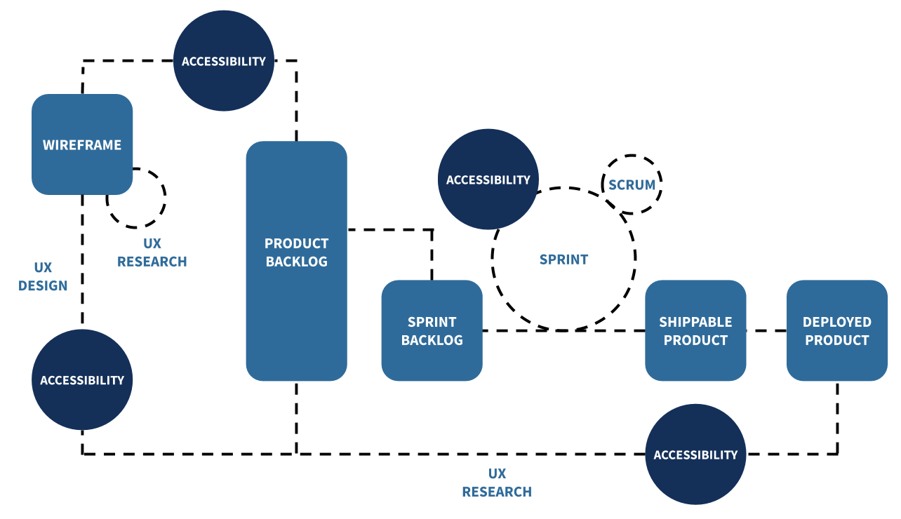

# 可访问性指南

## 简介

### 什么是可访问性？

> 可访问性 Accessibility（以下缩写为 A11y——表示，字母 “a”，后跟 11 个字符，最后是“y”）是指（一）让所有人都能使用应用，并且（二）为用户提供平等的体验，无论情景和行动能力。

Spotify 的使命是让数十亿的粉丝有机会享受到艺术家的作品，并受其启发。因为我们的应用面向每个人，所以[可访问性是 Spotify 的核心关注点](https://newsroom.spotify.com/2021-12-03/spotify-joins-the-valuable-500-with-a-commitment-to-disability-inclusion/)。作为将 Spotify 体验扩展到其它社区的开发者，无论用户通过它们的设备如何使用我们的应用和接口，我们都有责任为用户创造一个安全、公平的空间。

*[The WCAG map by Intopia](https://intopia.digital/wp-content/uploads/2019/10/2019-WCAG2.1-Map-Intopia-plus-reading-order.pdf) 的摘要版本*

**“哪些人的体验会被排除在外？”**，每当我们在应用里为实现功能做选择的时候都要回答这个问题。在日常生活中，那些只能通过楼梯进入的商店已经积极做出了抉择，它们排除了轮椅使用者、带婴儿车的父母，以及带着轮子背包的购物者。每一个设计决策都是关于包容和缺乏包容的态度。

[《Play for All Guidelines》](https://www.worldcat.org/title/27241984)和[《The Inclusive City》](https://www.worldcat.org/title/61247468)的合著者，Susan Goltsman，一般把包容性描述为允许用户以多种方式体验一个事物（比如你的应用），而不是为所有人提供一种体验。

如果你对于问题“哪些人的体验会被排除在外？”，终极目标是得到“没有人会被排除。”的回答——那么这篇文章就是您用来提供高质量应用程序的指南，您的应用程序会有和 Spotify 平等包容性相当的价值观。

人工测试可访问性是必不可少的，因为自动化测试只能捕捉到一小部分问题，而且不能在整体上进行有效的体验。

> 作为应用程序的开发者，请记住，在你开发应用程序的时候，你要可以无缝地切换 a11y 控件的打开和关闭的状态，就像电灯开关让用户可以自主决定灯泡的开关一样。
> 
> 配置您的设备以便快速简单地使用辅助技术进行测试，移除不适感、节省时间。你会发现你的测试会越来越多和频繁。

### 在软件开发周期里的可访问性

正确的 A11y 可以带来高质量应用。越早考虑 a11y 就会有越少的回归过程，并且能保证您的应用从最开始就照顾到了每个人。

> 本指南假设您已经对 a11y 有了基本了解。随时随地，如果您需要进一步的参考资料，万维网联盟（W3C）的 Web A11y 机构已经发布了 [A11y 基础资源](https://www.w3.org/WAI/fundamentals/)，内容包含一系列主题和更深入的内容，而且也和本指南相关联。

下面的图片是 [Jason Dippel 关于可访问性纳入软件开发生命周期（SDCL）的早期阶段的一些看法](https://medium.com/hootsuite-engineering/building-an-accessible-product-eae6b3f3c2d6)。我们同意像下面这样关于可访问性应该被纳入 SDCL 的建议：1. 在 Wireframe 和 Product Backlog 阶段之间，作为用户体验设计（UX Design）的一部分，2. 作为 Sprints 的一部分，然后通知 Sprints Backlog，并且作为 Product Backlog 和 Deployed product 之间的用户体验研究（UX Research）的一部分，这样能有效节省您的成本。

### 如何使用这份指南

本指南的重点是提高您的技能，以便您可以在已经开发的应用里找到 a11y 的问题，并且进行修复，让您开始开发新应用的时候使用本指南提供的工具。

本指南分为 3 个章节，都以任务清单的方式引导你创建高质量和可访问的应用。章节都是按照易于实现的顺序排布，但是每一条建议同等重要，都应该在开发里优先考虑。它们是：
- [quick wins](#quick-wins)、
- [medium-term wins](#medium-term-wins) 和
- [intensive wins](#intensive-wins)。

## Quick Wins

可访问性 quick wins 是指只需要很短时间实施的修改，是所有人都能做到的第一步。

### 图片的“替代文字”

在你应用中，所有的视觉、非文字元素都应该附有可替换文字描述（“替代文字”作为简写），这些文字描述非文字元素的细节，这些文字为辅助技术用户的提供了必要的环境和背景。

**A11y 行动：**
1. 为所有的图片元素添加文字描述属性，例如，``；
2. 或者，在非文本元素之下添加细节标题；
3. 对于完全装饰性图片，添加空的 `<alt="">` 属性，以便于屏幕阅读器跳过它们。

**资源：**
- [WebAim’s guide to alternative text](https://webaim.org/techniques/alttext/)
- [W3C’s guide to text-alternatives in images](https://www.w3.org/WAI/tutorials/images/)

### 动画

> 作为应用程序开发者，遵守系统设定是很重要的。应用内设定同样重要，但是应该要被用户设定的系统首选项所覆盖。

大家知道动画会导致癫痫，包括恶心、头痛等等。对用户来说，根据偏好关闭动画很常见，例如优化设备性能和为电池省电。所以，以包容、不造成伤害的方式引入动画是很重要的。

**A11y 行动：**
1. 采用来自 [WCAG 的建议](https://www.w3.org/TR/WCAG21/#three-flashes-or-below-threshold)，动画的时候小次 3 个闪动，该建议规定在一秒内动画不能超过最多 3 次闪动；
2. 让用户有完全能力控制应用的动画，让他们可以暂停动画，或者按照用户的医院完全关闭动画；
3. 如果用户交互页面（例如上下滚动）会导致动画，添加可以禁用或者减少运动引起的动画的限制选项。

**资源：**
- [University of Maryland’s Photosensitive Epilepsy Analysis Tool](https://trace.umd.edu/peat/)

### 按钮

按钮是应用的用户触发行为的重要方式。

**A11y 行动：**
1. 纯图标按钮应该包含标注信息，用来提供按钮操作的上下文；
2. 禁用状态的按钮通常用来表示，在进入下一步前需要完成当前的操作。然而，屏幕阅读器不能访问禁用按钮，而且对于辅助技术用户，往往不清楚完成一系列操作之后会发生什么。添加标注信息来描述按钮为什么被禁用，以及需要做什么才能激活按钮；
3. 关于按钮的尺寸，确保为用户提供宽松的操作区域，例如，[iOS 的最小触摸尺寸是 44x44 点](https://developer.apple.com/design/human-interface-guidelines/foundations/layout/)，安卓则是 48x48 点；
4. 默认考虑使用内置按钮（网页和移动端），因为它们有预设的样式和 a11y 特性，例如触摸尺寸、tab 聚焦、聚焦高亮以及交互快捷键（不是每个人都是用指针设备进行交互）。

**资源：**
- [Accessibility guidelines on links, images and other clickable elements](http://web-accessibility.carnegiemuseums.org/content/buttons/)
- Find detailed recommendations about share buttons and best practices around them in the [Share Buttons](https://developer.spotify.com/documentation/accessibility#share-buttons) section of this a11y guide.

### 色彩对比度

色彩对比度衡量颜色之间的差异程度——相对的颜色有最高的对比度，色轮上相邻的颜色有最小的对比度。

**A11y 行动：**

WCAG 推荐
1. 背景和前景的色彩对比度应该要达到 4.5:1；
2. 图标和背景的对比度要达到 3:1。

**资源：**
- You can use [this color contrast resource by WebAIM](https://webaim.org/articles/contrast/) to guide you on what ratio to aim for.
- You can use [WebAIM’s color contrast checker tool](https://webaim.org/resources/contrastchecker/) to confirm that the colors you are using are appropriately contrasted.

### 标题

页面标题是屏幕阅读器和其它辅助技术在页面导航的主要方式。有效识别标题有利于辅助技术用户快览内容，并跳转到感兴趣的区域。

**A11y 行动：**
1. 使用 HTML 标签来标注标题。例如，这是[一份在 web 使用 `<header>` 标签的指南](https://developer.mozilla.org/en-US/docs/Web/HTML/Element/header)；
2. 按层次组织标题，不要跳级，比如 H2 应该跟随 H1，不要跳到 H3，也不要让 H4 跟随 H1；
3. 在原生移动端应用里，您也可以配置标题，让用户快速探索并快速导航，通过使用简单的手势在标题间跳转。

**资源：**
- [Web Accessibility Initiative (WAI) Guide to Headings](https://www.w3.org/WAI/tutorials/page-structure/headings/)
- [Digitally Accessible Headings by Princeton University](https://accessibility.princeton.edu/how/content/headings)

### 模态框

模态弹窗是弹出的一段信息，通常用于促使用户完成指定操作，或者提供更多的内容信息。

**A11y 行动：**

由于模态弹窗同样提供了有效信息，但是同时也破坏了页面原先的信息流，所以为用户提供完全可控的打开和关闭模态弹窗是很重要的。一个可访问的模态弹窗是这样的
1. 为屏幕阅读器提供正确信息；
2. 正确管理键盘焦点，您可以使用 HTML 和 ARIA 来提供语意信息，使用 JavaScript 来改变行为，使用 CSS 来指定样式。

> 一个常见错误是，打开模态弹框后焦点没有聚焦在弹框之上，又或者聚焦到了模态弹窗之后的内容里。请测试应用的模态弹框，并且修复纠正行为。

**资源：**
- [How to test an alert / modal dialog](https://www.magentaa11y.com/checklist-native/alert-dialog/)

### 多种模式

重要的信息应该被以多种方式传递，例如——色彩、触觉、声音、文本与图标——人人可感知。

考虑表单里的一个文本框，当用户输入非法信息，文本框就会高亮红色：如果开发者没有积极适配，色盲用户也许无法感知，屏幕阅读器也许无法识别。在出问题地方的旁边添加一些信息，来说明问题的缘由和解决问题的办法，让每个人都能理解问题。冗余在这种情况反而更有帮助。你呈现信息的方式越多，越方便用户理解。

**资源：**
- [WCAG 2.1 (Level A) 1.4.1 Success Criteria: Use of Color](https://www.w3.org/WAI/WCAG21/quickref/?showtechniques=141#use-of-color)

### 操作顺序

如果你的应用程序为用户的操作提供了选择，确保首先在这些选项中展示伤害程度最小的选项。例如，提醒用户确认删除选中的播放列表的时候，首先应该高亮**同意**，而不是**返回**（译者不理解，**返回**没有伤害，不是应该首先高亮**返回**吗）；或者如果有**返回**和**确认**作为选项，首先应该高亮**返回**，因为返回更容易做补救措施（返回之后可以撤销重做）。

> 处于时间成本考虑，如果用户选择了**取消**，考虑回到最近的状态，也就是表单被填满的状态，而不是丢弃所有输入、清空表单的状态。

### 分享按钮

为用户提供在不同社交媒体上分享应用程序的方法，是传播应用、吸引用户的常见办法。一个极简常用的方法是用一个带有社交媒体图标的超链接。

可访问性图标是指能够被平等访问的图像，并且它的功能能够被所有用户理解。这样做让您的图标可访问：

**A11y 行动：**
1. 为图标添加替代文字，来描述图标的意义，例如，点击之后的预期。阅读更多关于替代文字的最佳实践，查看[图片和替代文字](#图片的“替代文字”)章节；
2. 为图标选用和背景颜色具有高对比度的颜色，阅读[色彩对比度](#色彩对比度)一节，查看最佳实践；
3. 通过在图标旁边加上伴随文字，保持意义清晰，通常是类似图标旁边的一个文字标签。

> 给图标添加替代文字或者在图标旁添加伴随文字，都是无障碍实践。

**资源：**
- [Accessibility guidelines on links, images and other clickable elements](http://web-accessibility.carnegiemuseums.org/content/buttons/)

## Medium-term Wins

Medium-term wins 是指要比[可访问性 quick wins](#quick-wins)花费更多的时间来实现的修改。非常关键，所以我们强烈建议您能够把这些修改优先纳入应用程序中。

### 导航

菜单和它的子项目（列表）的结构化展示为辅助技术用户提供了良好基础，方便了辅助技术用户访问某个子项和相应功能。

**A11y 行动：**
1. 把菜单放在您应用程序所有页面的固定一致的位置上；
2. 标注您的菜单，这样用户能够轻易理解和区分；
3. 使用 HTML 或 ARIA 来高亮当前被选中/激活的选项；
4. 阅读[顺序与分组](#顺序与分组)来查看菜单选项的分组和顺序的最佳实践。

> 检测无障碍导航最好的方法之一，就是挑战[只用键盘或者不用鼠标](https://nomouse.org/)访问网页，或者用屏幕阅读器访问手机应用。

### 顺序与分组

> to be continued

