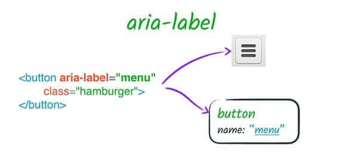
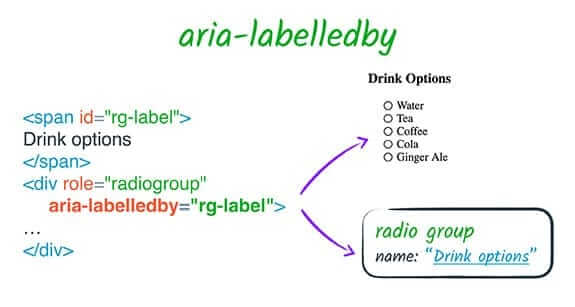
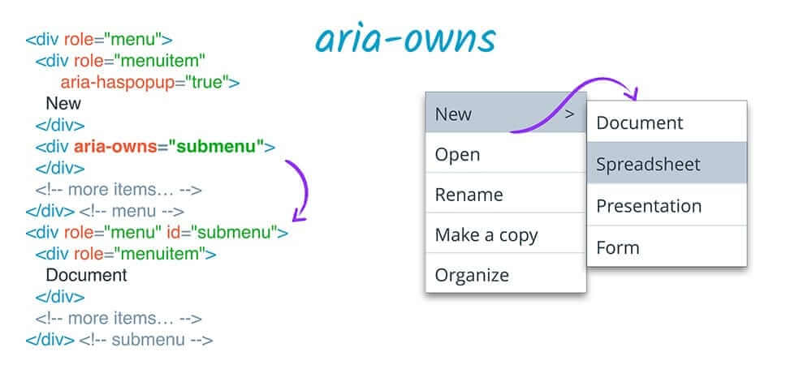
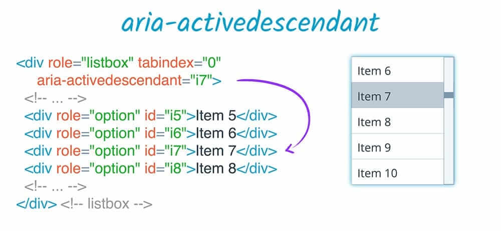
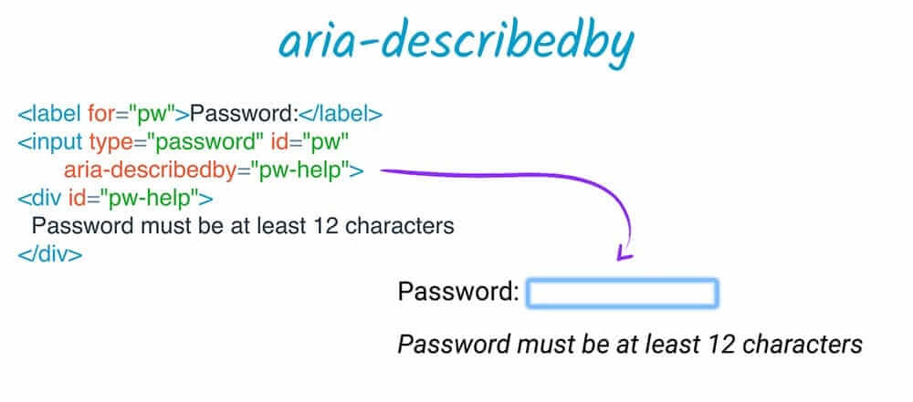
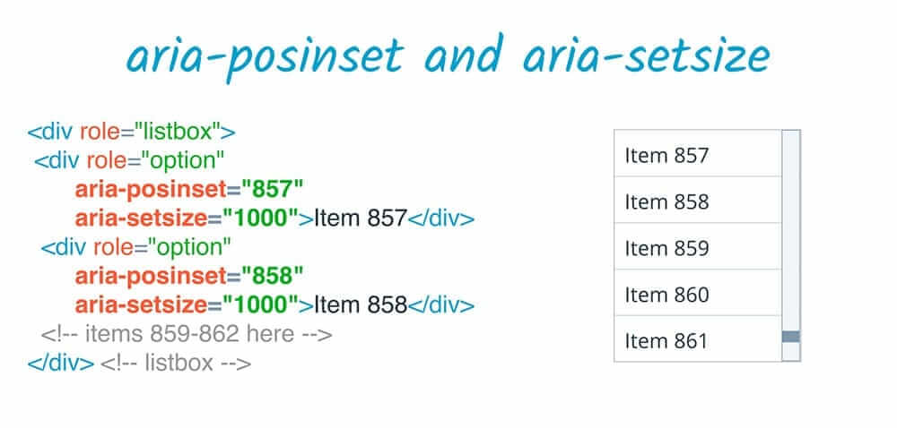

# ARIA 标注和 ARIA 关系

原文：*https://web.dev/aria-labels-and-relationships/*

原文日期：Oct 4, 2016 — Updated Sep 20, 2018

原文作者：[Meggin Kearney](https://web.dev/authors/megginkearney/)、[Dave Gash](https://web.dev/authors/dgash/)、[Alice Boxhall](https://web.dev/authors/aliceboxhall/)

翻译日期：05/26/23 09:34:28 May CST

利用 ARIA 标签创建可访问的元素描述。

## 标签

ARIA 为元素添加标签和描述提供了一些机制。事实上，ARIA 是提供可访问性和描述文字的唯一方式。现在让我们看一看 ARIA 用来创建无障碍标签的属性。

### aria-label

`aria-label` 让我们指定一个字符串作为可访问性标签。它会覆盖其它原生标签机制，比如 `label` 元素——例如，如果一个 `button` 同时有内容文字和 `aria-label` 属性，只有 `aria-label` 会生效。

当你有一些视觉指示类型元素时，也许会使用属性 `aria-label`，例如一个用图形代替文字的按钮、用图像表示意义的按钮，仍然需要让无法访问视觉元素的用户明了按钮的意义。

### aria-labelledby

`aria-labelledby` 允许我们把元素的标签指定为另一个元素的 ID。

很像 `label` 元素，但是有些不同：
1. `aria-labelledby` 作用于任何元素，而不只是可标签（labelable）的元素；
2. `label` 元素指向它标签的元素，而 `aria-labelledby` 关系则相反——被标签的元素指向标签它的元素；
3. 一个 `label` 元素关联一个可标签元素，而 `aria-labelledby` 可以传入列表，可以组合来自多个元素的标签，顺序是标签列表的顺序；
4. 你可以用 `aria-labelledby` 来指向隐藏的或者不在可访问性树里的元素，例如，您可以在需要标签的元素旁边添加一个隐藏的 `span`，然后用 `aria-labelledby` 指向它；
5. 另外，由于 ARIA 只会影响可访问性树，因此 `aria-labelledby` 不会有类似 `label` 元素的标签点击的行为效果。

重要的是，`aria-labelledby` 会覆盖元素其它**所有**的标签名称。例如，如果元素同时有 `aria-labelledby` 和 `aria-label`，或者 `aria-labelledby` 和原生 HTML 的 `label` 元素，`aria-labelledby` 都会有更高的优先级。

## 关系

`aria-labelledby` 是众多*关系属性*的一个。关系属性可以在元素之间创建语义上的关系，而不考虑 DOM 之间的联系。在 `aria-labelledby` 的例子里，创建的联系就是“这个元素被另一个元素所标注”。

ARIA 规范列出了 8 个关系属性。其中六个是，`aria-activedescendant`、`aria-controls`、`aria-describedby`、`aria-describedby`、`aria-labelledby` 和 `aria-owns`，它们在页面的元素间创建一个或多个连接。它们之间的不同点取决于不同的含义和面向用户的方式。

### aria-owns

`aria-owns` 是最常用的关系属性之一。该属性会告诉辅助技术，一个独立的 DOM 元素是另一个元素的子元素，或者把现有的子元素重新排列成不同的顺序。举个例子，如果一个子菜单视觉上展示在其父菜单的旁边，但由于可能引起样式问题，不能在 DOM 上把子菜单作为父菜单的子元素，这时您可以使用 `aria-owns` 来让屏幕阅读器知道，子菜单是父菜单的子元素。

### aria-activedescendant

`aria-activedescendant` 扮演关联的角色。就像页面上的活动元素是一个聚焦元素一样，设置一个元素的活动子后代可以在聚焦父元素的时候通过辅助技术把某个子元素告诉用户，就像子元素是活动的，是被聚焦的。举一个例子，在一个列表框中，你可能要把焦点留在列表框的外层上，但同时更新 `aria-activedescendant` 为最新的选中的列表单项。这让当前选中单项在辅助技术中就像它被聚焦了一样。

### aria-describedby

`aria-describedby` 使用和 `aria-labelledby` 同样的方式提供可访问性的描述。就像 `aria-labelledby`，无论元素是否可见、是否在 DOM 上隐藏、是否对辅助技术用户隐藏，`aria-describedby` 都可以引用这个元素。当用户需要一些额外的解释性文字的时候，这种技术无论是对辅助技术还是任何用户都是有用的。

一个常见的例子是密码输入框，在输入框的旁边有一段解释需要最短字符数的描述性文字。和标注不一样，这种描述不一定会展示给用户；用户可以选择是否访问，或者这些描述会在所有信息之后，又或者它会被其他信息打断。例如，用户此时正在输入信息，他们的输入会得到反馈，并且可能会打断关于输入的描述。所以，一份描述是传递补充信息的好方法，却不是必要的；它不会妨碍例如元素角色之类的关键信息。

### aria-posinset & aria-setsize

剩下的关系属性有些特殊，它们互相协同工作。`aria-posinset`（“position in set”）和 `aria-setsize`（“size of set”）是定义集合中的兄弟元素的关系的，例如列表。

当一个集合的大小不能通过 DOM 内已存在的元素决定时——例如使用懒加载避免一次性大量渲染——`aria-setsize` 指定集合的实际大小，`aria-posinset` 指定元素在集合的位置。举个例子，一个 1000 个元素的集合，即使某个元素第一个展示你也可以说它的 `aria-posinset` 是 857，并且同时要确保通过动态 HTML 技术让用户按需正确访问到了列表的指定位置。

