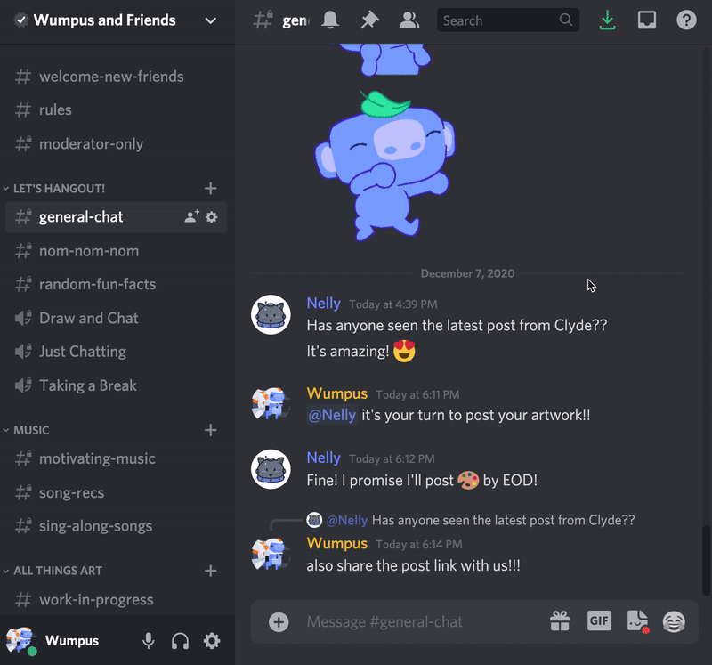

# 键盘导航-常见问题

原文：*https://support.discord.com/hc/en-us/articles/1500000056121-Keyboard-Navigation-FAQ*

原文日期：2022-06-01 01:13

原文作者：[Potato](https://support.discord.com/hc/en-us/profiles/12415876668-Potato)

翻译日期：05/04/23 10:02:34 Thu CST

> 注意: 键盘导航仅在桌面端和浏览器端支持。这些导航设定不会在移动端工作。

无论您是依赖键盘使用电脑，或只是不想使用鼠标，现在 Discord 的桌面端应用支持全键盘导航，所以你都可以用你喜欢的方式进行工作。

这篇文章的内容是什么？
- 开始使用键盘导航
- 导航消息
	- 消息快捷键列表
- 章节跳跃
- 关于快捷键的其它资源

## 出发

在 Discord 使用键盘导航基于两点：
1. 通过 <kbd>Tab</kbd> 和**方向键**来移动焦点，并且；
2. 使用 <kbd>Enter</kbd> 和 <kbd>Spacebar</kbd> 进行元素交互。

> 只要按下 <kbd>Tab</kbd> 就能开启键盘模式。

一旦您处在键盘模式，你会看见一个蓝色圆环包围在正在聚焦的元素周围。这个圆环会随着你的导航而移动。

大部分情况，<kbd>Tab</kbd> 可以让你浏览应用的所有内容。按钮、链接或者其它可交互内容通常是应用里 **Tab** 序列的一部分，所以如果你能点击某个元素，你也许也能够 <kbd>Tab</kbd> 到它。

对于其它情况，**方向键**会按预期进行移动——在类列表内容里，例如在 Guilds list、Channels、Messages、context menus 里等等。

由于这些内容里可能有上百条条目，所以它们通常不在 Tab 序列中，所以当你看到类列表的内容的时候，试试方向键。

## 导航消息

Discord 的消息可能很复杂。有些时候只有几个单词，但其它情况会是很多内容，例如用户信息、频道提及、链接、图片、视频、内嵌内容以及一整个用来操作各个信息的列表。

> 首先通过 <kbd>Tab</kbd> 来访问消息！
> 
> 然后你可以用**方向键**从当前消息访问下一条消息，然后通过 <kbd>Tab</kbd> 对消息的内容进行访问。

### 消息的快捷键列表

有很多操作来处理消息，当然也有很多专用快捷键来让处理更迅速。键盘模式下当您聚焦在某条消息上时，有蓝色圆环高亮在消息的周围时，您可以使用下面这些快捷键！

| 按键 | 行为 |
|:--|:--|
| q | 引用消息 |
| + | 添加一个反应 |
| r | 回复消息 |
| e | 编辑 |
| Backspace | 删除消息 |
| p | 大头针钉住消息 |
| Ctrl + C(Windows) / Cmd + C(Mac) | 复制消息 |
| Alt + Enter | 标记未读 |
| Escape | 回到 Textbox/Chatbar |

## 跑得更快——章节跳跃

Discord 里有很多东西。如果你有很多消息，一直按着 Tab 访问很快会变得麻烦。

为了让操作简易，帮助您移动更快，你可以使用**章节跳跃**来直接在章节之间移动。

> 当您在键盘模式，按下 <kbd>F6</kbd> 会立即移动到下一个章节的开头（按下 <kbd>Shift+F6</kbd> 会移动到上一个章节）。

例如，如果您正在聚焦频道列表里的某个频道，按下 F6 会直接跳到消息章节，再次按下，你会跳到频道成员章节，或者如果你在打开着的搜索框里，按下 F6 会跳到搜索结果。

在 server 视图，您可以跳转的章节有：
- Server 列表
- 频道列表
- 消息
- 成员列表

作为提醒，下表列出了**章节跳跃**的快捷键：

| 按键 | 行为 |
|:--|:--|
| F6 | 跳跃至下个章节开头 |
| Shift+F6 | 回到上个章节 |

## 使用快捷键更快速

Discord 还支持其它键盘快捷键。例如在公会和未读频道之间跳跃，使用 Inbox，以及打开 Quick Switcher。这些快捷键已经支持多年了！

现在您可以在 User Settings→Keybinds 找到键盘设定。

如果您对学习更多的热键感兴趣——查看这里的 [Mac 用户](https://support.discord.com/hc/en-us/articles/225878307--macOS-Discord-Hotkeys)链接和 [Windows 用户](https://support.discord.com/hc/en-us/articles/225977308--Windows-Discord-Hotkeys)链接吧！