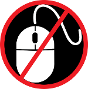

# 接受 \#NoMouse 挑战！

原文：*https://nomouse.org/*

原文日期：无日期

原文作者：[The DO-IT Center](http://uw.edu/doit)

翻译日期：05/21/23 11:05:46 May CST

## What is it?

\#NoMouse 挑战是一项全球性行动，旨在提高人们对可访问性网页设计的认识。只需要跟随下面三个简单步骤：

### 第一步，不用鼠标访问网站

若是你或组织有网站，试试不用鼠标，使用键盘访问。如果您没有个人网站，用键盘而非鼠标试试您最爱的几个网站。参考后文*几个使用键盘访问网站的小提示*。

访问的时候，提出几个问题：
1. 我能访问所有功能吗？
2. 我能操作所有的按钮、滑块，以及其余控件吗？
3. 我能很容易了解自己在页面的位置吗？

### 第二步，学习更多可访问性网站设计的知识

参考后面标题是“什么是可访问性网页设计？”的部分。如果您是网站的设计师或开发者，您生产影片、电子文档，始终考虑生产的内容是否对所有人都是可访问的。尝试学习与应用新技能，帮助您制作面向所有人的内容。

### 第三步，宣传！

在任何支持哈西标签的地方使用 **\#NoMouse**。

## 使用键盘访问网站的小提示

- 按下 **Tab** 移动至下一个链接、表单或按钮；
- 按下 **Shift+Tab** 移动至上一个链接、表单或按钮；
- 按下 **Enter** 或 **space bar** 来激活链接或者按钮；
- 在一些特定的区域使用 **方向键**、**Escape**，或者其它有意义的按键。

## 什么是可访问性网页设计？

根据[世卫组织统计](http://www.who.int/disabilities/world_report/2011/en/index.html)，世界上有超过 10 亿人身患残疾，有近 2 亿人行动能力困难。残障人士使用各种工具和科技来使用计算机和访问网络。However, they're dependent on people who create digital content (e.g., websites, Word docs, PDFs, video, audio) to create these materials in ways that are accessible.

创建无障碍数字内容的方法已经确立，很多情况也很容易。但如果制作数字内容的人们没有意识到这些方法，或者不应用，那么残障人士会被拒之门外，他们将不能访问、被排除在我们的数字社会外。

考虑以下用户以及和访问数字内容有关的需求：
- 有些身体残疾人士也许不能使用鼠标，他们完全依赖键盘，又或者使用辅助技术，例如语音识别、头部追踪器（head pointers）、口含指示棒（mouth sticks）、眼球追踪系统（eye-gaze tracking systems）。如果一个网站只面向鼠标用户，那么使用辅助技术的用户都会被排除在外；
- 盲人使用听觉输出设备（一种叫屏幕阅读器的产品，使用合成语音读区网页）或触感输出设备（可刷新盲文设备）。如果网站或者电子文档禁止辅助设备访问，这些用户将被拒之门外；
- 有认知或感知障碍的人，例如阅读障碍，用户也可能会使用听觉输出设备，也可能会从通过改变文字的风格（尺寸、颜色、间距）中受益。如果网站或电子文档不能通过用户的定制工具和方式来访问，他们也会被忽略；
- 低视力人群可能使用屏幕放大器来放大屏幕的一部分，或者他们会在浏览器偏好里改变默认字体大小。如果网站在放大之后样式被破坏，变得无法阅读，这些人也会被排除在外；
- 失聪或者听力障碍的人们不能访问音频内容，如果音频没有转录、视频没有字幕，这些用户也将被排除在外。

## 怎样了解更多信息？

[华盛顿大学无障碍技术](http://uw.edu/accessibility)网站有很多关于如何创建可访问性数字内容的指南，包括：
- 如何[开发无障碍网站](http://uw.edu/accessibility/web/)；
- 如何[创建无障碍文档](http://uw.edu/accessibility/documents)；
- 如何[创建无障碍视频](http://uw.edu/accessibility/videos)。

每一个资源都包含有用的资讯，以及其它获取更多信息的资源链接。

---

<table>
	<tr>
		<td></td>
		<td>NoMouse.org is a project of The DO-IT Center at the University of Washington, and is licensed under a Creative Commons Attribution-NonCommercial-ShareAlike 4.0 International License.</td>
		<td></td>
	</tr>
</table>

