# 电视空间导航

原文：*https://engineering.atspotify.com/2023/05/tv-spatial-navigation/*

原文日期：May 10, 2023

原文作者：Sergio Avalos, Senior Engineer

翻译日期：2025.01.26

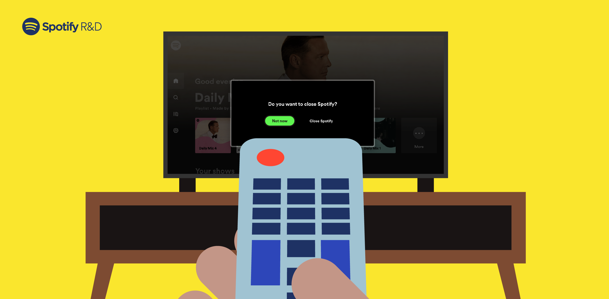

开发用户界面时，通常大部分注意力都集中在了视觉观感上，因为它是引起用户注意的主要因素。然而，有其他方面对于优秀的体验同样重要，例如用户输入——用户操作应用的方式。这可能会被忽视也是完全可以理解的；大多数情况，操作系统平台层面，例如电脑的 Windows，iPhone 的 iOS，家庭智能电视的 Android TV，已经代替应用开发者完成了这些工作。但其它场景该如何是好？

这就是我们团队当前的处境。我们要开发大屏上的 Spotify 体验，例如在家庭电视和游戏控制台上。其中，电视空间导航的研发就是一件富有挑战但有趣的例子。

## 什么是空间导航

空间导航指的是在平面视图上聚焦应用的不同元素的导航行为。一般会用电视遥控器的箭头按键或者游戏手柄的操控杆来完成导航。和桌面应用不同，使用这类控制器不如鼠标直观，使用鼠标是用户在用自己手的移动来模拟光标的移动。下面展示了用户往四个方向聚焦直到到达目的地。

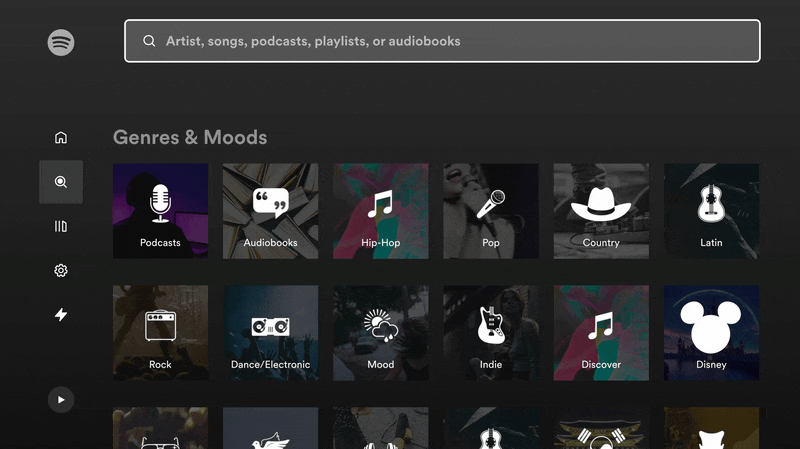

## 难道空间导航需要额外适配吗？

谈论空间导航和电视遥控时，听起来就像是键盘和鼠标的类比；对于电脑或平板，这些输入设备，操作系统平台的确已经实现了。所以难免联想“电视制造商还没提供这样的支持吗？”

是的，智能电视的确提供了这样的支持，但是只有在开发原生应用（即应用程序使用和制造商相同的技术或开发语言）时有支持。例如，Android TV 使用安卓 SDK，Apple TV 同样有自己专属软件开发方式，Roku TV 创造了它们自己的编程语言 BrightScript。

我们团队决定采取一种特殊途径来构建为电视和游戏操控台的 Spotify 客户端，我们选择了混合应用代替全部原生的开发方式。我们的应用会在各电视制造商打开 web 网页应用，来渲染用户界面。这个选择给了我们能够在不同设备商使用相同源代码的高通用性，但同时也丢失了原生应用的一些好处。

尽管浏览器本身是高级软件，但撰写本文时尚不支持空间导航。有一个 [CSS Spacial Navigation Level 1](https://www.w3.org/TR/css-nav-1/) 的草案，但是预计要花很长时间采纳和实现。

所以，由于空间导航不会由 web 浏览器和电视平台提供，我们有必要提出自己的解决方案。尽管如此，通过它的实现可以发现这是个有趣的项目，它包含了几何学和一点计算机科学基础知识。

## 定义我们的需求

在切实实现前，让我们先定义一些主要案例：

### 基础导航

下面是主页看起来的摸样：

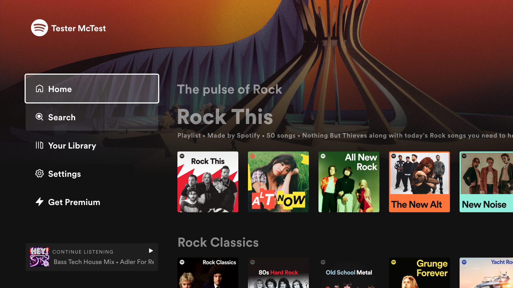

在这个视图中，应用程序只需标记触发操作的元素，例如导航到新页面、标记为喜欢、开始重放。提取它们后，我们获得了一个只包含可导航元素的新视图。


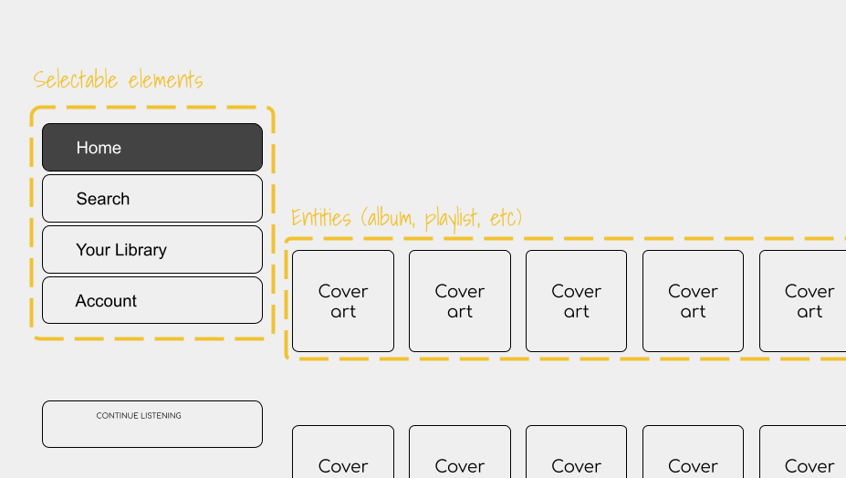


新视图中，左边菜单是可选元素。右侧则是不同的实体，例如专辑、播放列表等，选择它们将带领用户到相应新页面。

还有其它稍微复杂写的视图，例如在用户导航到搜索视图展示的矩阵。每个方块代表了一个音频内容的类别。

|:--|:--|
| 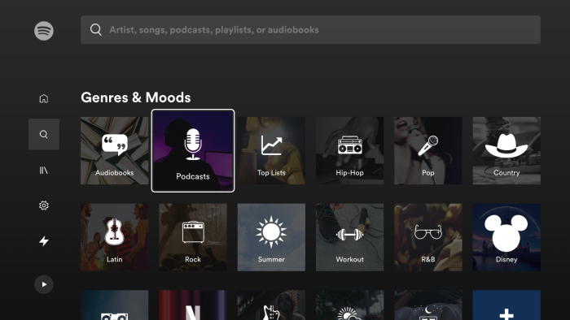 | 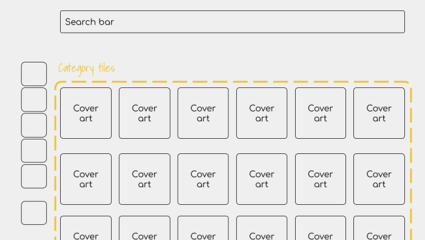 |

这些情况，用户期望导航到一个无法超越的边界，比如碰到曲目列表的底部就不再向下。然而在其它情况，用户不希望这样的限制。

### 循环导航

有的时候，移除限制、允许用户继续导航会更方便，即使已经到达了边界，例如菜单底部。点击向下的按键，聚焦菜单的第一个子项，我们称之为循环导航。

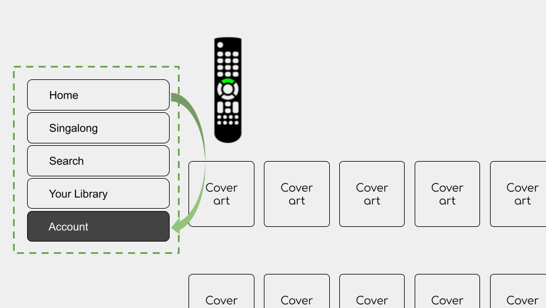

### 特定区域导航

最后还有一些情况，是允许选择凸出部分的元素而阻塞其它部分的导航（例如，一个需要用户回应才能继续操作的警告弹框，例如确认是否退出登录）。警告窗口背后的可导航元素可能还存在，但只要警告窗口存在就不能选中后面的元素。

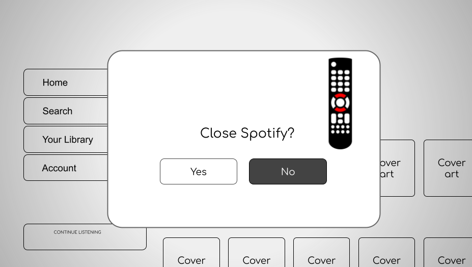

定义完所有需求后，现在我们可以寻求答案了。这个库的演变会在下面分为两个部分，但实际上，它要比这个超级简化的塑造复杂许多。

# 首次迭代：天真的实现

探险之前要准备地图。在我们这就是一个导航映射。因为应用基于 React，所以在内存里保留可导航元素的形式是合乎逻辑的，正如 React 对[虚拟 DOM](https://reactjs.org/docs/faq-internals.html) 使用类似方法。下面的图解释了页面是如何通过导航树展示的：

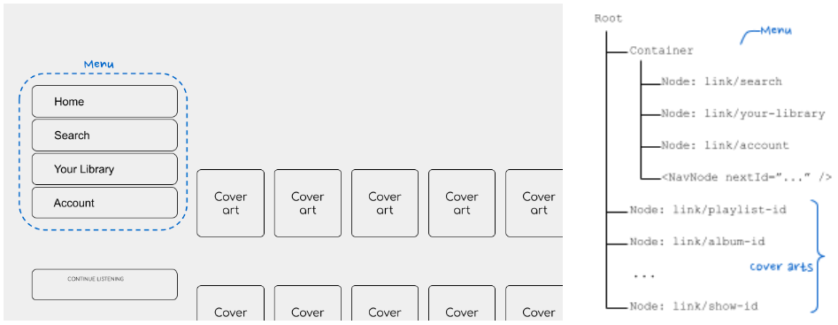

为了实现它，新的 React 组件会被创建用来做节点的分类；也即，这些渲染在页面的元素可以被电视遥控器选中。

#### 可导航元素

类比树，这些元素则是树叶。每个需要被选中的元素都包裹在 **NavNode** 元素中，它的职责是在导航树中注册包裹元素、指示哪些是兄弟“叶子”、处理用户选中时按下 Enter 按键。为了区分这些元素，每个元素都包含一个唯一 ID（或 navId），用于预测焦点走向。

```javascript
<NavNode navId=”toplist-link” nextRight=”news-link”>
  <a href=”/playlist/123”>
    
    <span>Sweden’s top list</span>
  </a>
</NavNode>
```

#### 容器元素

树叶依附树枝。`<NavContainer>` 元素包含了所有需要空间导航的元素，例如菜单。如果有需要，它会通过 DOM 树冒泡的方式处理循环导航或特定区域导航的情况。

```javascript
<nav>
  <NavContainer navId=”sidebar-menu” cycle>
    <NavNode navId=”search-item”>
      <a href=”/search”>Search</a>
    </NavNode>
    <NavNode navId=”settings-item” nextTop=”search-item”>
      <a href=”/settings”>Settings</a>
    </NavNode>
    ...
  </NavContainer>
</nav>
<main>
  <h1>Good morning, User!</h1>
  ...
```

#### 根元素

最后是 `<NavRoot` 根元素，它位于应用顶部。它的作用是协调所有元素：注册新的可导航元素，决定当前焦点的位置，在接收到导航事件时做出更新，在跳转新页面后更新导航树。

```javascript
function MyApp({ children }) {
  return (
    <NavRoot navId=”root”>
      <nav>
        <NavContainer navId=”sidebar-menu” cycle>
          <NavNode navId=”search-item”>
            <a href=”/search”>Search</a>
          </NavNode>
          ...
    </NavRoot>
  );
}
```


## 局限

尽管如此实现承担了基本作用，但从上面的例子来看也带来了一点局限：
- 导航逻辑是人工处理的，所以容易出错。开发者要用 nextRight/Left/Up/Down 属性来声明可导航元素的位置，这不总是已知的。属性 navId 有同样的问题，它要人工保持唯一性。
- 页面的 DOM 树因这些包裹元素变得更复杂。虽然额外的元素不是特别的问题，但也确实破坏了开发和调试体验。
- 最后一点，实现这个库需要开发者拥有导航流程的前置知识。这样的条件提高了新人的入职门槛。

# 第二次迭代：简单的开发体验

考虑到上面的限制，接下来的迭代目标就是通过两种方式来减少库的用户所需知识：
1. 简化 API 以及调用方式
2. 减少耦合以便测试

感谢 [React 16.8 的 Hooks](https://reactjs.org/docs/hooks-intro.html) 介绍，hooks 让我们有可能把业务逻辑压缩到一个函数里，而无需额外的包含可聚焦元素的组件。下面是一个实现的例子：

之前……

```javascript
function AcceptButton(props) {
  return (
    <NavNode
      navId=”ok-button”
      nextLeft=”more-button”
      nextRight=”cancel-button”
      focusable
      claimFocus
    >
      <button onClick={props.onClick}>
        OK
      </button>
    </NavNode>
  );
}
```

之后……

```javascript
function AcceptButton(props) {
  const { ref, isFocused } = useFocusRef();

  return (
    <button
      ref={ref}
      className={isFocused && ‘btn-focused’}
      onClick={props.onClick}>
        OK
    </button>
  );
}
```

重点：
- 无需额外的 DOM 元素！感谢 [useEffect 钩子函数](https://reactjs.org/docs/hooks-effect.html)，它让检测新元素是否挂载成为可能。更少的 DOM 元素等于更好的调试体验。
- 不再有导航逻辑！取而代之，我们只有一个可被聚焦的真实 DOM 元素的引用，这个引用会由 Hook 函数返回。

现在，好戏才刚刚开始。现在导航我们会完全依赖库的计算，而不是开发者的人工处理。感谢 [`Element.getBoundingClient`](https://developer.mozilla.org/en-US/docs/Web/API/Element/getBoundingClientRect) 这个 DOM API 让我们得以实现；它提供了相对视口的大小和坐标。


有了 navTree 的这些信息，就可以自动创建相同的带有可导航元素的视图。有了这个视图，我们可以通过 navTree 包含的方向信息检测下一个选中哪个元素，而无需为 DOM 添加额外元素。

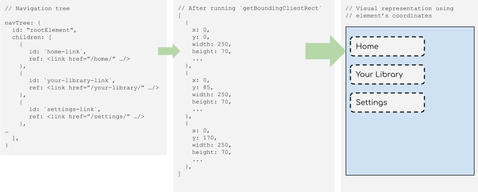

接下来需要改进的是元素间的耦合。很明显可以发现 NavRoot 做了很多工作：接收用户触发的事件，支配当前元素的聚焦情况，从导航树中添加或移除元素，等等。所以它会被分成三个特定模块：
1. NavEngine：保持导航树最新
2. FindFocusIn：跟踪当前聚焦元素
3. Navigate：作为导航核心，当用户按下方向键后找到下一个可聚焦元素

对我来说，最后一个模块我认为最有趣，因为它结合了计算机科学的一些概念。由于展示的可聚焦元素是一棵树，所以可以用[最近公共祖先算法](https://www.geeksforgeeks.org/lowest-common-ancestor-binary-tree-set-1/)来找到父元素。对于像涉及父元素的循环导航非常有用。

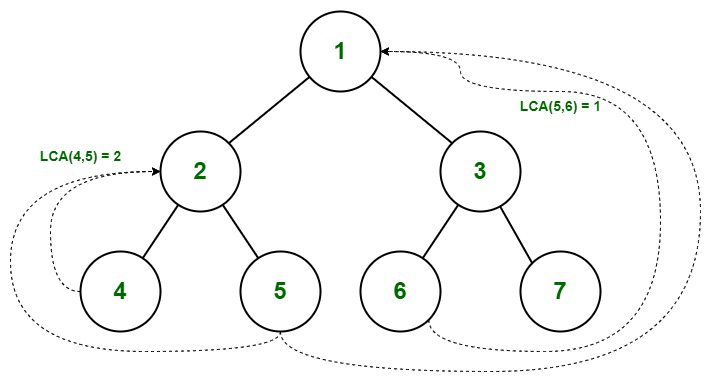

其它还有一些我乐在其中的挑战，比如根据尺寸、相对位置和选中的方向判断下一个元素。大多数情况无需考虑这些，因为用户界面可能是规则矩阵或是规则的行结构，但也有特殊情况（例如，从主视图返回左侧导航菜单）。

| 常见 | 不常见 |
|:--|:--|
| 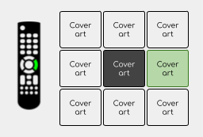 | 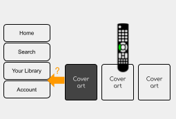 |

完成这一段业务逻辑不简单，尤其还要具备单元测试的能力。为了简化流程，我们要创建一个新项目，用于生成导航树的展示而无需运行整个应用。其背后的想法是提供一个绘图工具，用户可以在其中模拟可选元素如何定位的不同场景，该工具将返回JSON格式的可导航树。这个输出可以用来作为单元测试的输入。

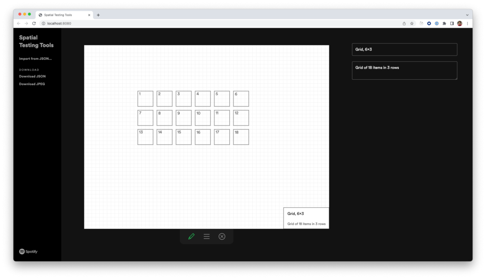

# 总结与展望

我们在应用里集成了这个空间导航库的最新版本，且没有做任何主版本更新，不吹不黑，对于用户的易用和开发团队的易于理解所需的输入，它都能够基本满足。我们的下一步是评估潜在的性能成本，因为 Spotify 会陆续登录更多电视。这一点对于低配设备以及具有不同格式内容的设备很重要。

特别感谢 Erin Depew、Daniel Lopes Alves、Dennis Gulich、Andreina Loriente 和 Yasa Akbulut。没有你们的指导和帮助就没有这篇文章。