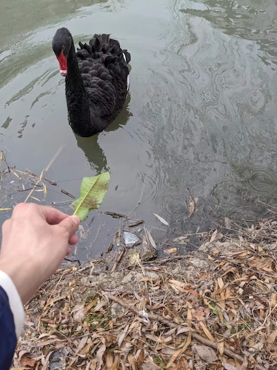
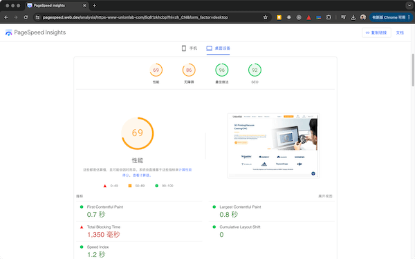
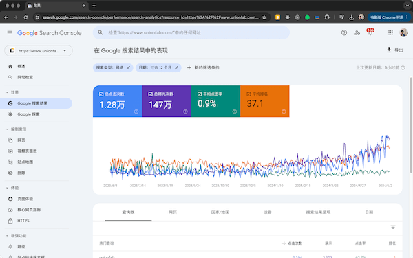
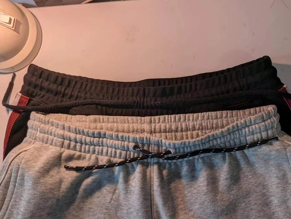
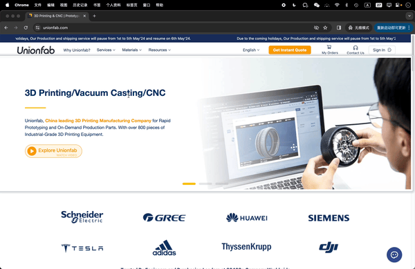
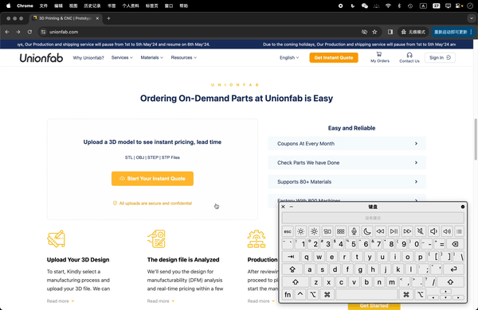
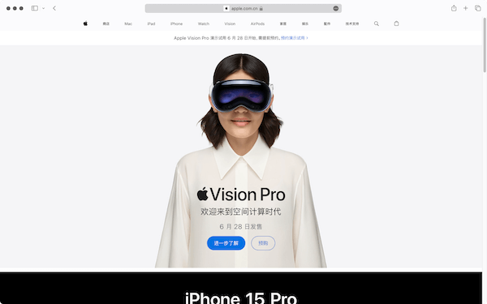
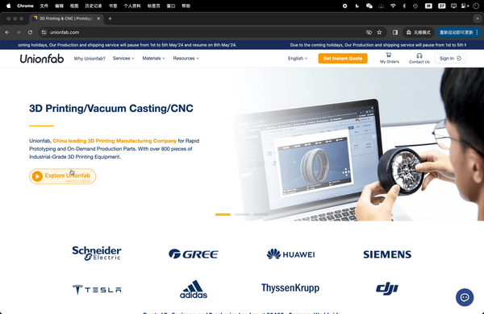
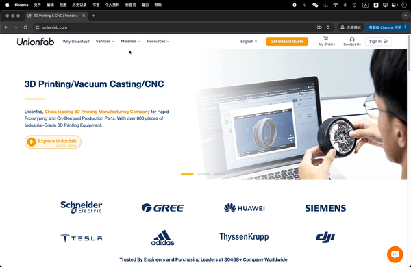

# 近一年的工作

从成都到上海，现在就快要工作一年，又要离开了。一份工作里有伤感、有快乐，虽然这一年的工作是一条泥路，走得艰难，好在这条路上找到了宝藏，我结识了几个朋友，储备了一些钱，翻新了一身装备，找到了稳定腰突症状的方法，见证了几段婚姻的开始，结束了漂泊动荡的一段时间。

回想成都的时光，满是不舍，遗憾没有足够的时间感受这座美丽的城市。这次回到上海，有时候当我走过熟悉的小路时，我会突然停下脚步，就感受到了周围陌生的树木和楼房，可能匆忙的人带走的是路上的味道、声音、行人的身影和那条习惯性的路线，回忆的时候很难有一副固定的图画，所以这一次，我总是会在一个地方停下来，成为生活在这里的人，在去往的人流中，用力去触碰前面的叶片和砖墙。

下面会分享一些我在这份工作里做的事情。

## 网站性能优化

这一份工作里着手做了性能优化的工作，优化之后，网站从 SSR 迁移到了 SSG，首页产包从原先的 2.5Mb 缩小至 1.8Mb，PageSpeed Insights（PSI）上的 Core Web Vitals 性能得分从最初的 30 分稳定到了 60 分以上。

主要做了下面这些工作：
- 渲染方式从 SSR 向 SSG 迁移；
- 全路径导入依赖，缩小产包，避免 `export *`（桶文件）导致的摇树失效；
- 延迟统计、日志脚本的加载，延迟加载 IM iframe；
- 组件库的用法优化；
- 固定图片的宽高，固定图片的比例，避免布局抖动；
- 将图片的尺寸缩放成适当大小，并且缩小图片体积；
- 图片、视频等资源的懒加载；
- 移除导航栏大量链接的 prefetch；
- 同步线性的多个请求修改为异步的 allSettled 请求；
- 移除未使用的依赖。

这里面每一项看起来都是日常开发的标配，但是也依赖项目的维护程度，没有定期维护的项目，从零开始，不同的问题会交织堆叠，优化起来需要很多的时间。

在我优化的官网项目里，SSG 的迁移不仅要替换 `getStaticProps`，还要做一点副业。原本为了方便 SEO 运营人员能够及时修改和更新每个页面的 `title`、`description` 等对 SEO 有利的数据，代码里通过 SSR 在每次请求页面的时候，同步执行接口来获取最新的 SEO 数据。所以，要迁移至 SSG，也要确保 SEO 数据能被及时更新。最后，我添加了页面增量静态生成 ISR 的支持，它会在更新完 SEO 数据后请求一个 API，next 服务接收到请求后，会对需要更新 SEO 数据的页面重新生成最新的静态页面。

SSG 的迁移给蜗牛搭上了火箭，让页面的速度回到了基线，下一步，是继续缩小产包体积，减少资源下载和程序运行的时间。综合 PSI、开发者工具的 Coverage 面板和产包分析工具 `@next/bundle-analyzer` 提供的线索，PSI 会提示某个文件执行耗时过长，Coverage 面板会列出未执行代码最多的文件，以及产包分析工具会可视化地辅助查看具体是某个包被引用在某个页面，最终我把优化目标锁定在 `_app.js` 中。

接下来，反复地在 `_app.js` 里进行同级和嵌套的二分操作，注释和解开注释，不断打包检查产包体积变化，最后，把无效依赖删除、并使用全路径导入依赖之后，产包缩小了 700Kb。除了这 700Kb，也找到了一个占用更大产包的组件——1Mb 的登录按钮组件。由于大量桶文件的引入方式，这个组件里盘根错节的依赖蔓延到了项目最深的土壤，仿佛摇动一下，其它组件会被拖连着塌陷下去，经过几次失败的优化尝试之后，仍然保留了这个组件的原本结构。

## 网站的 SEO 优化

这是我首次实践 SEO 的优化，和之前的工作不同，内部管理平台、小程序或 Hybrid H5 都不需要关注 SEO，这一次做的是海外官网，需要通过 SEO 提高搜索曝光度。

主要做了下面这些事情：
- 生成结构化路径，展示面包屑组件；
- 由接口管理的 title 和 description 配合 SSG 做增量静态生成；
- 使用 canonical `<link>` 标签规范网址，避免用于统计的 query string 被单独收录，例如避免 `https://official.com?code=abc` 被收录；
- 规范并生成多语言的 sitemap，为 sitemap 排除 noindex、301 页面；
- 为每个页面的多语言添加 alternate `<link>` 标签；
- 对禁止抓取的网址添加 noindex `<meta>` 标签或响应 noindex 头；
- 为图片添加 `alt` 属性、规范页面标题结构；
- 规范页面路径，启用硬 404，对旧路径实行 301 跳转；
- 点击事件跳转页面替换为 `<a>` 标签，增加内链数量；
- 性能优化。

关于面包屑组件，在我的实现里，引入这个组件会做两件事情，第一，借助 Nextjs 可以在任意位置放置 `<Head>` 标签的特性，生成`application/ld+json` 类型的 `<script>` 标签结构化路径，第二，负责 UI 层面的面包屑展示。

关于对旧路径实行 301 跳转。在这个项目里，博客页面来自 Wordpress，首先在 next 服务里请求 Wordpress 页面，获取 Wordpress 页面的 HTML 内容字符串后，再把它返回给客户端，所以，如果 Wordpress 页面执行了 301 中转，只会体现在 next 服务中，而客户端不能识别，客户端的 url 将不会改变。我使用的方法是利用 HTTP 的 HEAD 方法，只获取 301 和目标 url，然后返回客户端，最后客户端会自动跳转到对应的 url。

在实践上面这些技术上的 SEO 优化时，意外发现了一种规范图片 alt 的好方法——SEO 运营人员向开发者提供的一张 SEO 表格，这张表格包含一个页面所有的 SEO 信息，例如页面的 title 和 description、内容标题的 h1 到 h6，也包括页面里每一张图片对应的 alt 文本。有了这张表格，图片的 alt 被纳入到 SEO 的范围，终于可以从业务出发搞定图片的 alt 属性了（ESLint 何苦强制 alt 为难开发）。

## 网站的用户体验

好的用户体验让产品脱颖而出。MacBook 的磁吸式充电接口不仅让笔记本更便携，也能避免一些拖拽摔落的场景；楼梯两边的平滑坡道方便了携带旅行箱的人们；有抽绳的裤子，绳口之间存在镂空让绳端交叉穿出（下图的黑色裤子），相比没有镂空，能够省去一次打结的功夫。

每一个组件就像一个产品，细节分布在每个组件里，好的用户体验，组成一个让用户体验如蜜的网站。

### 页面切换进度条

当网站变成单页面应用 SPA 之后，有了类似软件的原生体验、更细粒度的路由，却丢失了浏览器左上角的刷新动画。如果新页面很重、网络环境很差，最后用户只能带着失望的心情离开我们的网站。

给网站添加页面切换进度条之后，效果就像下面这样，虽然这个进度条没有真实地表达进度百分比，但是它已经起到了和浏览器左上角刷新按钮同样的提示作用，用户会怀着期待的心情走进新的页面。

## 有点复杂的按钮

上一个例子是视觉上的用户体验的提升，这个例子会解释正确、规范的编码，会如何提升用户体验。

编码时，按钮是个经常会被用错的控件，正因为它的常用，错误的使用更容易破坏网站的用户体验，例如使用按钮实现一个链接，又或者使用 `
` 标签当成点击事件的监听元素，模拟一个按钮，这些 `
` 标签按钮却没有模拟按钮的其它特性：
- 设置 ARIA 的 `button` 角色及其它相关 ARIA 属性，以便被屏幕阅读器识别；
- 监听键盘按下空格和回车的事件；
- 按钮 `disabled` 状态下的不可触发样式；
- 按钮被聚焦，以及鼠标 `hover` 时的样式；
- 按钮按下空格时的样式；
- 为 `
` 标签添加 `tabindex` 属性。

这些特性让按钮这个 Web 控件和操作系统的原生按钮有一致或类似的体验，组成了用户体验，可以防止用户对控件产生陌生感。从这些特性看，自制一个按钮是复杂的，这也是推荐使用原生 `<button>` 标签的原因。

使用 `<button>` 标签有可能产生新的顾虑，是因为之所以使用 `
` 按钮，是希望监听一个复杂布局的点击事件，而按钮通常包裹的是简单的短文本，例如“提交”按钮和“删除”按钮。实际上，`<button>` 标签对子元素的确有一些限制，这些限制却不是布局的限制，而是子元素标签种类的限制，子元素只允许是短语内容（Phrasing content），例如子元素可以是 ``，不可以是 `
`，因此我们可以按照规范，使用 `` 结合 CSS 开发复杂布局的按钮。

下面是我使用 `<button>` 改造监听点击事件的 `
` 的一个例子，改造之后，它能够被点击、能够通过键盘访问、触发后有样式反馈、同时也有复杂的布局，这样的按钮既有好的用户体验，满足了用户预期，因为他有宽大的布局，也能够吸引用户触发，符合了产品的预期，最后，这样的代码也更容易维护，这是因为 `<button>` 标签是有语义的，看见了它就清楚它一定包含事件函数。

除了按钮，很多时候，链接也需要包含复杂的布局，用上面的思路实现一个复杂布局的链接当然也可以，只是需要注意链接的规范和按钮不一样，例如链接 `<a>` 内可以包含 `
`。如果看到无处不是链接的苹果官网首页，会发现苹果为复杂布局的链接提供了另一个值得借鉴的思路，那就是单独设置一个绝对定位、全宽、全高的 `<a>`，撑满在复杂布局之下，这样轻而易举地满足了规范，即使看起来使用了不合规范的嵌套链接 `<a>`，同时基于无障碍的考量，这个绝对定位的链接和复杂布局内的某个链接指向同一个目标，为了不让辅助设备（TalkBack、VoiceOver 等）重复访问，因此又为这个绝对定位的链接加上了 `aria-hidden="true"`，库克微微一笑。

## 网站的创意表达

> 我在社会中所扮演的角色，或者任何艺术家或诗人的角色，就是尝试将我们感受到的一切表达出来。不是去告诉人们如何感受，不是作为一名传道士，不是作为一名领导者，而是作为对我们所有人的某种反应。
> 
> ——《约翰·列侬——在他生命中》，p6

作为父亲，约翰把对儿子的话写成了歌曲《Beatiful Boy》，作为丈夫，约翰为了平复和妻子的矛盾，写下了歌曲《Aisumasen (I'm Sorry)》，作为孩子，从小失去家庭的约翰，写下了歌曲《Mother》。所以，“世界很大，你要说话。”

编码也如此，需要表达，而不是沉浸在优雅的代码规范中跳舞，对于前端，它和用户面对面，因此它的反馈最快，所需的表达欲也最强烈。

### 富有科技感的按钮

这是一个放在首页顶部轮播图的、醒目的按钮，当我思考如何体现科技感时，我点开了触发按钮后打开的视频，看到了视频开头的点阵，我找到了灵感，我让移动的点阵在鼠标悬浮或是按钮被聚焦的时候显现出来，下面是最终的效果。

### 一体感强的导航栏菜单

最近越来越多的导航栏开始用一种有“一体感”的方式展现内容，例如苹果官网的导航栏，打开不同的菜单，菜单的面板没有收回，而是改变面板的高度，再替换面板的内容。这样的切换方式会让用户感觉流畅，所以我也对官网的导航栏做了类似的效果实现。

我保留了菜单面板高度变化的效果，改变了面板切换时的过渡动画，我让内容根据切换的方向进行入场和退场，下一个菜单会把上一个菜单推向背后。最后，菜单面板就像一个履带，切换轨道、前后输送。这个效果也被我提取成了一个[开源组件 navbar-153](https://github.com/wswmsword/navbar-153)。

---

> The show must go on.

## 相关链接

- 短语内容（Phrasing content），[*https://developer.mozilla.org/en-US/docs/Web/HTML/Content_categories#phrasing_content*](https://developer.mozilla.org/en-US/docs/Web/HTML/Content_categories#phrasing_content)
- ARIA Buttons，自制按钮，[*‌https://github.com/scottaohara/aria_buttons/tree/main*](https://github.com/scottaohara/aria_buttons/tree/main)
- 基于 Web Vitals 的前端性能优化实践，[*https://keenwon.com/web-vitals/#473-%E6%A0%B8%E5%BF%83%E8%BF%98%E6%98%AF%E9%99%8D%E4%BD%8E-js-%E4%BD%93%E7%A7%AF*](https://keenwon.com/web-vitals/#473-%E6%A0%B8%E5%BF%83%E8%BF%98%E6%98%AF%E9%99%8D%E4%BD%8E-js-%E4%BD%93%E7%A7%AF)
- 搜索引擎优化 (SEO) 入门指南，[*https://developers.google.com/search/docs/fundamentals/seo-starter-guide?hl=zh-cn*](https://developers.google.com/search/docs/fundamentals/seo-starter-guide?hl=zh-cn)
- The W3C Markup Validation Service，HTML 标签规范验证，[https://validator.w3.org/#validate_by_input](https://validator.w3.org/#validate_by_input)